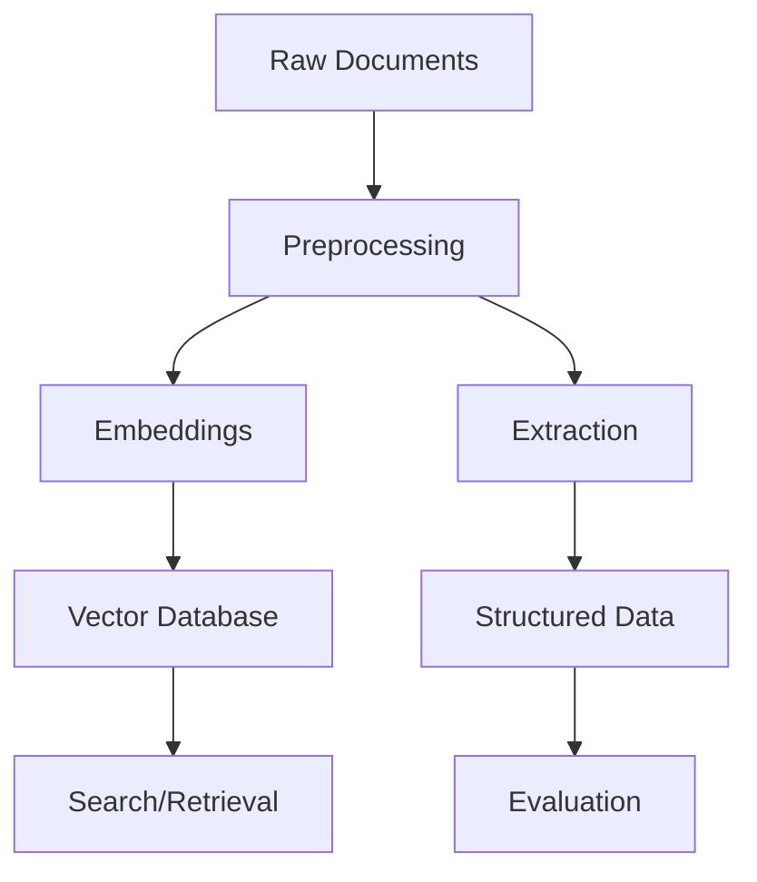

# Documentation Improvement Plan

## Executive Summary

This document outlines specific improvements to implement across the JuDDGES documentation, including file reorganization, content updates, and standardization efforts.

## 1. Immediate Actions Required

### Merge Duplicate Files

**Action**: Combine related API troubleshooting documents

- [x] Created unified `GEMINI_API_TROUBLESHOOTING.md`
- [ ] Delete `GEMINI_API_AUTH_FIX.md` (redundant)
- [ ] Delete `GEMINI_API_KEY_ISSUE.md` (redundant)

### Add Missing Core Documentation

**Action**: Create essential missing guides

- [x] `GETTING_STARTED.md` - Quick start guide for new users
- [x] `STYLE_GUIDE.md` - Documentation standards
- [ ] `CONTRIBUTING.md` - Contribution guidelines
- [ ] `ARCHITECTURE.md` - System architecture overview
- [ ] `DEPLOYMENT.md` - Production deployment guide
- [ ] `API_REFERENCE.md` - Complete API documentation

### Fix Broken References

**Action**: Update outdated paths and links

Files requiring updates:
- `README.md` - Update links to new documentation
- `PROJECT_OVERVIEW.md` - Fix contact placeholders
- `RESEARCH_PUBLICATIONS.md` - Add actual GitHub/HuggingFace URLs
- All files - Replace placeholder emails with actual contacts

## 2. File Reorganization Plan

### Current Structure (Flat - 27 files)
```
docs/
├── All 27 .md files at root level
└── No subdirectories
```

### Proposed Structure (Hierarchical by Diátaxis)
```
docs/
├── README.md                       # Main index
├── GETTING_STARTED.md             # Quick start
├── STYLE_GUIDE.md                 # Documentation standards
│
├── tutorials/                     # Learning-oriented
│   ├── README.md
│   ├── first-extraction.md
│   ├── end-to-end-workflow.md
│   └── fine-tuning-basics.md
│
├── how-to/                        # Task-oriented
│   ├── README.md
│   ├── data-acquisition/
│   │   ├── pl-court-data.md
│   │   └── nsa-scraping.md
│   ├── embeddings/
│   │   ├── generate-embeddings.md
│   │   └── deploy-weaviate.md
│   ├── extraction/
│   │   ├── use-gemini.md
│   │   ├── troubleshoot-api.md
│   │   └── create-schemas.md
│   ├── visualization/
│   │   ├── umap-sampling.md
│   │   ├── umap-visualization.md
│   │   └── apply-coordinates.md
│   └── deployment/
│       ├── docker-setup.md
│       └── production-deploy.md
│
├── reference/                     # Information-oriented
│   ├── README.md
│   ├── api/
│   │   ├── extraction.md
│   │   ├── embeddings.md
│   │   └── weaviate.md
│   ├── schemas/
│   │   ├── document-schema.md
│   │   ├── swiss-loans.md
│   │   └── dataset-mapping.md
│   ├── configuration/
│   │   ├── hydra-configs.md
│   │   └── dvc-pipeline.md
│   └── cli/
│       └── commands.md
│
├── explanation/                   # Understanding-oriented
│   ├── README.md
│   ├── architecture/
│   │   ├── system-overview.md
│   │   └── component-design.md
│   ├── concepts/
│   │   ├── vector-search.md
│   │   ├── legal-nlp.md
│   │   └── evaluation-metrics.md
│   └── research/
│       ├── project-overview.md
│       ├── milestones.md
│       ├── impact-assessment.md
│       └── publications.md
│
└── meta/                         # About documentation
    ├── changelog.md
    ├── contributing.md
    └── roadmap.md
```

## 3. Content Standardization

### Apply Consistent Headers

All documents should follow:
```markdown
# Title

Brief description (1-2 sentences).

## Table of Contents

- [Section 1](#section-1)
- [Section 2](#section-2)

---

## Main Content

### Subsections

---

## Related Documentation

- [Link 1](path/to/doc1.md)
- [Link 2](path/to/doc2.md)

## Support

See [Getting Help](../GETTING_STARTED.md#getting-help)

---

**Last Updated**: YYYY-MM-DD | **Version**: X.Y | **Status**: Draft/Published
```

### Standardize File Naming

**Current Issues**:
- Mix of UPPERCASE.md and lowercase_with_underscores.md
- Inconsistent naming patterns

**New Convention**:
- Major documents: `UPPERCASE.md` (README, GETTING_STARTED)
- Category documents: `lowercase-with-hyphens.md`
- No underscores in new files

### Fix Formatting Inconsistencies

**Issues Found**:
- Inconsistent code block languages
- Mixed heading styles (with/without emojis)
- Varying table formats
- Different link styles

**Actions**:
- Remove emojis from headers (keep in content only)
- Use consistent code block languages
- Standardize table formatting
- Use reference-style links for repeated URLs

## 4. Content Updates Required

### Update Outdated Information

| Document | Issue | Action Required |
|----------|-------|-----------------|
| README.md | Missing external links | Add GitHub, HuggingFace URLs |
| PROJECT_OVERVIEW.md | Placeholder contacts | Add real contact information |
| MILESTONES_AND_ACHIEVEMENTS.md | Old statistics | Update with current numbers |
| All docs | Version dates inconsistent | Add consistent date format |

### Add Missing Sections

| Document | Missing Section | Priority |
|----------|----------------|----------|
| GEMINI_EXTRACTION.md | Performance benchmarks | Medium |
| LANGFUSE_SETUP.md | Integration with CI/CD | Low |
| RESEARCH_PUBLICATIONS.md | Actual submission deadlines | High |
| IMPACT_ASSESSMENT.md | Metrics tracking | Medium |

### Enhance Cross-References

**Current State**: Some cross-references, but inconsistent

**Improvement Plan**:
1. Every document must have "Related Documentation" section
2. Link to prerequisite documents at the start
3. Use consistent link text matching target document titles
4. Add "Next Steps" section to guide readers

Example:
```markdown
## Prerequisites

Before starting, read:
- [Getting Started](../GETTING_STARTED.md)
- [System Architecture](../explanation/architecture/overview.md)

## Next Steps

After completing this guide:
- Try [Advanced Extraction](../how-to/extraction/advanced.md)
- Learn about [Evaluation](../how-to/evaluation/metrics.md)
```

## 5. Quality Improvements

### Add Diagrams

Create Mermaid diagrams for:
- System architecture overview
- Data processing pipeline
- Extraction workflow
- Evaluation process
- DVC pipeline stages

Example:


### Improve Code Examples

**Current Issues**:
- Some examples don't include imports
- Missing expected output
- No error handling shown

**Improvement Template**:
```python
# Complete, runnable example
from juddges.extraction import GeminiExtractionChain
from juddges.extraction.gemini_chain import DocumentType, ExtractionSchema
import os

try:
    # Setup
    chain = GeminiExtractionChain(
        model_name="gemini-2.5-flash",
        api_key=os.getenv("GOOGLE_API_KEY"),
    )

    # Execute
    result = chain.extract(...)

    # Show output
    print(result)
    # Expected output:
    # {'field1': 'value1', 'field2': 'value2'}

except Exception as e:
    print(f"Error: {e}")
    # Troubleshooting: Check GEMINI_API_TROUBLESHOOTING.md
```

### Add Validation

For all how-to guides, add:
- Prerequisites check
- Success verification steps
- Common errors and solutions
- Rollback procedures (if applicable)

## 6. Implementation Timeline

### Week 1: Critical Updates
- [x] Merge duplicate documents
- [x] Create GETTING_STARTED.md
- [x] Create STYLE_GUIDE.md
- [ ] Fix broken links
- [ ] Update placeholder content

### Week 2: Reorganization
- [ ] Create new directory structure
- [ ] Move files to appropriate categories
- [ ] Update all internal links
- [ ] Create category README files

### Week 3: Content Enhancement
- [ ] Standardize all headers/footers
- [ ] Add missing cross-references
- [ ] Create architecture diagrams
- [ ] Improve code examples

### Week 4: Final Polish
- [ ] Run link checker
- [ ] Spell check all documents
- [ ] Version and date all files
- [ ] Create migration guide for users

## 7. Automation Recommendations

### Set Up Documentation CI/CD

```yaml
# .github/workflows/docs.yml
name: Documentation CI

on:
  pull_request:
    paths:
      - 'docs/**'

jobs:
  validate:
    runs-on: ubuntu-latest
    steps:
      - uses: actions/checkout@v2

      - name: Check links
        uses: gaurav-nelson/github-action-markdown-link-check@v1

      - name: Spell check
        uses: streetsidesoftware/cspell-action@v2

      - name: Validate structure
        run: python scripts/validate_docs.py
```

### Create Documentation Templates

Store in `docs/templates/`:
- `tutorial-template.md`
- `how-to-template.md`
- `reference-template.md`
- `explanation-template.md`

### Generate API Documentation

Use Sphinx or MkDocs to auto-generate from docstrings:
```bash
# Install
pip install sphinx sphinx-autodoc-typehints

# Generate
sphinx-apidoc -o docs/reference/api juddges/

# Build
sphinx-build -b html docs/ docs/_build/
```

## 8. Success Metrics

Track documentation quality with:

| Metric | Current | Target | How to Measure |
|--------|---------|--------|----------------|
| Broken links | Unknown | 0 | Link checker |
| Missing sections | 15+ | 0 | Manual review |
| Code examples tested | 50% | 100% | pytest-doctest |
| Cross-references | 40% | 90% | Script analysis |
| Last updated < 3 months | 60% | 100% | Date check |
| User feedback score | N/A | 4.5/5 | Survey |

## 9. Review Checklist

Before considering improvements complete:

- [ ] All duplicate files merged/removed
- [ ] New directory structure implemented
- [ ] All documents follow style guide
- [ ] Cross-references comprehensive
- [ ] Code examples tested and working
- [ ] Diagrams added where helpful
- [ ] Links validated
- [ ] Dates and versions updated
- [ ] CI/CD pipeline running
- [ ] User feedback collected

## 10. Next Steps

1. **Get team buy-in** on proposed structure
2. **Prioritize** based on user needs
3. **Assign owners** to document categories
4. **Set up tracking** for metrics
5. **Schedule regular reviews** (monthly)

---

## Related Documentation

- [Documentation Analysis](DOCUMENTATION_ANALYSIS.md)
- [Style Guide](STYLE_GUIDE.md)
- [Getting Started](GETTING_STARTED.md)

## Support

For questions about documentation improvements, create an issue on [GitHub](https://github.com/pwr-ai/JuDDGES/issues) or contact: lukasz.augustyniak@pwr.edu.pl

---

**Last Updated**: 2025-10-11 | **Version**: 1.0 | **Status**: Published