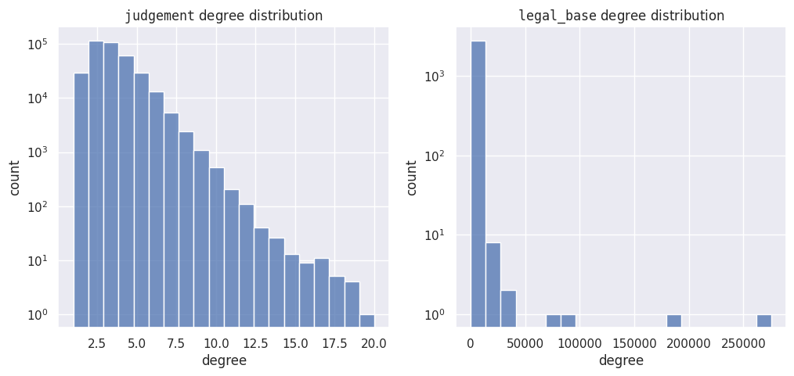

# Polish Court Judgments Graph

## Dataset description
We introduce a graph dataset of Polish Court Judgments. This dataset is primarily based on the [`JuDDGES/pl-court-raw`](https://huggingface.co/datasets/JuDDGES/pl-court-raw). The dataset consists of nodes representing either judgments or legal bases, and edges connecting judgments to the legal bases they refer to. Also, the graph was cleaned from small disconnected components, leaving single giant component. Consequently, the resulting graph is bipartite. We provide the dataset in both `JSON` and `PyG` formats, each has different purpose. While structurally graphs in these formats are the same, their attributes differ. 

The `JSON` format is intended for analysis and contains most of the attributes available in [`JuDDGES/pl-court-raw`](https://huggingface.co/datasets/JuDDGES/pl-court-raw). We excluded some less-useful attributes and text content, which can be easily retrieved from the raw dataset and added to the graph as needed.

The `PyG` format is designed for machine learning applications, such as link prediction on graphs, and is fully compatible with the [`Pytorch Geometric`](https://github.com/pyg-team/pytorch_geometric) framework. 

In the following sections, we provide a more detailed explanation and use case examples for each format.

## Dataset statistics

| feature                    | value                |
|----------------------------|----------------------|
| #nodes                     | {{num_nodes}}        |
| #edges                     | {{num_edges}}        |
| #nodes (type=`judgment`)  | {{num_src_nodes}}    |
| #nodes (type=`legal_base`) | {{num_target_nodes}} |
| avg(degree)                | {{avg_degree}}       |

    

    


## `JSON` format

The `JSON` format contains graph node types differentiated by `node_type` attrbute. Each `node_type` has its additional corresponding attributes (see [`JuDDGES/pl-court-raw`](https://huggingface.co/datasets/JuDDGES/pl-court-raw) for detailed description of each attribute):

| node_type    | attributes                                                                                                          |
|--------------|---------------------------------------------------------------------------------------------------------------------|
| `judgment`   | {{judgment_attributes}}  |
| `legal_base` | {{legal_base_attributes}}                                                                                                |

### Loading
Graph the `JSON` format is saved in node-link format, and can be readily loaded with `networkx` library:

```python
import json
import networkx as nx
from huggingface_hub import hf_hub_download

DATA_DIR = "<your_local_data_directory>"
JSON_FILE = "data/judgment_graph.json"
hf_hub_download(repo_id="JuDDGES/pl-court-graph", repo_type="dataset", filename=JSON_FILE, local_dir=DATA_DIR)

with open(f"{DATA_DIR}/{JSON_FILE}") as file:
    g_data = json.load(file)

g = nx.node_link_graph(g_data)
```

### Example usage
```python
# TBD
```

## `PyG` format

The `PyTorch Geometric` format includes embeddings of the judgment content, obtained with [{{embedding_method}}](https://huggingface.co/{{embedding_method}}) for judgment nodes, 
and one-hot-vector identifiers for legal-base nodes (note that for efficiency one can substitute it with random noise identifiers, 
like in [(Abboud et al., 2021)](https://arxiv.org/abs/2010.01179)).
    


### Loading
In order to load graph as pytorch geometric, one can leverage the following code snippet
```python
import torch
import os
from torch_geometric.data import InMemoryDataset, download_url


class PlCourtGraphDataset(InMemoryDataset):
    URL = (
        "https://huggingface.co/datasets/JuDDGES/pl-court-graph/resolve/main/"
        "data/pyg_judgment_graph.pt?download=true"
    )

    def __init__(self, root_dir: str, transform=None, pre_transform=None):
        super(PlCourtGraphDataset, self).__init__(root_dir, transform, pre_transform)
        data_file, index_file = self.processed_paths
        self.load(data_file)
        self.judgment_idx_2_iid, self.legal_base_idx_2_isap_id = torch.load(index_file).values()

    @property
    def raw_file_names(self) -> str:
        return "pyg_judgment_graph.pt"

    @property
    def processed_file_names(self) -> list[str]:
        return ["processed_pyg_judgment_graph.pt", "index_map.pt"]

    def download(self) -> None:
        os.makedirs(self.root, exist_ok=True)
        download_url(self.URL + self.raw_file_names, self.raw_dir)

    def process(self) -> None:
        dataset = torch.load(self.raw_paths[0])
        data = dataset["data"]

        if self.pre_transform is not None:
            data = self.pre_transform(data)

        data_file, index_file = self.processed_paths
        self.save([data], data_file)

        torch.save(
            {
                "judgment_idx_2_iid": dataset["judgment_idx_2_iid"],
                "legal_base_idx_2_isap_id": dataset["legal_base_idx_2_isap_id"],
            },
            index_file,
        )

    def __repr__(self) -> str:
        return f"{self.__class__.__name__}({len(self)})"


ds = PlCourtGraphDataset(root_dir="data/datasets/pyg")
print(ds)
```

### Example usage
```python
# TBD
```