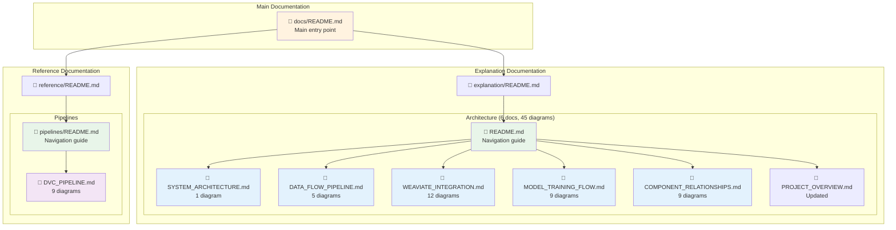

# Architecture Diagrams Quick Index

This document provides a quick reference index to all Mermaid architecture diagrams in the JuDDGES documentation.

## Documentation Structure

---

## Quick Access by Diagram Type

### System Overview Diagrams
| Document | Diagram | Purpose |
|----------|---------|---------|
| [System Architecture](explanation/architecture/SYSTEM_ARCHITECTURE.md) | High-Level System Architecture | Complete system overview with all components |

### Data Processing Diagrams
| Document | Diagram | Purpose |
|----------|---------|---------|
| [Data Flow Pipeline](explanation/architecture/DATA_FLOW_PIPELINE.md) | Complete Data Flow Pipeline | 9-stage transformation journey |
| [Data Flow Pipeline](explanation/architecture/DATA_FLOW_PIPELINE.md) | Data Format Evolution | Format transformations through pipeline |
| [Data Flow Pipeline](explanation/architecture/DATA_FLOW_PIPELINE.md) | Parallel Processing Architecture | Concurrent execution paths |
| [Data Flow Pipeline](explanation/architecture/DATA_FLOW_PIPELINE.md) | Data Volume Flow | Sankey diagram of volume changes |
| [Data Flow Pipeline](explanation/architecture/DATA_FLOW_PIPELINE.md) | Error Handling | Recovery strategies |

### Pipeline & Orchestration Diagrams
| Document | Diagram | Purpose |
|----------|---------|---------|
| [DVC Pipeline](reference/pipelines/DVC_PIPELINE.md) | Pipeline DAG | Complete pipeline dependencies |
| [DVC Pipeline](reference/pipelines/DVC_PIPELINE.md) | Embedding Stage | Embed stage details |
| [DVC Pipeline](reference/pipelines/DVC_PIPELINE.md) | SFT Stage Matrix | Multi-model training matrix |
| [DVC Pipeline](reference/pipelines/DVC_PIPELINE.md) | Prediction Stage | Inference pipeline |
| [DVC Pipeline](reference/pipelines/DVC_PIPELINE.md) | Evaluation Pipeline | Dual evaluation paths |
| [DVC Pipeline](reference/pipelines/DVC_PIPELINE.md) | Configuration Structure | Config hierarchy |
| [DVC Pipeline](reference/pipelines/DVC_PIPELINE.md) | Pipeline Execution Flow | Sequence of operations |
| [DVC Pipeline](reference/pipelines/DVC_PIPELINE.md) | Matrix Execution | Parallel matrix runs |
| [DVC Pipeline](reference/pipelines/DVC_PIPELINE.md) | Cache Management | Cache structure |

### Vector Database Diagrams
| Document | Diagram | Purpose |
|----------|---------|---------|
| [Weaviate Integration](explanation/architecture/WEAVIATE_INTEGRATION.md) | Integration Architecture | Complete Weaviate setup |
| [Weaviate Integration](explanation/architecture/WEAVIATE_INTEGRATION.md) | legal_documents Schema | Document collection schema |
| [Weaviate Integration](explanation/architecture/WEAVIATE_INTEGRATION.md) | document_chunks Schema | Chunk collection schema |
| [Weaviate Integration](explanation/architecture/WEAVIATE_INTEGRATION.md) | Data Ingestion Pipeline | Ingestion flowchart |
| [Weaviate Integration](explanation/architecture/WEAVIATE_INTEGRATION.md) | Query Architecture | Query processing sequence |
| [Weaviate Integration](explanation/architecture/WEAVIATE_INTEGRATION.md) | Semantic Search | Search query flow |
| [Weaviate Integration](explanation/architecture/WEAVIATE_INTEGRATION.md) | Hybrid Search | Dual-path search |
| [Weaviate Integration](explanation/architecture/WEAVIATE_INTEGRATION.md) | RAG Context Pipeline | Context retrieval for LLMs |
| [Weaviate Integration](explanation/architecture/WEAVIATE_INTEGRATION.md) | Performance Optimization | Optimization strategies |
| [Weaviate Integration](explanation/architecture/WEAVIATE_INTEGRATION.md) | Docker Deployment | Container configuration |
| [Weaviate Integration](explanation/architecture/WEAVIATE_INTEGRATION.md) | Monitoring & Metrics | Metrics collection |
| [Weaviate Integration](explanation/architecture/WEAVIATE_INTEGRATION.md) | Error Handling | State machine |

### Model Training & Inference Diagrams
| Document | Diagram | Purpose |
|----------|---------|---------|
| [Model Training Flow](explanation/architecture/MODEL_TRAINING_FLOW.md) | Training Architecture | End-to-end training |
| [Model Training Flow](explanation/architecture/MODEL_TRAINING_FLOW.md) | PEFT/LoRA Strategy | Parameter-efficient fine-tuning |
| [Model Training Flow](explanation/architecture/MODEL_TRAINING_FLOW.md) | Multi-Model Matrix | Model-dataset combinations |
| [Model Training Flow](explanation/architecture/MODEL_TRAINING_FLOW.md) | Inference Pipeline | Complete inference flow |
| [Model Training Flow](explanation/architecture/MODEL_TRAINING_FLOW.md) | Optimization Techniques | Three optimization categories |
| [Model Training Flow](explanation/architecture/MODEL_TRAINING_FLOW.md) | Evaluation Flow | Metrics calculation sequence |
| [Model Training Flow](explanation/architecture/MODEL_TRAINING_FLOW.md) | Deployment Strategies | Four deployment options |
| [Model Training Flow](explanation/architecture/MODEL_TRAINING_FLOW.md) | Training Monitoring | Dashboard metrics |
| [Model Training Flow](explanation/architecture/MODEL_TRAINING_FLOW.md) | Hardware Requirements | GPU specs by model size |

### Component & Dependency Diagrams
| Document | Diagram | Purpose |
|----------|---------|---------|
| [Component Relationships](explanation/architecture/COMPONENT_RELATIONSHIPS.md) | Component Architecture | High-level modules |
| [Component Relationships](explanation/architecture/COMPONENT_RELATIONSHIPS.md) | Module Dependencies | Internal dependencies |
| [Component Relationships](explanation/architecture/COMPONENT_RELATIONSHIPS.md) | Class Relationships | Object interactions |
| [Component Relationships](explanation/architecture/COMPONENT_RELATIONSHIPS.md) | Data Flow Dependencies | Layer architecture |
| [Component Relationships](explanation/architecture/COMPONENT_RELATIONSHIPS.md) | Configuration Dependencies | Hydra composition |
| [Component Relationships](explanation/architecture/COMPONENT_RELATIONSHIPS.md) | Error Propagation | Error handling flow |
| [Component Relationships](explanation/architecture/COMPONENT_RELATIONSHIPS.md) | Testing Dependencies | Test structure |
| [Component Relationships](explanation/architecture/COMPONENT_RELATIONSHIPS.md) | Package Dependencies | Dependency tree |
| [Component Relationships](explanation/architecture/COMPONENT_RELATIONSHIPS.md) | Communication Patterns | Sequence interactions |

---

## Quick Access by Use Case

### For Understanding the System
1. [System Architecture](explanation/architecture/SYSTEM_ARCHITECTURE.md) - Start here for big picture
2. [Data Flow Pipeline](explanation/architecture/DATA_FLOW_PIPELINE.md) - Understand data transformations
3. [Component Relationships](explanation/architecture/COMPONENT_RELATIONSHIPS.md) - See how pieces connect

### For Working with Data
1. [Data Flow Pipeline](explanation/architecture/DATA_FLOW_PIPELINE.md) - Complete data journey
2. [Weaviate Integration](explanation/architecture/WEAVIATE_INTEGRATION.md) - Vector database operations
3. [DVC Pipeline](reference/pipelines/DVC_PIPELINE.md) - Pipeline execution

### For Training Models
1. [Model Training Flow](explanation/architecture/MODEL_TRAINING_FLOW.md) - Training workflows
2. [DVC Pipeline](reference/pipelines/DVC_PIPELINE.md) - Pipeline configuration
3. [Component Relationships](explanation/architecture/COMPONENT_RELATIONSHIPS.md) - Module structure

### For Deployment
1. [Model Training Flow](explanation/architecture/MODEL_TRAINING_FLOW.md) - Deployment strategies
2. [Weaviate Integration](explanation/architecture/WEAVIATE_INTEGRATION.md) - Database deployment
3. [System Architecture](explanation/architecture/SYSTEM_ARCHITECTURE.md) - Infrastructure overview

### For Debugging
1. [Component Relationships](explanation/architecture/COMPONENT_RELATIONSHIPS.md) - Error propagation
2. [Data Flow Pipeline](explanation/architecture/DATA_FLOW_PIPELINE.md) - Error handling
3. [DVC Pipeline](reference/pipelines/DVC_PIPELINE.md) - Troubleshooting guide

---

## Diagram Type Reference

### Flowcharts (18 diagrams)
Used for sequential processes, decision trees, and workflows.

**Examples**:
- Data Flow Pipeline (9-stage transformation)
- Weaviate Ingestion Pipeline
- Inference Pipeline
- Error Handling Flow

### Graph/Network Diagrams (12 diagrams)
Used for component relationships and architecture overviews.

**Examples**:
- System Architecture
- Component Relationships
- Configuration Hierarchy
- Package Dependencies

### Sequence Diagrams (5 diagrams)
Used for time-based interactions between components.

**Examples**:
- Query Architecture
- Pipeline Execution Flow
- Model Evaluation Flow
- Communication Patterns

### Class Diagrams (3 diagrams)
Used for object relationships and database schemas.

**Examples**:
- legal_documents Schema
- document_chunks Schema
- Class Relationships

### State Diagrams (2 diagrams)
Used for error handling and state transitions.

**Examples**:
- Error Handling and Recovery
- Weaviate Error States

### Sankey Diagrams (1 diagram)
Used for data volume flow visualization.

**Examples**:
- Data Volume Flow through pipeline stages

---

## Statistics Summary

| Metric | Value |
|--------|-------|
| **Total Documents** | 11 (6 primary + 5 supporting) |
| **Total Diagrams** | 45 comprehensive diagrams |
| **Total Lines** | 3,005 lines of documentation |
| **Coverage** | 100% of major system components |
| **Diagram Types** | 6 different types |

---

## Related Resources

### Navigation Guides
- [Architecture README](explanation/architecture/README.md) - Detailed navigation for architecture docs
- [Pipeline README](reference/pipelines/README.md) - Pipeline reference guide
- [Main Documentation Index](README.md) - Complete documentation overview

### Practical Guides
- [How-To Guides](how-to/) - Task-oriented instructions
- [Tutorials](tutorials/) - Learning-oriented guides
- [Reference](reference/) - Technical specifications

### External Tools
- [Mermaid Live Editor](https://mermaid.live/) - Interactive diagram editing
- [Mermaid Documentation](https://mermaid.js.org/) - Syntax reference
- [GitHub Mermaid Support](https://github.blog/2022-02-14-include-diagrams-markdown-files-mermaid/) - Native rendering

---

**Last Updated**: 2025-10-11
**Version**: 1.0
**Total Diagrams**: 45