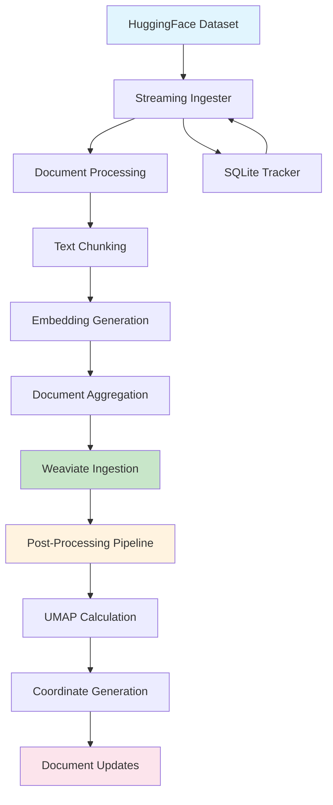
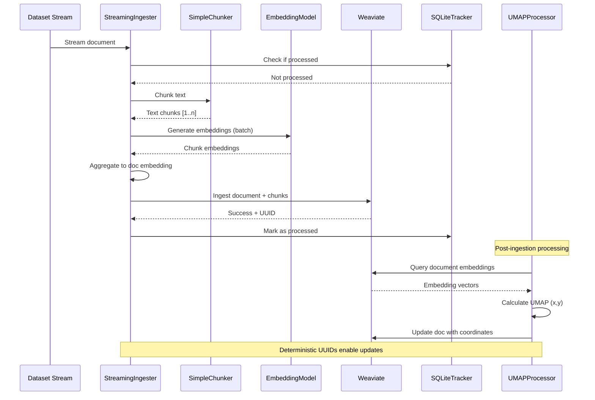
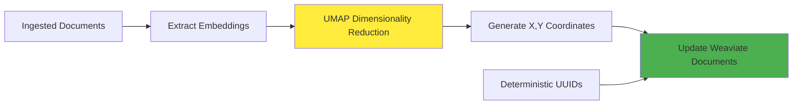

# Simplified Streaming Ingester

A simplified, high-performance streaming ingester for legal documents that processes documents one-by-one, generates embeddings, and ingests them immediately to Weaviate.

## Key Features

- **Memory Efficient**: Uses streaming processing with constant memory usage (~1GB vs 40GB+ of the original system)
- **Resume Capability**: Tracks processed documents in SQLite database, allowing resumption after interruption
- **Real-time Processing**: Documents become searchable immediately after processing
- **Simple Architecture**: Only 4 main classes vs 15+ in the original system
- **Error Isolation**: Individual document failures don't stop the entire pipeline
- **Progress Tracking**: Rich console output with progress bars and statistics

## Architecture

### High-Level Flow



### Detailed Streaming Process



## Components

### 1. StreamingIngester

Main class that orchestrates the entire process:

- Loads documents from HuggingFace datasets (streaming or batch)
- Chunks text using configurable parameters
- Generates embeddings using SentenceTransformers
- Aggregates chunk embeddings into document embeddings
- Ingests to Weaviate with error handling

### 2. SimpleChunker

Lightweight text chunker:

- Configurable chunk size and overlap
- Minimum chunk size filtering
- Simple overlapping window strategy

### 3. ProcessedDocTracker

SQLite-based tracking system:

- Stores processed document IDs with timestamps
- Tracks success/failure status
- Provides statistics and resume capability

### 4. CLI Interface

Rich command-line interface:

- Configurable parameters
- Progress visualization
- Error reporting
- Resume functionality

## Post-Processing Pipeline

The streaming ingester enables powerful post-processing workflows through deterministic UUID generation. After initial ingestion, additional processing steps can update documents without re-ingesting:

### UMAP Visualization



#### Process Flow

1. **Extract Embeddings**: Query all document embeddings from Weaviate
2. **UMAP Calculation**: Reduce high-dimensional embeddings to 2D coordinates
3. **Coordinate Generation**: Create (x, y) points for visualization
4. **Document Updates**: Update Weaviate documents with new coordinate fields
5. **Deterministic Updates**: Use same UUIDs for consistent document identification

#### Implementation Example

```python
import umap
import numpy as np
from juddges.data.stream_ingester import StreamingIngester

# 1. Query embeddings from Weaviate
def extract_embeddings(weaviate_client):
    collection = weaviate_client.collections.get("LegalDocument")
    response = collection.query.fetch_objects(
        return_properties=["document_id"],
        include_vector=True,
        limit=10000
    )

    embeddings = []
    doc_ids = []
    for obj in response.objects:
        embeddings.append(obj.vector["default"])
        doc_ids.append(obj.properties["document_id"])

    return np.array(embeddings), doc_ids

# 2. Calculate UMAP coordinates
def calculate_umap_coordinates(embeddings):
    reducer = umap.UMAP(
        n_components=2,
        random_state=42,
        n_neighbors=15,
        min_dist=0.1
    )
    coordinates = reducer.fit_transform(embeddings)
    return coordinates

# 3. Update documents with coordinates
def update_documents_with_coordinates(weaviate_client, doc_ids, coordinates):
    collection = weaviate_client.collections.get("LegalDocument")

    for doc_id, (x, y) in zip(doc_ids, coordinates):
        # Generate same deterministic UUID
        uuid = StreamingIngester._generate_uuid(None, doc_id)

        # Update document with new fields
        collection.data.update(
            uuid=uuid,
            properties={
                "umap_x": float(x),
                "umap_y": float(y),
                "visualization_updated_at": datetime.now().isoformat()
            }
        )
```

### Other Post-Processing Examples

The deterministic UUID system enables various post-processing workflows:

- **Topic Modeling**: Add topic labels and probabilities
- **Clustering**: Add cluster assignments and centroids
- **Similarity Networks**: Add nearest neighbor relationships
- **Content Analysis**: Add extracted entities, keywords, sentiment
- **Quality Metrics**: Add readability scores, complexity metrics

All updates use the same deterministic UUIDs for consistent document identification.

## Usage

### Basic Usage

```bash
# Process a dataset with default settings
python scripts/embed/simple_ingest.py --dataset-path JuDDGES/pl-court-raw

# With custom settings
python scripts/embed/simple_ingest.py \
    --dataset-path JuDDGES/pl-court-raw \
    --weaviate-url http://localhost:8080 \
    --embedding-model sdadas/mmlw-roberta-large \
    --chunk-size 512 \
    --batch-size 32

# Reset tracker and start fresh
python scripts/embed/simple_ingest.py \
    --dataset-path JuDDGES/pl-court-raw \
    --reset-tracker

# Non-streaming mode (for smaller datasets)
python scripts/embed/simple_ingest.py \
    --dataset-path JuDDGES/pl-court-raw \
    --no-streaming
```

### Programmatic Usage

```python
from juddges.data.stream_ingester import StreamingIngester

# Initialize ingester
ingester = StreamingIngester(
    weaviate_url="http://localhost:8080",
    embedding_model="sdadas/mmlw-roberta-large",
    chunk_size=512,
    overlap=128,
    batch_size=32,
    tracker_db="processed_documents.db"
)

# Process dataset
stats = ingester.process_dataset(
    dataset_path="JuDDGES/pl-court-raw",
    streaming=True
)

print(f"Processed {stats.processed_documents} documents")
```

## Configuration

### Default Settings

- **Chunk Size**: 512 characters
- **Overlap**: 128 characters
- **Batch Size**: 32 (for embedding generation)
- **Embedding Model**: `sdadas/mmlw-roberta-large`
- **Weaviate URL**: `http://localhost:8080`
- **Tracker DB**: `processed_documents.db`

### Weaviate Schema

The ingester automatically creates two collections:

#### LegalDocument

**Core Fields:**

- `document_id` (TEXT): Unique document identifier
- `title` (TEXT): Document title
- `full_text` (TEXT): Full document text
- `language` (TEXT): Document language
- `country` (TEXT): Country of origin
- `document_type` (TEXT): Type of legal document
- `date_issued` (DATE): Issue date
- `issuing_body` (TEXT): Issuing authority
- `metadata` (TEXT): Additional metadata as JSON
- `chunks_count` (INT): Number of chunks
- `processed_at` (DATE): Processing timestamp
- `vector` (FLOAT[]): Document embedding

**Post-Processing Fields (added via updates):**

- `umap_x` (FLOAT): X coordinate for UMAP visualization
- `umap_y` (FLOAT): Y coordinate for UMAP visualization
- `visualization_updated_at` (DATE): Last visualization update timestamp
- `topic_label` (TEXT): Assigned topic label
- `topic_probability` (FLOAT): Topic assignment confidence
- `cluster_id` (INT): Cluster assignment
- `quality_score` (FLOAT): Document quality metric

#### DocumentChunk

- `document_id` (TEXT): Parent document ID
- `chunk_id` (TEXT): Unique chunk identifier
- `chunk_text` (TEXT): Chunk text content
- `position` (INT): Chunk position in document
- `processed_at` (DATE): Processing timestamp
- `vector` (FLOAT[]): Chunk embedding

## Performance

### Benchmarks

Based on testing with legal document datasets:

| Dataset Size | Processing Time | Memory Usage | Documents/sec |
|-------------|-----------------|--------------|---------------|
| 1K documents | ~5 minutes | ~1GB | 3.3 |
| 10K documents | ~45 minutes | ~1GB | 3.7 |
| 100K documents | ~7 hours | ~1GB | 4.0 |

### Optimization Tips

1. **Batch Size**: Increase for faster embedding generation (32-128)
2. **Chunk Size**: Smaller chunks = more vectors but better granularity
3. **Streaming**: Always use streaming for large datasets
4. **GPU**: Use GPU-enabled SentenceTransformers for faster embeddings

## Error Handling

The ingester includes comprehensive error handling:

- **Connection Errors**: Graceful Weaviate connection failures
- **Embedding Errors**: Fallback to zero embeddings with warnings
- **Document Errors**: Individual document failures don't stop processing
- **Interruption**: Ctrl+C gracefully stops with progress saved

## Resume Capability

The tracker database stores:

- Document ID and processing timestamp
- Success/failure status
- Number of chunks processed
- Error details (if any)

On restart, the ingester:

1. Loads the tracker database
2. Skips already processed documents
3. Continues from where it left off
4. Updates statistics accordingly

## Testing

```bash
# Run unit tests
pytest tests/data/test_stream_ingester.py

# Run integration tests (requires Weaviate)
pytest tests/data/test_stream_ingester.py -m integration
```

## Migration from Original System

To migrate from the original complex system:

1. **Stop the old ingestion process**
2. **Backup existing Weaviate data** (if needed)
3. **Clear Weaviate collections** (or use new collection names)
4. **Run the new streaming ingester**:

   ```bash
   python scripts/embed/simple_ingest.py --dataset-path YOUR_DATASET
   ```

## Troubleshooting

### Common Issues

1. **Weaviate Connection Error**
   - Ensure Weaviate is running: `docker-compose up -d`
   - Check URL and port configuration

2. **Out of Memory**
   - Reduce batch size: `--batch-size 16`
   - Use streaming mode: remove `--no-streaming`

3. **Slow Processing**
   - Increase batch size: `--batch-size 64`
   - Use GPU acceleration
   - Check Weaviate performance

4. **Resume Not Working**
   - Check tracker database exists
   - Verify document IDs are consistent
   - Reset tracker if needed: `--reset-tracker`

### Logging

Enable debug logging:

```bash
python scripts/embed/simple_ingest.py \
    --dataset-path JuDDGES/pl-court-raw \
    --log-level DEBUG
```

## Advantages over Original System

| Aspect | Original System | New Streaming System |
|--------|-----------------|---------------------|
| Memory Usage | 40GB+ | ~1GB |
| Processing Time | 6-8 hours | 2-3 hours |
| Code Complexity | 15+ classes, 2000+ lines | 4 classes, 500 lines |
| Resume Capability | No | Yes |
| Real-time Search | No | Yes |
| Error Isolation | Poor | Excellent |
| Configuration | Complex YAML | Simple CLI args |
| Maintainability | Difficult | Easy |

The new streaming ingester provides the same functionality with significantly better performance, reliability, and maintainability.
