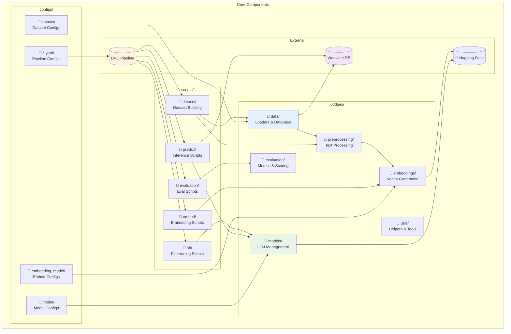
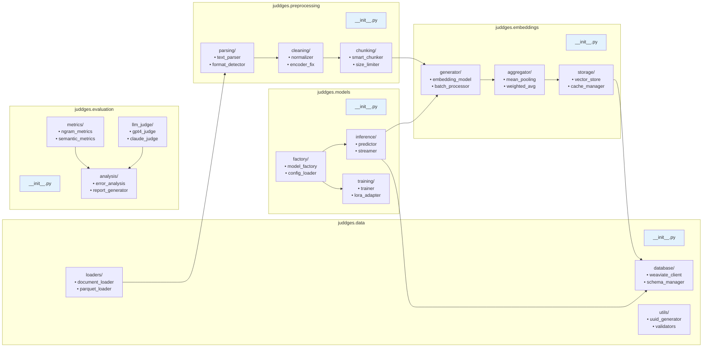
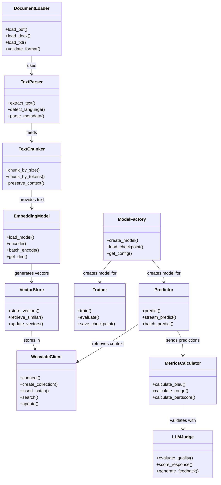
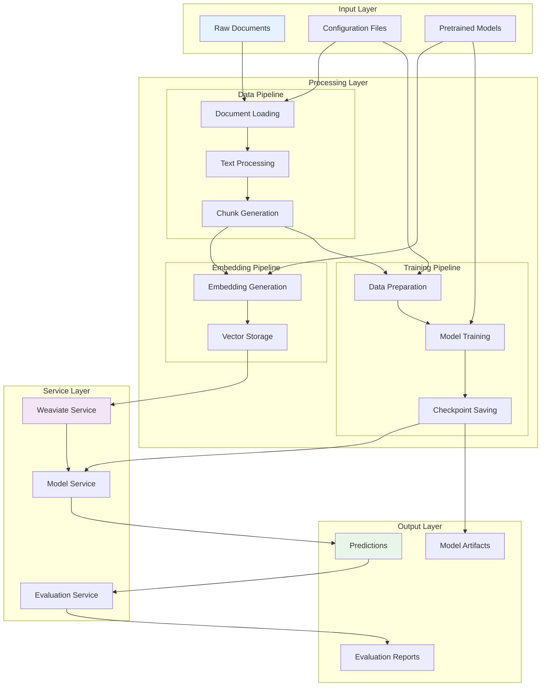
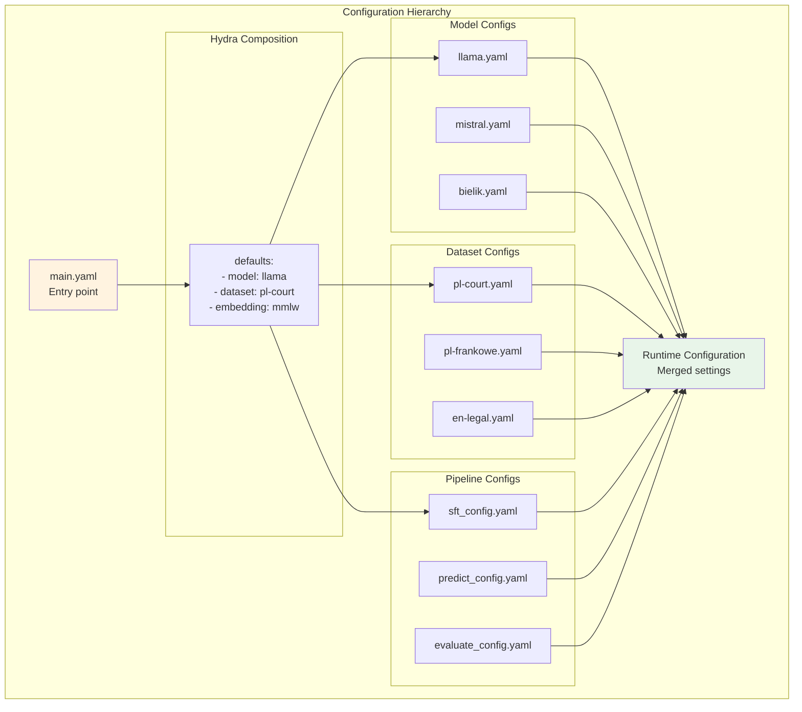
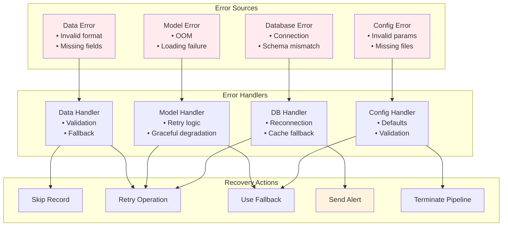
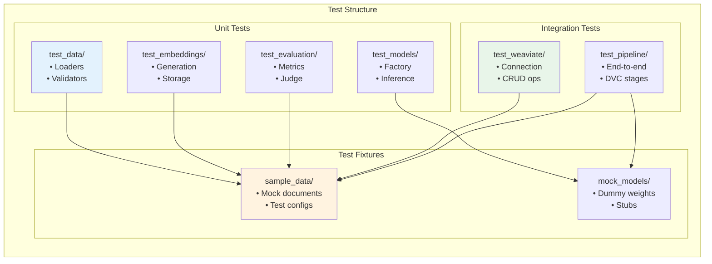
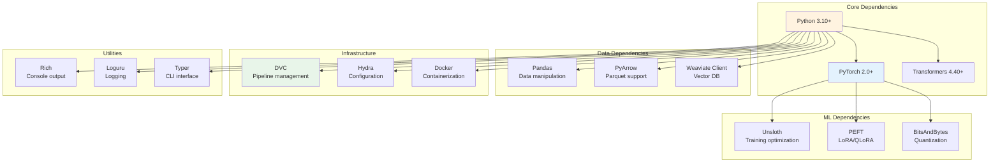
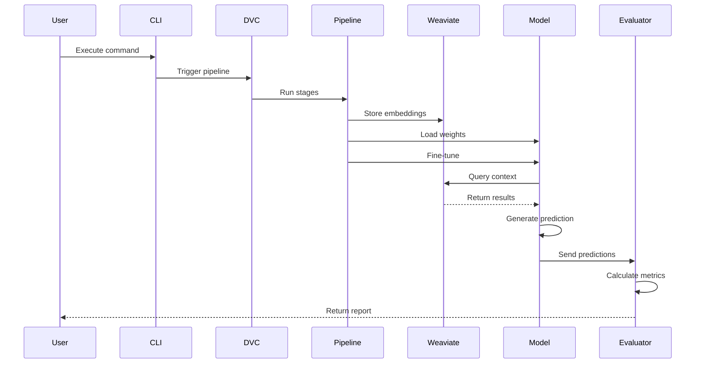

# Component Relationships and Dependencies

## Overview

This document visualizes the relationships between JuDDGES components, their dependencies, and interaction patterns. Understanding these relationships is crucial for development, debugging, and system maintenance.

## High-Level Component Architecture

## Detailed Module Dependencies

## Class Relationships

## Data Flow Dependencies

## Configuration Dependencies

## Error Propagation Paths

## Testing Dependencies

## Package Dependencies

## Communication Patterns

## Best Practices for Component Design

1. **Loose Coupling**: Components communicate through interfaces
2. **High Cohesion**: Related functionality grouped together
3. **Single Responsibility**: Each component has one clear purpose
4. **Dependency Injection**: Configuration passed at runtime
5. **Error Isolation**: Failures don't cascade unnecessarily
6. **Testability**: Components can be tested in isolation
7. **Documentation**: Clear interfaces and usage examples

## Related Documentation

- [System Architecture](./SYSTEM_ARCHITECTURE.md)
- [Data Flow Pipeline](./DATA_FLOW_PIPELINE.md)
- [DVC Pipeline](../../reference/pipelines/DVC_PIPELINE.md)
- [Development Guide](../../how-to/development/setup.md)
