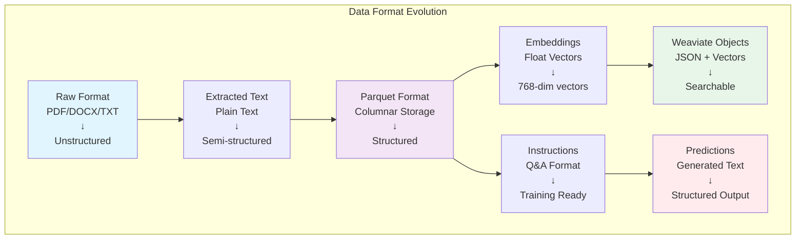
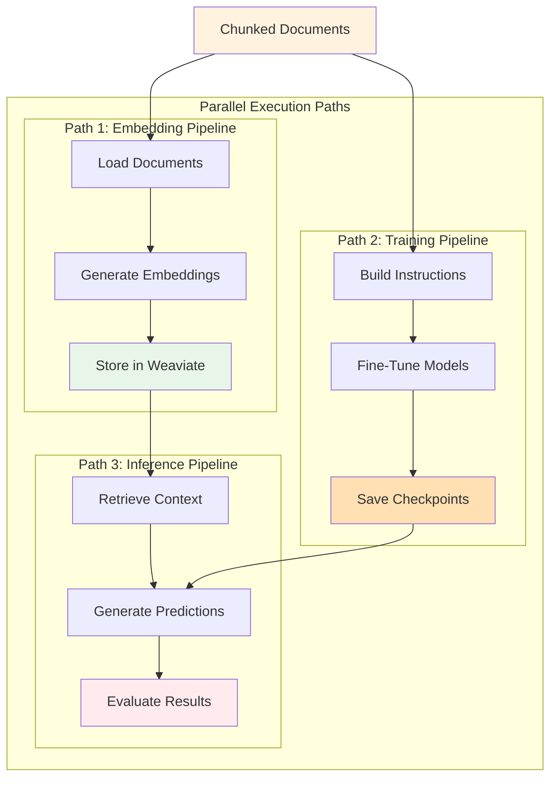
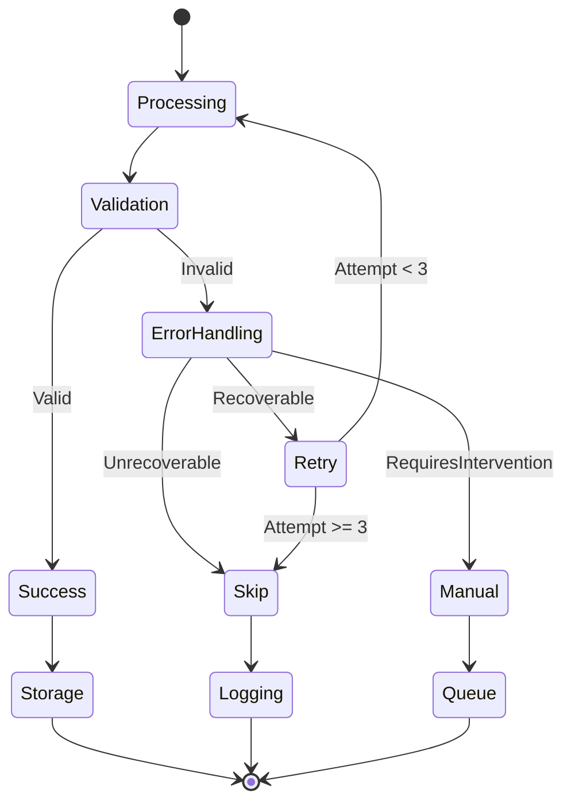

# Data Flow Pipeline Architecture

## Overview

This document visualizes the complete data transformation journey in JuDDGES, from raw legal documents to actionable insights. The pipeline follows a structured approach ensuring data quality, traceability, and reproducibility at each stage.

## Complete Data Flow Pipeline

```mermaid
graph LR
    subgraph "Stage 1: Data Ingestion"
        Raw[("📄 Raw Documents<br/>• PDF<br/>• DOCX<br/>• TXT<br/>• HTML")]
        Loader["Document Loader<br/>juddges/data/loaders/"]
        Validator["Format Validation<br/>• Schema Check<br/>• Encoding Fix"]
    end

    subgraph "Stage 2: Preprocessing"
        Parser["Text Parser<br/>• Extract Content<br/>• Remove Noise"]
        Cleaner["Text Cleaner<br/>• Normalize<br/>• Fix Encoding"]
        Chunker["Smart Chunker<br/>• Context-Aware<br/>• Size Limits"]
    end

    subgraph "Stage 3: Storage"
        ParquetRaw[("Parquet Storage<br/>data/datasets/pl/raw/<br/>data/datasets/en/raw/")]
        ParquetChunks[("Chunked Parquet<br/>• Metadata<br/>• Text Segments")]
    end

    subgraph "Stage 4: Embedding Generation"
        EmbedPrep["Embedding Prep<br/>• Tokenization<br/>• Truncation"]
        EmbedModel["mmlw-roberta-large<br/>Batch Processing"]
        EmbedAgg["Aggregation<br/>• Mean Pooling<br/>• Normalization"]
    end

    subgraph "Stage 5: Vector Storage"
        WeaviateIngest["Weaviate Ingestion<br/>• UUID Generation<br/>• Batch Upload"]
        LegalDocs[("legal_documents<br/>Collection")]
        DocChunks[("document_chunks<br/>Collection")]
    end

    subgraph "Stage 6: Instruction Dataset"
        InstBuilder["Instruction Builder<br/>• Template Application<br/>• Context Window"]
        InstDataset[("Instruction Dataset<br/>• Question-Answer<br/>• Task Format")]
    end

    subgraph "Stage 7: Model Training"
        DataLoader["Data Loader<br/>• Batching<br/>• Shuffling"]
        Tokenizer["Tokenization<br/>• Model-Specific<br/>• Padding"]
        Training["Fine-Tuning<br/>• PEFT/LoRA<br/>• Gradient Accumulation"]
        Checkpoint[("Model Checkpoints<br/>• Best Model<br/>• Intermediate")]
    end

    subgraph "Stage 8: Inference"
        InferPrep["Inference Prep<br/>• Prompt Format<br/>• Context Retrieval"]
        ModelInfer["Model Inference<br/>• Batch Prediction<br/>• Streaming"]
        PostProc["Post-Processing<br/>• Format Output<br/>• Validation"]
    end

    subgraph "Stage 9: Evaluation"
        PredOutput[("Predictions<br/>• JSON Format<br/>• Structured Data")]
        Metrics["Metrics Calculation<br/>• BLEU/ROUGE<br/>• Legal Accuracy"]
        Reports[("Evaluation Reports<br/>• Performance<br/>• Error Analysis")]
    end

    %% Flow connections
    Raw --> Loader
    Loader --> Validator
    Validator --> Parser
    Parser --> Cleaner
    Cleaner --> Chunker
    Chunker --> ParquetRaw
    Chunker --> ParquetChunks

    ParquetChunks --> EmbedPrep
    EmbedPrep --> EmbedModel
    EmbedModel --> EmbedAgg
    EmbedAgg --> WeaviateIngest
    WeaviateIngest --> LegalDocs
    WeaviateIngest --> DocChunks

    ParquetChunks --> InstBuilder
    InstBuilder --> InstDataset

    InstDataset --> DataLoader
    DataLoader --> Tokenizer
    Tokenizer --> Training
    Training --> Checkpoint

    Checkpoint --> InferPrep
    DocChunks --> InferPrep
    InferPrep --> ModelInfer
    ModelInfer --> PostProc
    PostProc --> PredOutput

    PredOutput --> Metrics
    Metrics --> Reports

    style Raw fill:#e3f2fd
    style ParquetRaw fill:#f3e5f5
    style ParquetChunks fill:#f3e5f5
    style LegalDocs fill:#e8f5e9
    style DocChunks fill:#e8f5e9
    style InstDataset fill:#fff3e0
    style Checkpoint fill:#ffe0b2
    style PredOutput fill:#ffebee
    style Reports fill:#ffebee
```



## Data Formats and Transformations

### Stage Details



## Parallel Processing Architecture



## Data Volume Flow

```mermaid
sankey-beta

"Raw Documents" 100
"Text Extraction" 95
"Valid Documents" 90
"Document Chunks" 180
"Embeddings Generated" 180
"Weaviate Storage" 180
"Instruction Dataset" 150
"Training Data" 120
"Validation Data" 30
"Model Predictions" 90
"Successful Evaluations" 85

"Raw Documents","Text Extraction"
"Text Extraction","Valid Documents"
"Valid Documents","Document Chunks"
"Document Chunks","Embeddings Generated"
"Embeddings Generated","Weaviate Storage"
"Document Chunks","Instruction Dataset"
"Instruction Dataset","Training Data"
"Instruction Dataset","Validation Data"
"Valid Documents","Model Predictions"
"Model Predictions","Successful Evaluations"
```

## Processing Metrics

| Stage | Input Format | Output Format | Processing Time | Data Volume Change |
|-------|--------------|---------------|-----------------|-------------------|
| Document Loading | PDF/DOCX/TXT | Plain Text | ~1s per doc | 1:1 |
| Chunking | Plain Text | Text Segments | ~0.5s per doc | 1:5-10 chunks |
| Embedding | Text Segments | Float Vectors | ~0.2s per chunk | 1:768 floats |
| Weaviate Ingest | Vectors + Text | Stored Objects | ~0.1s per object | 1:1 |
| Instruction Build | Chunks | Q&A Pairs | ~0.3s per pair | Variable |
| Fine-Tuning | Q&A Pairs | Model Weights | Hours | N/A |
| Inference | Context + Query | Generated Text | ~1-5s per query | Variable |
| Evaluation | Predictions | Metrics | ~0.5s per pred | Many:1 |

## Error Handling and Recovery



## Data Lineage Tracking

- **DVC Tracking**: Every pipeline run is versioned
- **UUID Consistency**: Deterministic IDs for document tracking
- **Metadata Preservation**: Original source, timestamps, processing history
- **Audit Trail**: Complete transformation log for compliance

## Performance Optimization

1. **Batch Processing**: Configurable batch sizes for each stage
2. **Parallel Execution**: `NUM_PROC` environment variable for parallelization
3. **GPU Utilization**: `CUDA_VISIBLE_DEVICES` for multi-GPU processing
4. **Memory Management**: Streaming for large documents, chunked processing
5. **Caching**: Intermediate results cached in Parquet format

## Next Steps

- [DVC Pipeline Details](../../reference/pipelines/DVC_PIPELINE.md)
- [Weaviate Schema](./WEAVIATE_INTEGRATION.md)
- [Model Training Flow](./MODEL_TRAINING_FLOW.md)
