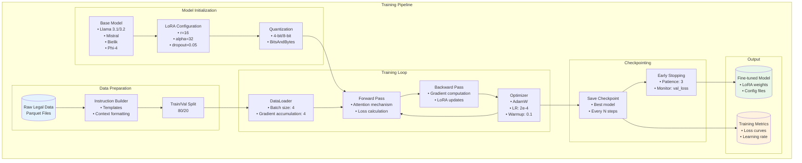
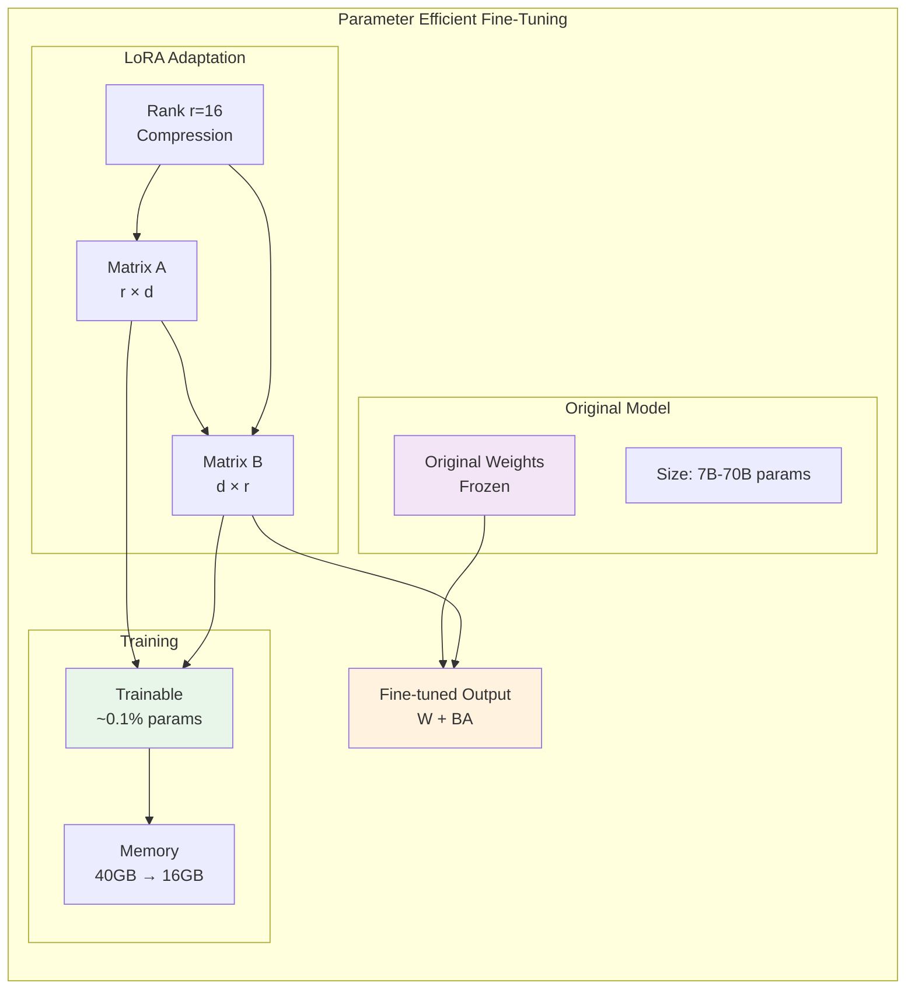
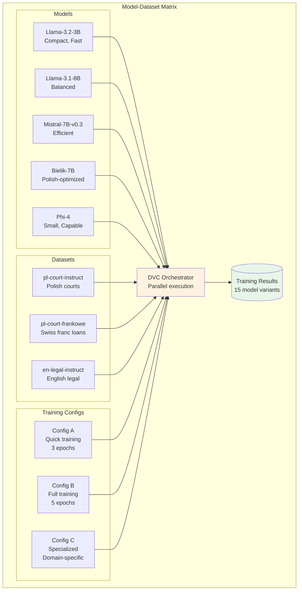
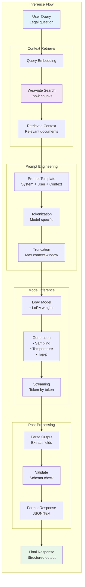
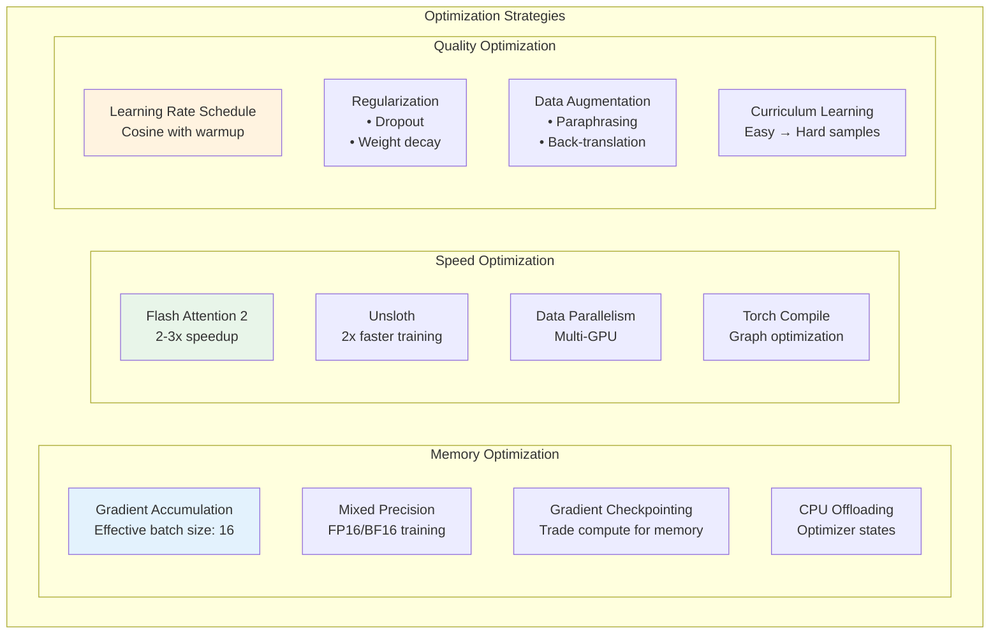
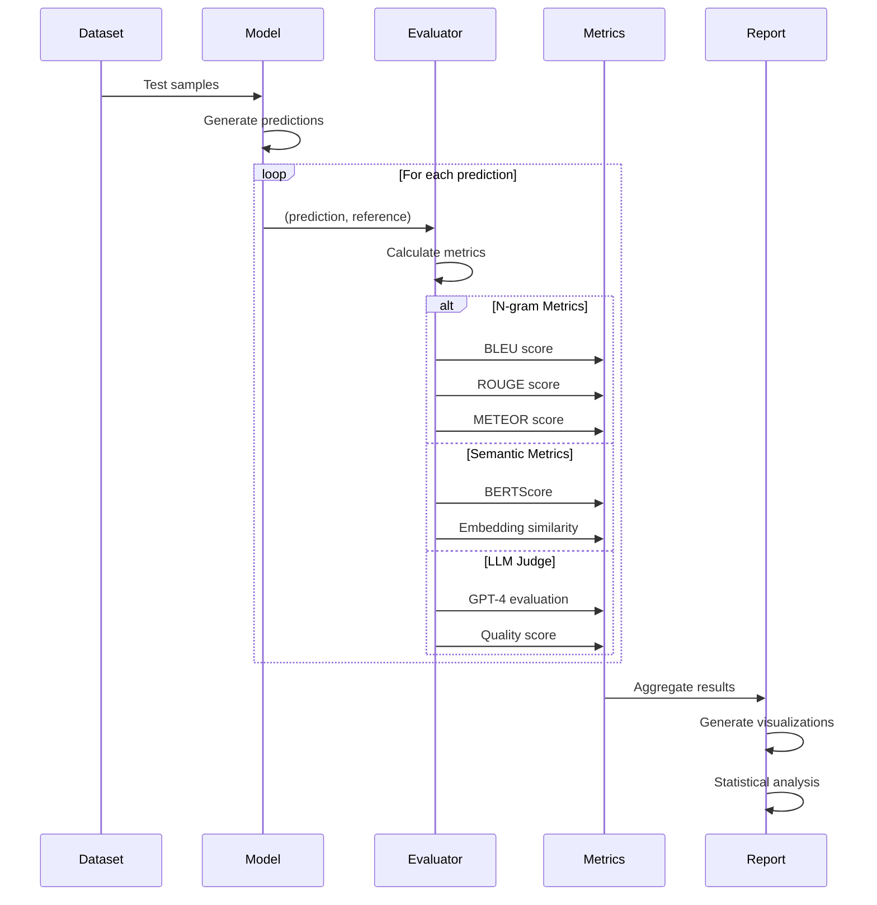
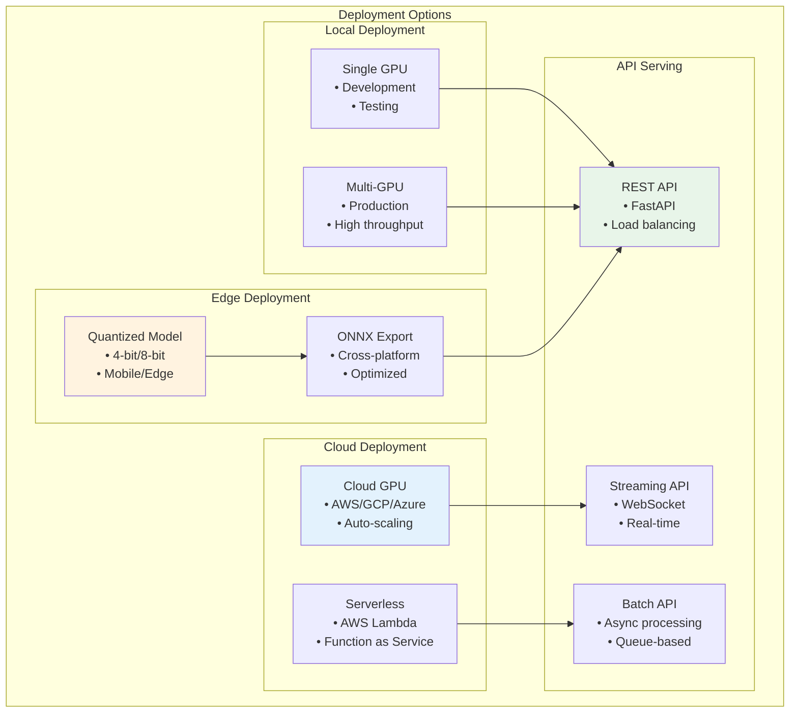
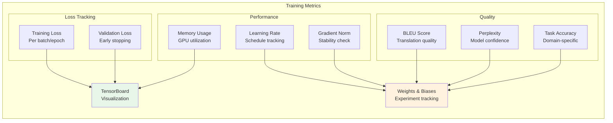
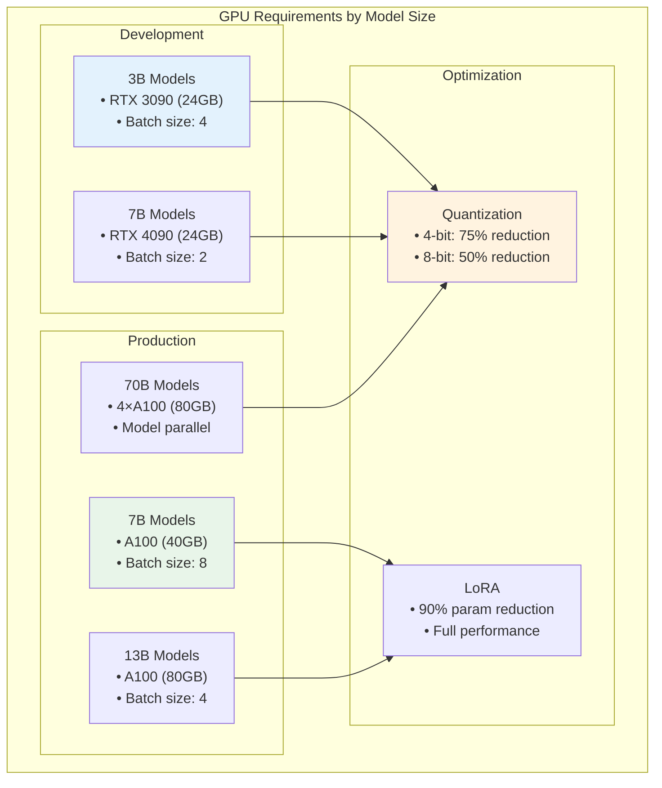

# Model Training and Inference Flow

## Overview

This document visualizes the complete model training and inference workflows in JuDDGES, including fine-tuning strategies, optimization techniques, and deployment patterns for legal document processing.

## Training Architecture

## Fine-Tuning Strategy: PEFT/LoRA

## Multi-Model Training Matrix

## Inference Pipeline

## Training Optimization Techniques

## Model Evaluation Flow

## Deployment Strategies

## Training Monitoring Dashboard

## Hardware Requirements

## Best Practices

1. **Learning Rate**: Start with 2e-4, use cosine schedule with warmup
2. **Batch Size**: Maximize GPU memory usage with gradient accumulation
3. **Evaluation**: Evaluate every 500 steps to catch overfitting early
4. **Checkpointing**: Save best model and regular checkpoints
5. **Mixed Precision**: Use FP16/BF16 for 2x memory savings
6. **Data Quality**: Clean and validate training data thoroughly
7. **Monitoring**: Track all metrics for experiment reproducibility

## Troubleshooting

| Issue | Solution |
|-------|----------|
| Out of Memory | Reduce batch size, enable gradient checkpointing |
| Slow Training | Enable Flash Attention, use Unsloth |
| Overfitting | Increase dropout, add regularization |
| Poor Quality | Check data quality, adjust learning rate |
| Unstable Training | Reduce learning rate, check gradient norms |

## Related Documentation

- [System Architecture](./SYSTEM_ARCHITECTURE.md)
- [DVC Pipeline](../../reference/pipelines/DVC_PIPELINE.md)
- [Fine-Tuning Guide](../../how-to/training/fine_tuning.md)
- [Model Configuration](../../reference/configs/model_configs.md)