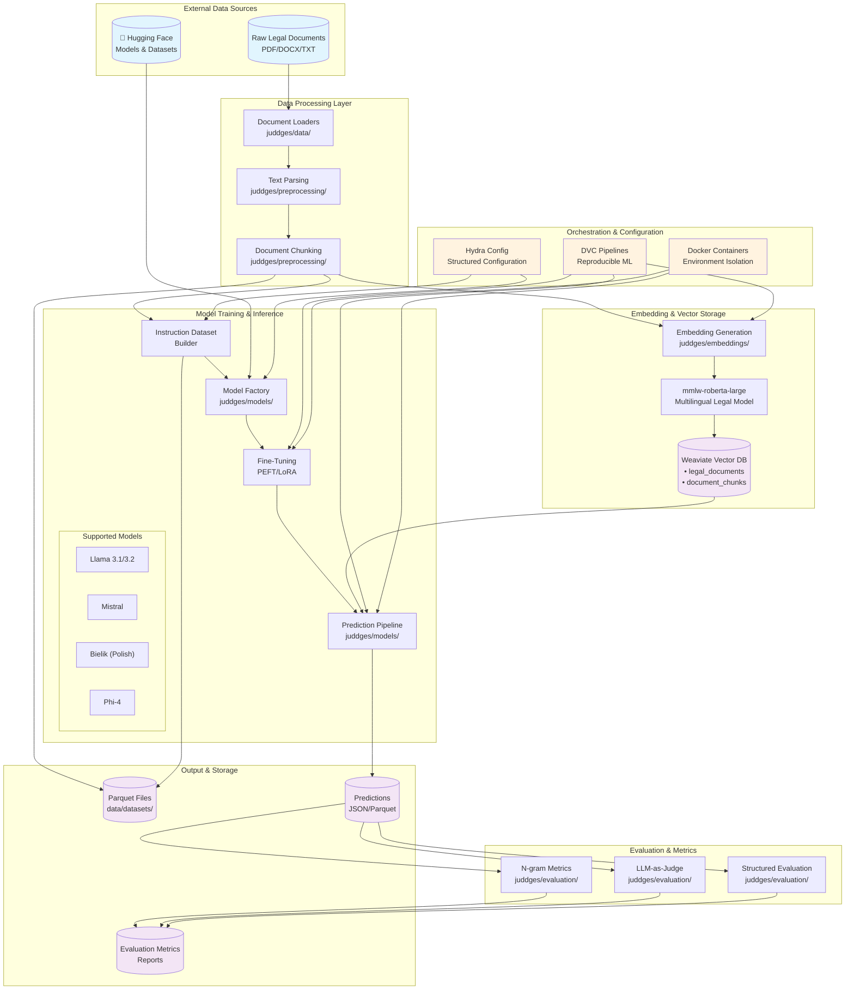

# System Architecture Overview

## Introduction

This document provides a comprehensive visual and conceptual overview of the JuDDGES system architecture. JuDDGES is a sophisticated legal AI system that processes, analyzes, and extracts information from legal documents using state-of-the-art machine learning techniques.

## High-Level System Architecture

The following diagram illustrates the overall system architecture, showing how different components interact to form a complete legal document processing pipeline.

## Component Interactions

### Data Ingestion
- **Document Loaders**: Handle multiple formats (PDF, DOCX, TXT) with specialized parsers
- **Preprocessing**: Text extraction, cleaning, and normalization for downstream processing
- **Chunking**: Intelligent document segmentation preserving legal context

### Embedding Pipeline
- **Multilingual Support**: Polish and English legal documents
- **Legal-Specific Model**: `sdadas/mmlw-roberta-large` optimized for legal text
- **Vector Storage**: Weaviate provides semantic search capabilities with two collections:
  - `legal_documents`: Complete document representations
  - `document_chunks`: Granular text segments for detailed retrieval

### Model Layer
- **Model Factory Pattern**: Flexible architecture supporting multiple LLM backends
- **Fine-Tuning**: PEFT/LoRA for efficient domain adaptation
- **Multi-Model Support**: Llama, Mistral, Bielik (Polish-specific), and Phi-4

### Evaluation Framework
- **Multi-Strategy Evaluation**: Combines traditional metrics with LLM-based judgment
- **Domain-Specific Metrics**: Legal accuracy, citation extraction, entity recognition

### Orchestration
- **DVC**: Ensures reproducible ML experiments and pipeline management
- **Hydra**: Hierarchical configuration for complex experimental setups
- **Docker**: Containerized environments for consistent execution

## Technology Stack

| Component | Technology | Purpose |
|-----------|------------|---------|
| Vector Database | Weaviate | Semantic search and document retrieval |
| Embeddings | mmlw-roberta-large | Multilingual legal text embeddings |
| LLMs | Llama, Mistral, Bielik, Phi | Text generation and extraction |
| Training | Unsloth, PEFT/LoRA | Efficient fine-tuning |
| Pipeline | DVC | Reproducible ML workflows |
| Configuration | Hydra | Structured experiment management |
| Containerization | Docker | Environment isolation |
| Storage | Parquet | Efficient data serialization |

## Scalability Considerations

1. **Horizontal Scaling**: Weaviate supports distributed deployments
2. **GPU Optimization**: Multi-GPU training with configurable batch sizes
3. **Parallel Processing**: DVC matrix for concurrent model/dataset combinations
4. **Memory Efficiency**: Quantization and LoRA for reduced memory footprint

## Security & Compliance

- **Data Isolation**: Docker containers ensure process isolation
- **Deterministic Processing**: UUID generation for consistent document handling
- **Audit Trail**: DVC tracks all pipeline executions and data lineage

## Next Steps

- [Data Flow Pipeline](./DATA_FLOW_PIPELINE.md) - Detailed data transformation journey
- [DVC Pipeline Architecture](../../reference/pipelines/DVC_PIPELINE.md) - Pipeline stage details
- [Weaviate Integration](./WEAVIATE_INTEGRATION.md) - Vector database schema and operations