# Weaviate Vector Database Integration

## Overview

Weaviate serves as the semantic search engine and vector database for JuDDGES, enabling efficient similarity search, context retrieval, and document management. This document details the integration architecture, schema design, and operational workflows.

## Integration Architecture

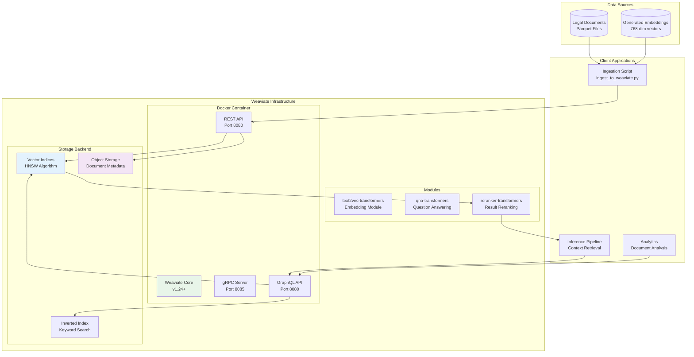

## Schema Design

### Collection: `legal_documents`

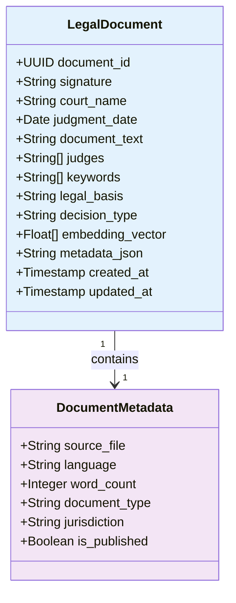

### Collection: `document_chunks`

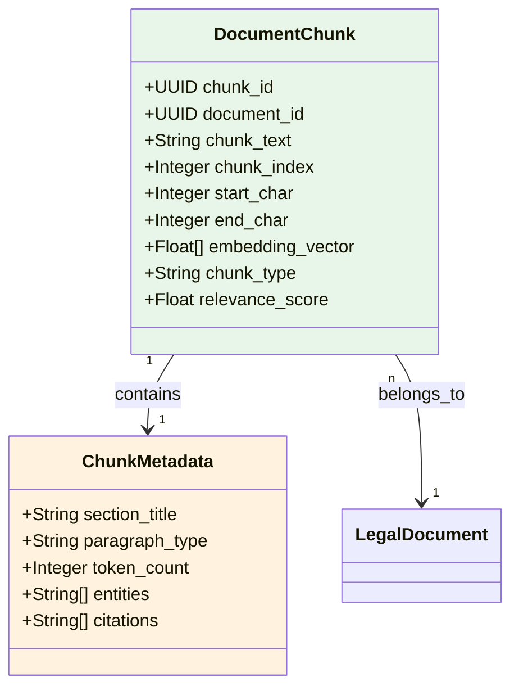

## Data Ingestion Pipeline

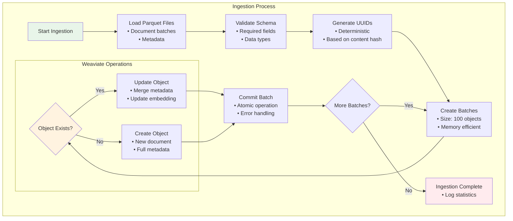

## Query Architecture

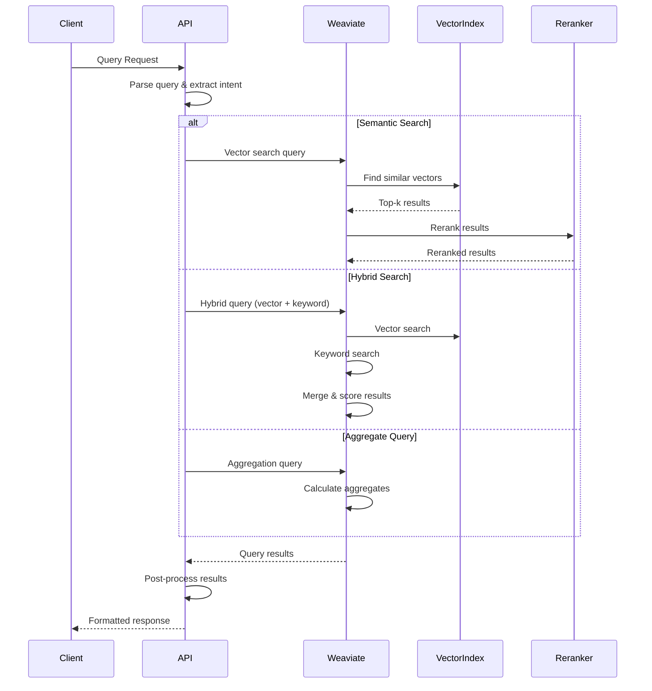

## Query Types and Patterns

### 1. Semantic Search

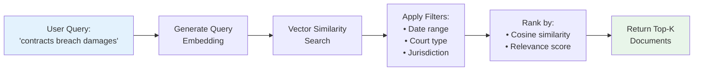

### 2. Hybrid Search

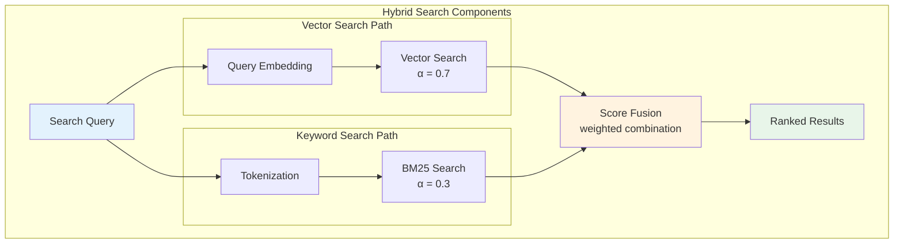

### 3. Context Retrieval for RAG

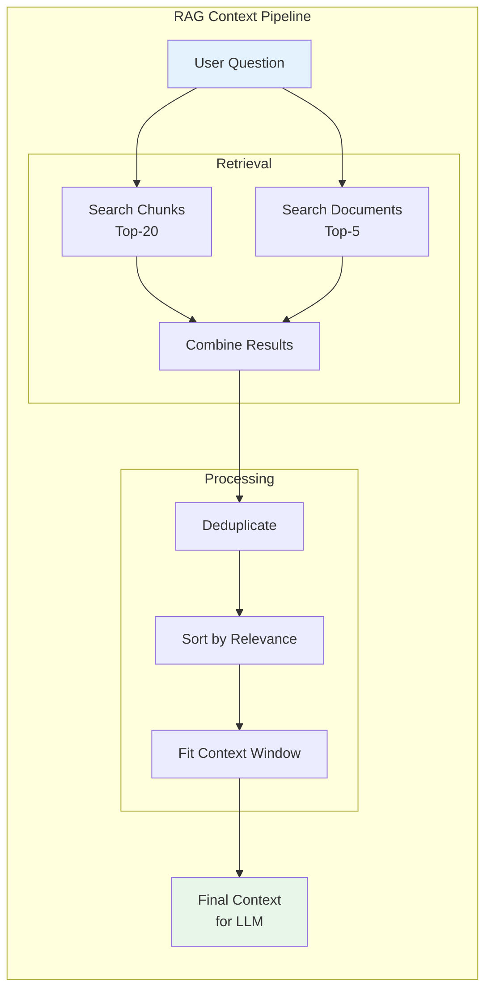

## Performance Optimization

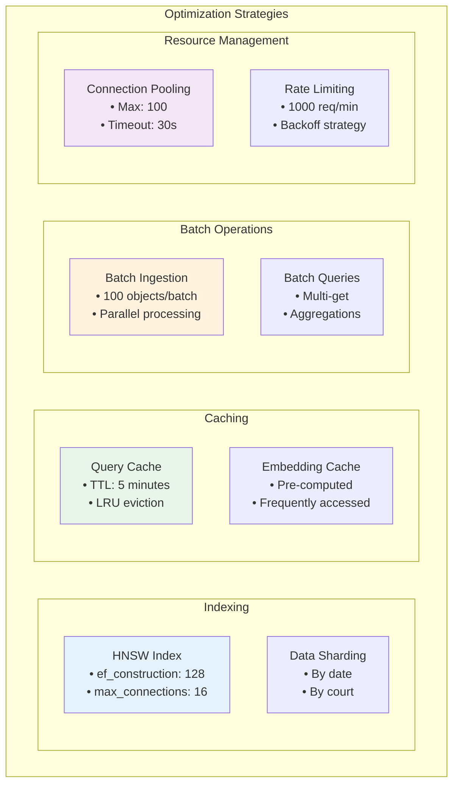

## Docker Deployment

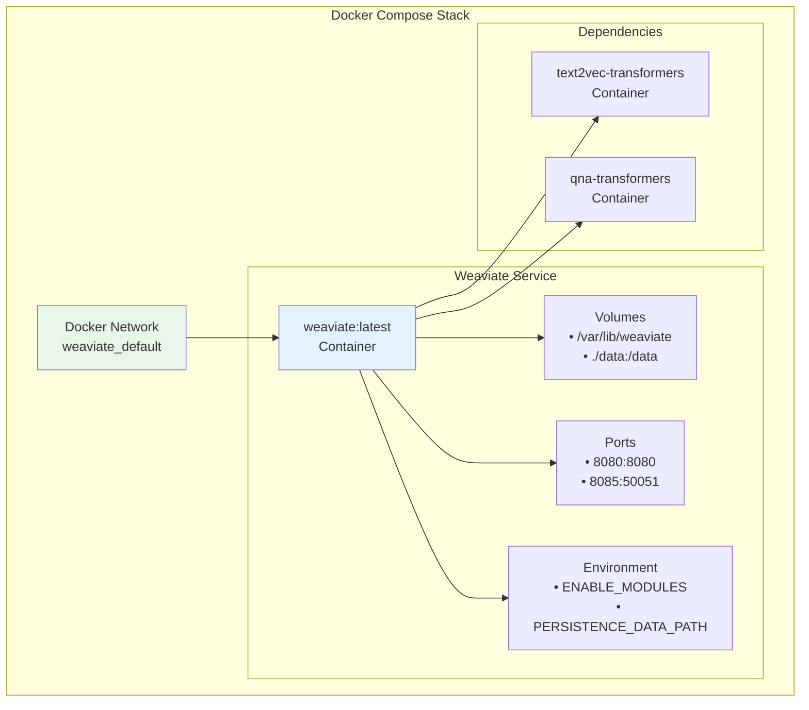

## Monitoring and Metrics

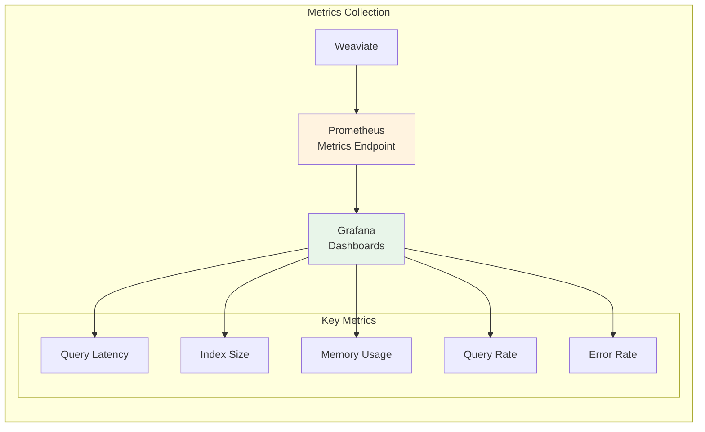

## Error Handling

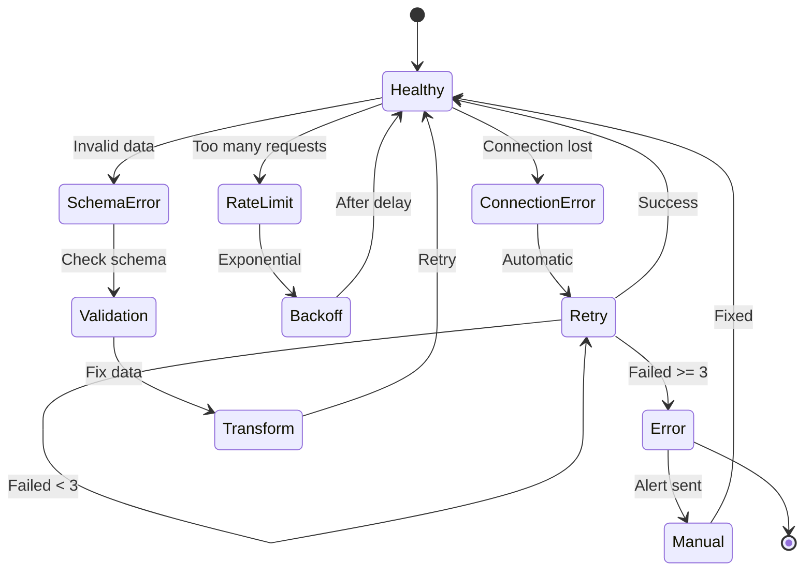

## Best Practices

1. **UUID Generation**: Use deterministic UUIDs based on document content
2. **Batch Size**: Optimal batch size is 100 objects for ingestion
3. **Connection Pooling**: Reuse connections for better performance
4. **Error Recovery**: Implement exponential backoff for transient errors
5. **Schema Evolution**: Version schemas and migrate carefully
6. **Monitoring**: Track query latency and index performance
7. **Backup**: Regular backups of Weaviate data directory

## API Examples

### Creating a Collection

```python
# Schema definition for legal_documents
schema = {
    "class": "LegalDocument",
    "properties": [
        {"name": "signature", "dataType": ["text"]},
        {"name": "court_name", "dataType": ["text"]},
        {"name": "judgment_date", "dataType": ["date"]},
        {"name": "document_text", "dataType": ["text"]},
        {"name": "judges", "dataType": ["text[]"]},
        {"name": "keywords", "dataType": ["text[]"]}
    ],
    "vectorizer": "none"  # Using pre-computed embeddings
}
```

### Querying Documents

```graphql
# GraphQL query for semantic search
{
  Get {
    LegalDocument(
      nearVector: {
        vector: [0.1, 0.2, ...]
        certainty: 0.8
      }
      limit: 10
    ) {
      signature
      court_name
      judgment_date
      _additional {
        certainty
        distance
      }
    }
  }
}
```

## Related Documentation

- [System Architecture](./SYSTEM_ARCHITECTURE.md)
- [Data Flow Pipeline](./DATA_FLOW_PIPELINE.md)
- [Embedding Generation](../../how-to/embeddings/generate_embeddings.md)
- [Weaviate Setup Guide](../../how-to/setup/weaviate_setup.md)
