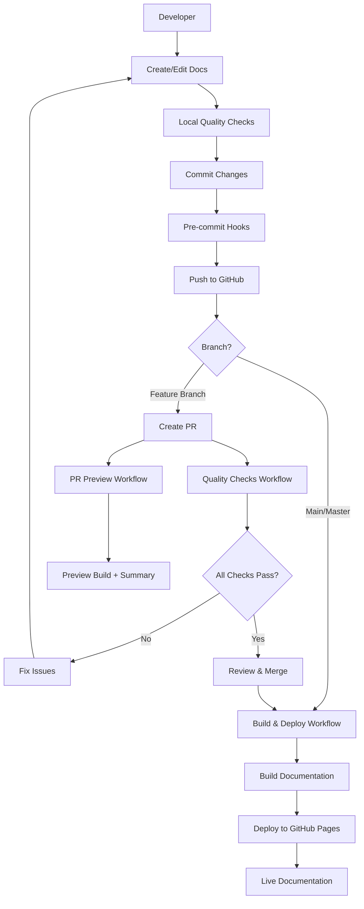

# Documentation CI/CD Setup Summary

This document provides an overview of the comprehensive documentation CI/CD system that has been set up for the JuDDGES project.

## Overview

A complete documentation automation pipeline has been implemented following 2025 best practices for docs-as-code workflows. The system ensures high-quality, up-to-date documentation that stays synchronized with the codebase through automated builds, quality checks, and deployments.

## What Was Created

### 1. GitHub Actions Workflows

Three comprehensive workflows in `.github/workflows/`:

#### docs-build-deploy.yaml

- **Purpose**: Builds and deploys documentation to GitHub Pages
- **Triggers**: Push to main/master, workflow_dispatch
- **Features**:
  - Automated MkDocs build in strict mode
  - Deployment to GitHub Pages
  - Pip and MkDocs build caching for speed
  - Full git history for better metadata

#### docs-quality-checks.yaml

- **Purpose**: Validates documentation quality on every PR and push
- **Jobs** (all run in parallel):
  - Markdown linting with markdownlint-cli2
  - Link validation with lychee
  - Spell checking with cspell
  - Python code example validation
  - Build test with strict mode
  - Navigation structure verification
  - TODO/FIXME marker detection

#### docs-pr-preview.yaml

- **Purpose**: Builds preview and generates change summary for pull requests
- **Features**:
  - Generates documentation change statistics
  - Posts summary comment on PR
  - Validates preview build
  - Reports build warnings and site size

### 2. Configuration Files

#### .markdownlint.json

Comprehensive markdown linting rules:

- ATX-style headings
- 120-character line length
- Consistent list formatting
- Fenced code blocks
- Allowed HTML elements
- Proper heading hierarchy

#### cspell.json

Spell checking configuration with:

- Custom dictionary (100+ technical terms)
- Pattern exclusions (URLs, emails, UUIDs, etc.)
- Ignore paths for build artifacts
- Case-insensitive matching
- Compound word support
- Multiple dictionaries (English, Python, software terms)

### 3. Pre-commit Hooks

Updated `.pre-commit-config.yaml` with:

- Markdown linting hook
- Spell checking hook
- Integration with existing hooks (ruff, gitleaks, nbdev)

### 4. Documentation

#### docs/how-to/documentation/CONTRIBUTING_TO_DOCS.md

Comprehensive 500+ line guide covering:

- Documentation structure (Diátaxis framework)
- Getting started instructions
- Writing guidelines
- Local development workflow
- Quality check procedures
- CI/CD pipeline explanation
- Best practices
- Troubleshooting guide

#### docs/reference/cicd/documentation-cicd.md

Technical reference documentation with:

- Workflow specifications
- Configuration file details
- Quality check implementations
- Deployment pipeline architecture
- Caching strategies
- Permissions and secrets
- Troubleshooting procedures
- Mermaid diagrams for workflows

### 5. README Updates

Enhanced `<path-to-JuDDGES>/README.md` with:

- Documentation build status badges
- Documentation quality check badges
- Direct link to live documentation
- Documentation section explaining structure
- Contributing to documentation instructions

### 6. Navigation Updates

Updated `mkdocs.yml` to include:

- How-To Guides > Documentation > Contributing to Docs
- API Reference > CI/CD > Documentation CI/CD

## Architecture Overview



## Key Features

### Automated Quality Assurance

- **Markdown Linting**: Ensures consistent formatting
- **Link Validation**: Catches broken links before deployment
- **Spell Checking**: Prevents typos while allowing technical terms
- **Code Validation**: Ensures Python examples are syntactically correct
- **Build Testing**: Strict mode catches warnings as errors

### Fast Builds with Caching

- **Pip Dependencies**: Cached based on requirements
- **MkDocs Build**: Cached per commit
- **npm Dependencies**: Cached for spell checking
- **Typical Build Times**:
  - Initial: 2-3 minutes
  - Cached: 1-2 minutes
  - Quality checks: 3-4 minutes (parallel)

### Pull Request Workflow

1. Developer creates PR with documentation changes
2. Quality checks run automatically
3. Preview build generates change summary
4. PR comment shows:
   - Files changed (new, modified, deleted)
   - Build status
   - Deployment note
5. On merge, automatic deployment to GitHub Pages

### GitHub Pages Deployment

- **URL**: <https://laugustyniak.github.io/JuDDGES/>
- **Source**: GitHub Actions (not branch-based)
- **Frequency**: On every push to main/master
- **CDN**: Automatic caching and global distribution

## Technology Stack

- **Documentation**: MkDocs with Material theme
- **API Docs**: mkdocstrings with Python handler
- **Markdown**: pymdown-extensions for enhanced features
- **Linting**: markdownlint-cli2
- **Spell Checking**: cspell
- **Link Checking**: lychee
- **Deployment**: GitHub Pages via GitHub Actions
- **Caching**: GitHub Actions cache

## Quality Standards

### Markdown Standards

- ATX-style headings only
- 120-character line length
- Fenced code blocks with language identifiers
- No trailing whitespace
- Blank lines around elements
- Consistent list formatting

### Documentation Standards

- Follow Diátaxis framework (Tutorials, How-Tos, Reference, Explanation)
- Google-style docstrings for API documentation
- Working code examples
- Cross-references to related topics
- Mermaid diagrams for architecture
- Admonitions for notes/warnings/tips

### Code Example Standards

- All Python code blocks must be syntactically valid
- Use proper syntax highlighting
- Include imports and context
- Skip validation for examples with ellipsis or placeholders

## Local Development Workflow

1. **Setup**:

   ```bash
   pip install mkdocs-material mkdocstrings[python] pymdown-extensions
   pip install -e .
   pre-commit install
   npm install -g cspell
   ```

2. **Preview**:

   ```bash
   mkdocs serve
   # Open http://localhost:8000
   ```

3. **Quality Checks**:

   ```bash
   make fix  # Format and lint
   markdownlint-cli2 "docs/**/*.md"  # Markdown lint
   cspell "docs/**/*.md"  # Spell check
   mkdocs build --strict  # Build test
   ```

4. **Commit**:

   ```bash
   git add .
   git commit -m "docs: improve extraction guide"
   # Pre-commit hooks run automatically
   ```

## CI/CD Workflow Summary

### On Pull Request

1. **Trigger**: PR created/updated with doc changes
2. **Quality Checks** (parallel):
   - Markdown linting
   - Link validation
   - Spell checking
   - Code example validation
   - Build test
3. **Preview Build**:
   - Build documentation
   - Generate change summary
   - Post PR comment

### On Merge to Main

1. **Trigger**: Push to main/master
2. **Build**:
   - Install dependencies
   - Build documentation (strict mode)
   - Upload artifact
3. **Deploy**:
   - Deploy to GitHub Pages
   - Update live site

## Configuration Reference

### Workflow Permissions

- **Build & Deploy**: `contents: read`, `pages: write`, `id-token: write`
- **Quality Checks**: Default (read-only)
- **PR Preview**: `contents: read`, `pull-requests: write`

### Environment Variables

None required - all configuration is in files.

### Secrets

- **GITHUB_TOKEN**: Automatically provided by GitHub Actions

### Repository Settings Required

1. GitHub Pages enabled
2. GitHub Actions enabled
3. Pages source: GitHub Actions
4. Workflow permissions: Read/write

## Benefits

### For Developers

- Automated quality checks catch issues early
- Local preview for immediate feedback
- Clear contribution guidelines
- Pre-commit hooks prevent bad commits

### For Maintainers

- Automated deployments reduce manual work
- Quality standards enforced consistently
- Change tracking via PR comments
- Easy rollback via git history

### For Users

- Always up-to-date documentation
- Professional appearance
- Fast, searchable interface
- Mobile-friendly design

## Monitoring and Maintenance

### Checking Status

- **Live Site**: <https://laugustyniak.github.io/JuDDGES/>
- **Build Status**: GitHub Actions tab
- **Badges**: README.md shows current status

### Updating Configuration

- **Markdown Rules**: Edit `.markdownlint.json`
- **Spell Dictionary**: Add words to `cspell.json`
- **Navigation**: Update `mkdocs.yml`
- **Workflows**: Modify `.github/workflows/*.yaml`

### Troubleshooting

Common issues and solutions documented in:

- `<path-to-JuDDGES>/docs/how-to/documentation/CONTRIBUTING_TO_DOCS.md`
- `<path-to-JuDDGES>/docs/reference/cicd/documentation-cicd.md`

## Next Steps

### Immediate Actions

1. **Enable GitHub Pages**:
   - Go to repository Settings > Pages
   - Set source to "GitHub Actions"

2. **Test Workflow**:
   - Push a documentation change to main
   - Monitor Actions tab for build

3. **Update Team**:
   - Share contributing guide with team
   - Add documentation review to PR process

### Future Enhancements

Consider adding:

- Documentation coverage metrics
- Automated changelog generation
- Multi-version documentation
- Internationalization (i18n)
- Documentation analytics
- Automated API reference updates on releases

## Resources

### Documentation

- [MkDocs Documentation](https://www.mkdocs.org/)
- [Material for MkDocs](https://squidfunk.github.io/mkdocs-material/)
- [Diátaxis Framework](https://diataxis.fr/)
- [Contributing Guide](<path-to-JuDDGES>/docs/how-to/documentation/CONTRIBUTING_TO_DOCS.md)
- [CI/CD Reference](<path-to-JuDDGES>/docs/reference/cicd/documentation-cicd.md)

### Tools

- [markdownlint](https://github.com/DavidAnson/markdownlint)
- [cspell](https://cspell.org/)
- [lychee](https://github.com/lycheeverse/lychee)
- [GitHub Actions](https://docs.github.com/en/actions)

## Summary

A complete, production-ready documentation CI/CD system has been implemented with:

- 3 automated workflows
- 2 configuration files for quality tools
- Pre-commit hooks for local validation
- Comprehensive contribution guide (500+ lines)
- Technical reference documentation (1000+ lines)
- Updated README with badges and links
- Integrated navigation in MkDocs

The system follows 2025 best practices for docs-as-code, implements the Diátaxis framework, uses aggressive caching for performance, and provides comprehensive quality assurance through automated checks.

Documentation is now ready for:

- Automated deployment on every merge
- Quality validation on every PR
- Easy contributions from team members
- Professional presentation to users
