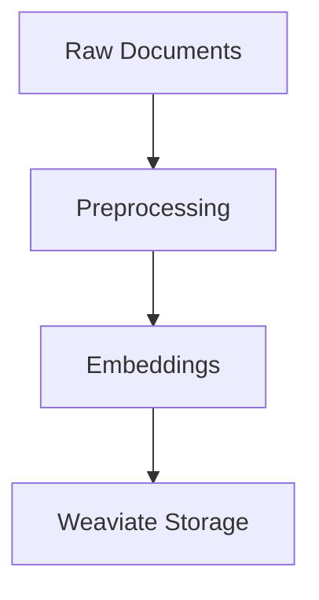

# Contributing to Documentation

This guide explains how to contribute to the JuDDGES documentation, run quality checks locally, and understand the CI/CD pipeline.

## Table of Contents

- [Overview](#overview)
- [Documentation Structure](#documentation-structure)
- [Getting Started](#getting-started)
- [Writing Documentation](#writing-documentation)
- [Local Development](#local-development)
- [Quality Checks](#quality-checks)
- [CI/CD Pipeline](#cicd-pipeline)
- [Best Practices](#best-practices)
- [Troubleshooting](#troubleshooting)

## Overview

The JuDDGES documentation follows the **Diátaxis framework**, organizing content into four distinct types:

1. **Tutorials** - Learning-oriented guides that teach through practical examples
2. **How-To Guides** - Task-oriented instructions for solving specific problems
3. **Reference** - Information-oriented API documentation and technical specifications
4. **Explanation** - Understanding-oriented discussions of concepts and architecture

## Documentation Structure

```
docs/
├── index.md                    # Homepage
├── getting-started/            # Installation and quickstart
├── tutorials/                  # Step-by-step learning guides
├── how-to/                     # Problem-solving guides
│   ├── documentation/          # Documentation contribution guides
│   ├── data_acquisition.md
│   ├── embeddings.md
│   └── extraction.md
├── reference/                  # API reference and technical specs
│   └── api/                    # Auto-generated API docs
└── explanation/                # Conceptual explanations
    ├── architecture.md
    └── research.md
```

## Getting Started

### Prerequisites

- Python 3.11+
- Git
- Node.js 20+ (for spell checking)
- Text editor with Markdown support

### Initial Setup

1. Clone the repository and set up your environment:

   ```bash
   git clone https://github.com/laugustyniak/JuDDGES.git
   cd JuDDGES
   ```

2. Install Python dependencies:

   ```bash
   # Using UV (recommended)
   uv venv .venv
   source .venv/bin/activate  # On Linux/macOS
   # .venv\Scripts\activate  # On Windows
   uv pip install -e .

   # Using Make (legacy)
   make install_cpu
   ```

3. Install MkDocs and documentation tools:

   ```bash
   pip install mkdocs-material mkdocstrings[python] pymdown-extensions
   ```

4. Install pre-commit hooks:

   ```bash
   pre-commit install
   ```

5. Install Node.js tools for spell checking:

   ```bash
   npm install -g cspell@latest
   ```

## Writing Documentation

### Markdown Guidelines

- Use ATX-style headings (`#`, `##`, `###`)
- Keep lines under 120 characters where possible
- Use fenced code blocks with language specifiers
- Add blank lines before and after headings, lists, and code blocks

### Code Examples

Always include language identifiers for syntax highlighting:

```python
from juddges.data import BaseWeaviateDatabase

# Initialize database connection
db = BaseWeaviateDatabase(
    url="http://localhost:8080",
    collection_name="legal_documents"
)
```

### Admonitions

Use admonitions for notes, warnings, and tips:

```markdown
!!! note "Important Information"
    This is a note with a custom title.

!!! warning
    This is a warning without a custom title.

!!! tip
    This is a helpful tip.
```

### Mermaid Diagrams

Include architecture and flow diagrams using Mermaid:

````markdown

````

### Cross-References

Link to other documentation pages:

```markdown
For more information, see [Data Acquisition](../data_acquisition.md).

See the [API Reference](/reference/api/data/loaders/) for detailed documentation.
```

### API Documentation

API reference documentation is auto-generated from docstrings. Ensure your code has comprehensive Google-style docstrings:

```python
def load_documents(path: str, limit: int = None) -> List[Document]:
    """Load documents from a parquet file.

    Args:
        path: Path to the parquet file.
        limit: Maximum number of documents to load. If None, load all.

    Returns:
        List of Document objects.

    Raises:
        FileNotFoundError: If the specified path does not exist.
        ValueError: If the file format is invalid.

    Example:
        ```python
        docs = load_documents("data/documents.parquet", limit=100)
        ```
    """
    pass
```

## Local Development

### Preview Documentation Locally

Start a local development server with auto-reload:

```bash
mkdocs serve
```

Then open <http://localhost:8000> in your browser. The documentation will automatically reload when you save changes.

### Build Documentation

Build the static site without serving:

```bash
mkdocs build
```

The built site will be in the `site/` directory.

### Strict Mode

Build in strict mode to catch warnings as errors:

```bash
mkdocs build --strict
```

This is the same mode used in CI/CD.

## Quality Checks

### Run All Checks Locally

Before submitting a PR, run all quality checks:

```bash
# Format and lint code (includes pre-commit hooks)
make fix

# Run markdown linting
markdownlint-cli2 "docs/**/*.md" --config .markdownlint.json

# Run spell checker
cspell --config cspell.json "docs/**/*.md" "README.md"

# Build documentation in strict mode
mkdocs build --strict

# Run tests
make test
```

### Individual Checks

#### Markdown Linting

```bash
# Check specific files
markdownlint-cli2 "docs/how-to/data_acquisition.md"

# Check all documentation
markdownlint-cli2 "docs/**/*.md"

# Auto-fix issues where possible
markdownlint-cli2 "docs/**/*.md" --fix
```

#### Spell Checking

```bash
# Check specific files
cspell docs/how-to/data_acquisition.md

# Check all documentation
cspell "docs/**/*.md"

# Add words to custom dictionary
# Edit cspell.json and add to the "words" array
```

#### Link Validation

```bash
# Build documentation first
mkdocs build

# Check links using lychee
lychee "./site/**/*.html" --exclude 'linkedin.com' --exclude 'twitter.com'
```

#### Python Code Examples

Python code blocks in documentation are automatically validated for syntax errors in CI. Test them locally:

```bash
# Run comprehensive code example tests
pytest tests/docs/test_documentation_examples.py -v

# Run standalone validator
python scripts/docs/test_code_examples.py --verbose

# Test specific file
python scripts/docs/test_code_examples.py docs/reference/api/README.md
```

**Writing Testable Examples**:

Follow these guidelines to ensure your code examples pass tests:

```python
# Good: Complete, executable example
from juddges.preprocessing.text_chunker import TextChunker

chunker = TextChunker(
    id_col="judgment_id",
    text_col="full_text",
    chunk_size=512,
    chunk_overlap=50
)

dataset = {
    "judgment_id": ["doc1"],
    "full_text": ["Sample text..."]
}

result = chunker(dataset)
```

**Skipping Examples**:

Use annotations to skip examples that can't be tested:

```python
# doctest: +SKIP
# This requires live Weaviate instance

import weaviate
client = weaviate.Client("http://production:8080")
results = client.query.get(...)
```

**Available annotations**:

- `# doctest: +SKIP` - Skip this example
- `# requires: weaviate` - Requires Weaviate (will use mock)
- `# requires: gemini` - Requires Gemini API (will use mock)
- `# demonstration-only` - Demonstration code, not executable

Each example is collected and validated by `scripts/docs/test_code_examples.py`.

### Pre-commit Hooks

Pre-commit hooks automatically run on `git commit`:

```bash
# Run hooks on all files
pre-commit run --all-files

# Run specific hook
pre-commit run markdownlint-cli2 --all-files
pre-commit run cspell --all-files
```

## CI/CD Pipeline

### Workflows Overview

The documentation CI/CD consists of three main workflows:

#### 1. Documentation Build & Deploy (`docs-build-deploy.yaml`)

- **Trigger**: Push to `main`/`master` branch
- **Actions**:
  - Builds MkDocs documentation
  - Deploys to GitHub Pages
- **Caching**: Pip dependencies and MkDocs build cache

#### 2. Documentation Quality Checks (`docs-quality-checks.yaml`)

- **Trigger**: Pull requests and pushes to `main`/`master`
- **Jobs**:
  - **Markdown Linting**: Validates markdown formatting
  - **Link Checking**: Validates internal and external links
  - **Spell Checking**: Checks spelling with custom dictionary
  - **Code Examples**: Validates Python code blocks (syntax, imports, execution)
  - **Build Test**: Tests documentation build in strict mode
- **Parallel Execution**: All jobs run in parallel for speed
- **Artifacts**: Generates `code-examples-report.json` with test results

#### 3. Documentation PR Preview (`docs-pr-preview.yaml`)

- **Trigger**: Pull requests
- **Actions**:
  - Builds documentation preview
  - Generates change summary
  - Posts comment on PR with statistics

### Workflow Behavior

#### On Pull Request

1. Quality checks run automatically
2. Build preview generates change summary
3. PR comment shows:
   - Number of files changed
   - New/modified/deleted files
   - Build status

#### On Merge to Main

1. Quality checks run (final validation)
2. Documentation builds and deploys to GitHub Pages
3. Live site updates automatically

### Viewing Workflow Status

Check workflow status in:

- PR checks section
- GitHub Actions tab: <https://github.com/laugustyniak/JuDDGES/actions>

### Workflow Caching

Workflows use caching to speed up builds:

- **Pip dependencies**: Cached based on `requirements.txt` and `pyproject.toml`
- **MkDocs build**: Cached based on commit SHA
- **npm dependencies**: Cached for spell checking

## Best Practices

### Documentation Writing

1. **Be Clear and Concise**: Use simple language and short sentences
2. **Use Active Voice**: "Install dependencies" not "Dependencies should be installed"
3. **Provide Examples**: Include working code examples for all concepts
4. **Link Strategically**: Link to related topics but avoid excessive linking
5. **Update Regularly**: Update docs when code changes

### Diátaxis Guidelines

#### Tutorials

- Start with prerequisites and objectives
- Use step-by-step numbered instructions
- Include expected output at each step
- End with what was learned and next steps

#### How-To Guides

- Start with the problem/goal
- Assume basic knowledge
- Focus on the solution, not explanation
- Include troubleshooting tips

#### Reference

- Be comprehensive and accurate
- Use consistent structure
- Include all parameters and return types
- Provide code examples

#### Explanation

- Discuss concepts and design decisions
- Explain the "why" not the "how"
- Compare alternatives
- Provide architectural context

### Version Control

1. **One Topic Per PR**: Keep documentation PRs focused
2. **Descriptive Commits**: Use clear commit messages
3. **Review Changes**: Preview locally before pushing
4. **Update Navigation**: Add new pages to `mkdocs.yml`

### Accessibility

1. **Alt Text**: Add descriptions for images
2. **Link Text**: Use meaningful link text (not "click here")
3. **Headings**: Use proper heading hierarchy
4. **Code Blocks**: Always specify language for syntax highlighting

## Troubleshooting

### Common Issues

#### MkDocs Build Fails

**Issue**: `mkdocs build` fails with missing module errors

**Solution**:

```bash
# Reinstall dependencies
pip install -e .
pip install mkdocs-material mkdocstrings[python] pymdown-extensions
```

#### Link Checker Fails

**Issue**: Lychee reports broken internal links

**Solution**:

- Ensure linked files exist in the `docs/` directory
- Check file paths are relative and correct
- Verify navigation structure in `mkdocs.yml`

#### Spell Checker False Positives

**Issue**: cspell reports valid technical terms as misspelled

**Solution**: Add terms to `cspell.json` under `"words"` array:

```json
{
  "words": [
    "YourTechnicalTerm",
    "AnotherTerm"
  ]
}
```

#### Markdown Lint Errors

**Issue**: markdownlint reports formatting errors

**Solution**:

```bash
# Auto-fix issues
markdownlint-cli2 "docs/**/*.md" --fix

# Or adjust rules in .markdownlint.json if needed
```

#### Pre-commit Hooks Fail

**Issue**: Pre-commit hooks fail on commit

**Solution**:

```bash
# Update hooks
pre-commit autoupdate

# Run manually to see detailed errors
pre-commit run --all-files
```

#### GitHub Pages Not Updating

**Issue**: Documentation doesn't update after merge

**Solution**:

1. Check GitHub Actions for build errors
2. Verify GitHub Pages is enabled in repository settings
3. Ensure workflow has correct permissions

### Getting Help

- **Documentation Issues**: Open an issue on GitHub
- **Technical Questions**: Ask in project discussions
- **CI/CD Problems**: Check GitHub Actions logs

## Additional Resources

- [MkDocs Documentation](https://www.mkdocs.org/)
- [Material for MkDocs](https://squidfunk.github.io/mkdocs-material/)
- [Diátaxis Framework](https://diataxis.fr/)
- [Google Developer Documentation Style Guide](https://developers.google.com/style)
- [Markdown Guide](https://www.markdownguide.org/)
- [Mermaid Documentation](https://mermaid.js.org/)

## Summary

Contributing to documentation:

1. Set up your local environment
2. Write clear, structured documentation following Diátaxis
3. Run quality checks locally
4. Submit a PR and review automated feedback
5. Address any issues and merge

Thank you for contributing to JuDDGES documentation!
