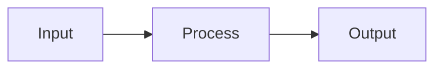

# API Documentation Generation Guide

This guide explains how to generate, maintain, and contribute to the JuDDGES API reference documentation.

## Overview

The JuDDGES API documentation is automatically generated from Python docstrings using:

- **MkDocs**: Static site generator
- **mkdocstrings**: Python documentation plugin
- **Material for MkDocs**: Modern responsive theme

This approach follows the **docs-as-code** methodology, treating documentation as part of the codebase.

## Quick Start

### Generate Documentation

```bash
# Install documentation dependencies
uv pip install mkdocs mkdocs-material mkdocstrings[python]

# Generate and serve documentation locally
mkdocs serve

# Build static site
mkdocs build

# View at http://127.0.0.1:8000
```

### Using the Script

```bash
# Regenerate all API documentation
./scripts/docs/generate_api_docs.sh

# Build and serve
./scripts/docs/generate_api_docs.sh --serve

# Build for production
./scripts/docs/generate_api_docs.sh --build
```

## Documentation Structure

### Directory Layout

```
docs/
├── reference/
│   └── api/
│       ├── index.md              # API documentation index
│       ├── core/                 # Core configuration modules
│       │   ├── config.md
│       │   ├── settings.md
│       │   └── ...
│       ├── data/                 # Data management modules
│       │   ├── index.md
│       │   ├── loaders.md
│       │   ├── judgments_weaviate_db.md
│       │   └── ...
│       ├── llm/                  # LLM modules
│       │   ├── factory.md
│       │   ├── predict.md
│       │   └── ...
│       ├── extraction/           # Extraction modules
│       │   └── gemini_chain.md
│       ├── preprocessing/        # Preprocessing modules
│       │   ├── text_chunker.md
│       │   └── ...
│       ├── evals/               # Evaluation modules
│       │   ├── metrics.md
│       │   └── ...
│       └── ...
└── ...
```

### Configuration

**mkdocs.yml** defines:

- Site metadata
- Navigation structure
- Theme configuration
- Plugin settings
- Markdown extensions

## Writing API Documentation

### Docstring Standards

Use **Google-style docstrings** throughout:

```python
def extract_information(
    text: str,
    schema: ExtractionSchema,
    temperature: float = 0.0
) -> dict[str, Any]:
    """Extract structured information from legal document.

    This function uses the Gemini API to extract structured data
    according to the provided schema. It handles caching and retries
    automatically.

    Args:
        text: Full text of the legal document to analyze
        schema: Extraction schema defining fields and types
        temperature: Sampling temperature (0.0 for deterministic)

    Returns:
        Dictionary with extracted fields matching schema definition

    Raises:
        ValueError: If text is empty or schema is invalid
        APIError: If Gemini API request fails

    Example:
        >>> schema = ExtractionSchema(
        ...     fields={"date": "ISO 8601 date", "court": "string"}
        ... )
        >>> result = extract_information("Sąd...", schema)
        >>> print(result["date"])
        '2024-01-15'

    Note:
        Results are cached in SQLite to reduce API costs.
        Temperature=0.0 ensures deterministic outputs.
    """
    # Implementation
```

### Documentation Page Template

Each module should have a markdown page:

````markdown
# Module Name

Brief description (1-2 sentences).

## Overview

Detailed description of module purpose, features, and use cases.

## Key Features

- Feature 1
- Feature 2
- Feature 3

## Usage Examples

### Basic Usage

```python
from juddges.module import Class

# Example code
instance = Class()
result = instance.method()
```

### Advanced Usage

```python
# More complex example
```

## API Reference

::: juddges.module.Class
    options:
      show_root_heading: true
      show_source: true
      heading_level: 2

## Configuration

Explain configuration options.

## Related

- [Related Module](../other/module.md)
- [How-To Guide](../../how-to/guide.md)

## Common Patterns

Show typical usage patterns.
````

### mkdocstrings Syntax

Use the `:::` directive to include API docs:

```markdown
::: juddges.data.loaders.DatasetLoader
    options:
      show_root_heading: true
      show_source: true
      heading_level: 2
      show_signature_annotations: true
      separate_signature: true
```

### Options

| Option | Description |
|--------|-------------|
| `show_root_heading` | Show class/function name as heading |
| `show_source` | Include source code |
| `heading_level` | Heading level (1-6) |
| `show_signature_annotations` | Show type annotations |
| `separate_signature` | Signature on separate line |
| `show_if_no_docstring` | Show even if no docstring |

## Adding New API Documentation

### Step 1: Write Docstrings

Add comprehensive docstrings to your Python code:

```python
class NewFeature:
    """Brief description of new feature.

    Longer description with details about purpose,
    architecture, and design decisions.

    Attributes:
        attr1: Description of attribute 1
        attr2: Description of attribute 2

    Example:
        >>> feature = NewFeature()
        >>> result = feature.process()
    """

    def process(self, data: str) -> dict:
        """Process data and return results.

        Args:
            data: Input data to process

        Returns:
            Processed results as dictionary

        Raises:
            ValueError: If data is invalid
        """
        pass
```

### Step 2: Create Documentation Page

Create `docs/reference/api/module/new_feature.md`:

```markdown
# New Feature

Description and usage examples.

## API Reference

::: juddges.module.NewFeature
    options:
      show_root_heading: true
      show_source: true
      heading_level: 2
```

### Step 3: Update Navigation

Add to `mkdocs.yml`:

```yaml
nav:
  - API Reference:
    - Module:
      - New Feature: reference/api/module/new_feature.md
```

### Step 4: Test Locally

```bash
mkdocs serve
# Visit http://127.0.0.1:8000/reference/api/module/new_feature/
```

### Step 5: Build and Deploy

```bash
mkdocs build
# Output in site/ directory
```

## Automation with CI/CD

### GitHub Actions Workflow

Create `.github/workflows/docs.yml`:

```yaml
name: Deploy Documentation

on:
  push:
    branches: [main, master]
    paths:
      - 'docs/**'
      - 'juddges/**/*.py'
      - 'mkdocs.yml'

jobs:
  deploy:
    runs-on: ubuntu-latest
    steps:
      - uses: actions/checkout@v4

      - name: Set up Python
        uses: actions/setup-python@v5
        with:
          python-version: '3.11'

      - name: Install dependencies
        run: |
          pip install mkdocs mkdocs-material mkdocstrings[python]

      - name: Build documentation
        run: mkdocs build

      - name: Deploy to GitHub Pages
        uses: peaceiris/actions-gh-pages@v3
        with:
          github_token: ${{ secrets.GITHUB_TOKEN }}
          publish_dir: ./site
```

### Pre-commit Hook

Add to `.pre-commit-config.yaml`:

```yaml
repos:
  - repo: local
    hooks:
      - id: mkdocs-build
        name: Build MkDocs
        entry: mkdocs build --strict
        language: system
        pass_filenames: false
```

## Documentation Quality Checklist

### Code Quality

- [ ] All public APIs have docstrings
- [ ] Docstrings follow Google style
- [ ] Type annotations are complete
- [ ] Examples are included
- [ ] Exceptions are documented

### Documentation Quality

- [ ] Overview section explains purpose
- [ ] Key features are listed
- [ ] Usage examples are provided
- [ ] API reference is included
- [ ] Related links are added
- [ ] Common patterns are shown

### Technical Quality

- [ ] Documentation builds without errors
- [ ] Links are valid (no 404s)
- [ ] Code examples are tested
- [ ] Navigation is logical
- [ ] Search works correctly

## Maintenance Schedule

### Regular Updates

- **Weekly**: Review new/changed modules
- **Monthly**: Update examples and patterns
- **Quarterly**: Review entire API documentation
- **Annually**: Major restructuring if needed

### Version Control

Tag documentation versions with code releases:

```bash
git tag -a v1.0.0-docs -m "Documentation for v1.0.0"
git push origin v1.0.0-docs
```

## Advanced Features

### Custom CSS

Add to `docs/stylesheets/extra.css`:

```css
/* Custom styling for API docs */
.doc-heading {
    color: #3f51b5;
}

.doc-example {
    background-color: #f5f5f5;
    padding: 1em;
    border-radius: 4px;
}
```

Include in `mkdocs.yml`:

```yaml
extra_css:
  - stylesheets/extra.css
```

### Mermaid Diagrams

Include diagrams in API docs:

````markdown

````

### Tabbed Content

Show multiple examples:

````markdown
=== "Python"

    ```python
    result = process(data)
    ```

=== "Shell"

    ```bash
    python -m juddges.process data.txt
    ```
````

## Troubleshooting

### Build Errors

**Error: Module not found**

```bash
# Ensure juddges is installed
uv pip install -e .
```

**Error: Docstring parsing failed**

```bash
# Check docstring syntax
python -m pydoc juddges.module.Class
```

### Display Issues

**Signature not showing**

```yaml
# Enable in mkdocs.yml
handlers:
  python:
    options:
      show_signature: true
```

**Source code not visible**

```yaml
options:
  show_source: true
```

## Resources

### Documentation Tools

- [MkDocs Documentation](https://www.mkdocs.org/)
- [Material for MkDocs](https://squidfunk.github.io/mkdocs-material/)
- [mkdocstrings](https://mkdocstrings.github.io/)

### Style Guides

- [Google Python Style Guide](https://google.github.io/styleguide/pyguide.html)
- [NumPy Docstring Guide](https://numpydoc.readthedocs.io/en/latest/format.html)
- [Diátaxis Framework](https://diataxis.fr/)

### JuDDGES Resources

- [Style Guide](../STYLE_GUIDE.md)
- [Contributing Guide](../../CONTRIBUTING.md)
- [API Reference](api/index.md)

## Need Help?

- **GitHub Issues**: Report documentation bugs
- **Discussions**: Ask questions about documentation
- **Email**: Contact documentation maintainers

---

**Last Updated**: 2025-10-11
**Maintainer**: JuDDGES Documentation Team
**Version**: 1.0
