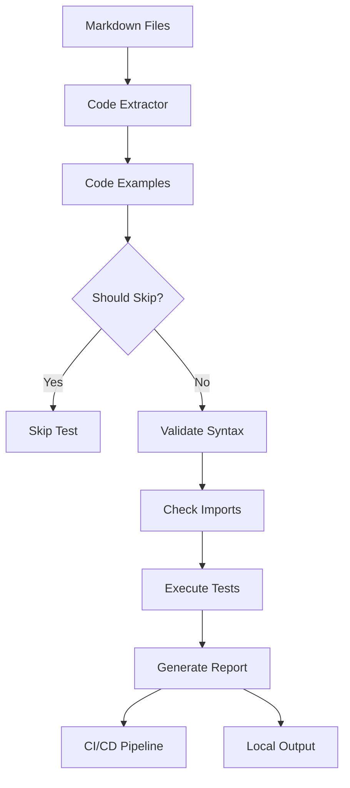

# Code Example Testing Reference

Comprehensive technical reference for the automated code example testing system in JuDDGES documentation.

## Overview

The code example testing system automatically validates all Python code blocks in markdown documentation to ensure they remain accurate and functional as the codebase evolves.

### Key Features

- **Automatic Extraction**: Scans all markdown files for Python code blocks
- **Syntax Validation**: Verifies Python syntax correctness
- **Import Checking**: Validates that imported modules exist
- **Mock Support**: Provides mocks for external services (Weaviate, Gemini API)
- **Annotation System**: Skip examples or require specific dependencies
- **CI/CD Integration**: Runs automatically on PRs and commits
- **Local Testing**: Run tests before committing

## Architecture



## Components

### 1. Configuration File (`.doctest.yaml`)

Central configuration for all code example testing behavior.

**Location**: `<path-to-JuDDGES>/.doctest.yaml`

**Key Sections**:

- `scan_paths`: Directories to scan for markdown files
- `exclude_paths`: Paths to skip
- `execution`: Timeout, parallelism, isolation settings
- `annotations`: Skip markers, requirements, output validation
- `mocks`: Mock configuration for external services
- `pytest`: Pytest integration options
- `reporting`: Report format and verbosity

### 2. Test Script (`scripts/docs/test_code_examples.py`)

Standalone script for testing code examples.

**Features**:

- Extract code blocks from markdown
- Validate syntax with AST parsing
- Generate detailed reports
- Progress tracking with rich console
- JSON report generation

**Usage**:

```bash
# Test all documentation
python scripts/docs/test_code_examples.py

# Test specific file
python scripts/docs/test_code_examples.py docs/reference/api/README.md

# Test with verbose output
python scripts/docs/test_code_examples.py --verbose

# Generate JSON report
python scripts/docs/test_code_examples.py --report report.json
```

### 3. Pytest Plugin (`tests/conftest_docs.py`)

Pytest fixtures and hooks for documentation testing.

**Features**:

- Dynamic test generation from markdown files
- Fixture providing (mock clients, sample data)
- Custom pytest markers
- Parametrized tests for each code block

**Fixtures**:

- `doctest_config`: Loads configuration
- `mock_weaviate_client`: Weaviate mock
- `mock_gemini_api`: Gemini API mock
- `sample_dataset`: Sample data for testing
- `mock_tokenizer`: Mock tokenizer

### 4. Mock Implementations (`tests/docs/fixtures.py`)

Mock classes for external dependencies.

**Available Mocks**:

- `MockWeaviateClient`: Weaviate vector database
- `MockGeminiAPI`: Google Gemini API
- `MockTokenizer`: HuggingFace tokenizer
- `MockDataset`: HuggingFace dataset

### 5. Pytest Tests (`tests/docs/test_documentation_examples.py`)

Comprehensive pytest test suite for documentation examples.

**Test Classes**:

- `TestDocumentationExamples`: Syntax, imports, undefined variables
- `TestSpecificExamples`: Concrete tests for specific examples
- `TestDocumentationCoverage`: Coverage and freshness metrics
- `TestDocumentationIntegration`: Integration tests with mocks

## Annotation System

### Skip Markers

Mark code examples to skip during testing:

```python
# doctest: +SKIP
from some_external_package import something

# This won't be tested
```

**Recognized markers**:

- `# doctest: +SKIP`
- `# doctest: SKIP`
- `# skip-test`
- `# demonstration-only`
- `# demo`

### Requirement Annotations

Specify external dependencies required for testing:

```python
# requires: weaviate
import weaviate

client = weaviate.Client("http://localhost:8080")
```

**Available requirements**:

- `# requires: weaviate` - Requires Weaviate running
- `# requires: gemini` - Requires Gemini API key
- `# requires: gpu` - Requires GPU available
- `# requires: network` - Requires network access

### Expected Output

Validate expected output from code examples:

```python
result = compute_value()
print(result)
# expected-output: 42
```

## Test Execution Flow

### Local Testing

1. **Pre-commit Hook**: Automatically runs on documentation changes

   ```bash
   # Triggered by git commit
   git add docs/reference/api/new_api.md
   git commit -m "docs: add new API documentation"
   # Hook runs automatically
   ```

2. **Manual Execution**: Run tests manually before committing

   ```bash
   # Run with pytest
   pytest tests/docs/test_documentation_examples.py -v

   # Run standalone script
   python scripts/docs/test_code_examples.py --verbose

   # Test specific file
   python scripts/docs/test_code_examples.py docs/how-to/embeddings/
   ```

### CI/CD Pipeline

Tests run automatically in GitHub Actions workflow:

**Trigger Events**:

- Pull requests touching `docs/**`
- Pushes to `master`/`main` branch
- Changes to `.doctest.yaml`

**Workflow Steps**:

1. Checkout repository
2. Setup Python 3.11
3. Install dependencies
4. Run pytest tests (non-integration)
5. Run standalone validator
6. Generate report
7. Upload artifacts

**Artifacts**:

- `code-examples-report.json`: Detailed test results

## Writing Testable Code Examples

### Best Practices

**DO**:

```python
from juddges.preprocessing.text_chunker import TextChunker

# Initialize chunker with clear parameters
chunker = TextChunker(
    id_col="judgment_id",
    text_col="full_text",
    chunk_size=512,
    chunk_overlap=50
)

# Use sample data structure
dataset = {
    "judgment_id": ["doc1", "doc2"],
    "full_text": ["Sample text...", "More text..."]
}

# Call with expected output
result = chunker(dataset)
```

**DON'T**:

```python
# Bad: Undefined variables
chunker = TextChunker(config)  # Where is config defined?

# Bad: External dependencies without skip marker
import some_external_package  # May not be installed

# Bad: Placeholder values
api_key = "YOUR_API_KEY_HERE"  # Will fail tests

# Bad: Incomplete code
def process_data():
    ...  # Not executable
```

### Complete vs. Demonstration Examples

**Complete Example** (testable):

```python
from juddges.data import BaseWeaviateDatabase

# Create client
db = BaseWeaviateDatabase(url="http://localhost:8080")

# Perform operation
result = db.list_collections()
print(result)
```

**Demonstration Example** (skip testing):

```python
# doctest: +SKIP
# This example requires live Weaviate instance with data

from juddges.data import BaseWeaviateDatabase

db = BaseWeaviateDatabase(url="http://production-db:8080")
results = db.query_complex_data(...)
```

### Using Mocks

Examples can use mocks implicitly when running tests:

```python
# This code will use MockWeaviateClient during tests
from juddges.data import BaseWeaviateDatabase

db = BaseWeaviateDatabase(url="http://localhost:8080")
# Works in tests thanks to automatic mocking
```

Or explicitly request mocking:

```python
# requires: weaviate
# This will only run if Weaviate is available or mocked

import weaviate

client = weaviate.Client("http://localhost:8080")
```

## Configuration Options

### Execution Settings

```yaml
execution:
  timeout: 30              # Max seconds per example
  max_workers: 4           # Parallel workers
  isolate: true            # Isolate in separate process
  show_output: false       # Show code output
```

### Code Block Detection

```yaml
code_blocks:
  languages:
    - python
    - python3

  demo_markers:
    - "# demonstration-only"
    - "# demo"
    - "..."

  placeholder_patterns:
    - "YOUR_.*"
    - "\\.\\.\\."
    - "<[A-Z_]+>"
```

### Mock Configuration

```yaml
mocks:
  weaviate:
    enabled: true
    mock_class: "tests.docs.fixtures.MockWeaviateClient"

  gemini:
    enabled: true
    mock_class: "tests.docs.fixtures.MockGeminiAPI"

  datasets:
    enabled: true
    use_sample_data: true
    sample_data_path: "data/sample_data/"
```

### Reporting

```yaml
reporting:
  format: text             # text, json, html
  verbosity: 1             # 0=quiet, 1=normal, 2=verbose
  show_success: false      # Show passing tests
  show_skipped: true       # Show skipped tests
  group_by_file: true      # Group results by file
```

## Pytest Integration

### Running Tests

```bash
# Run all documentation tests
pytest tests/docs/ -v

# Run with specific marker
pytest -m docs

# Skip integration tests
pytest -m "docs and not integration"

# Show test names without running
pytest --collect-only tests/docs/
```

### Custom Markers

Available pytest markers:

- `@pytest.mark.docs`: Documentation example test
- `@pytest.mark.requires_weaviate`: Requires Weaviate
- `@pytest.mark.requires_gemini`: Requires Gemini API
- `@pytest.mark.requires_gpu`: Requires GPU
- `@pytest.mark.requires_network`: Requires network
- `@pytest.mark.integration`: Integration test

### Using Fixtures

```python
def test_example_with_mocks(mock_weaviate_client, sample_dataset):
    """Test using provided fixtures."""
    # mock_weaviate_client is automatically available
    assert mock_weaviate_client.is_connected

    # sample_dataset provides test data
    assert len(sample_dataset["judgment_id"]) > 0
```

## Troubleshooting

### Common Issues

**Issue**: Tests fail with import errors

```bash
ModuleNotFoundError: No module named 'juddges'
```

**Solution**: Install package in development mode

```bash
pip install -e .
```

**Issue**: All tests are skipped

**Solution**: Check configuration and ensure code doesn't have skip markers

```bash
# Check configuration
cat .doctest.yaml

# Run with verbose output
python scripts/docs/test_code_examples.py --verbose
```

**Issue**: Pre-commit hook fails

**Solution**: Run tests manually to see detailed errors

```bash
python scripts/docs/test_code_examples.py docs/path/to/file.md
```

### Debug Mode

Enable detailed logging:

```bash
# Set log level
export LOGURU_LEVEL=DEBUG

# Run tests
python scripts/docs/test_code_examples.py --verbose
```

### Skipping Specific Tests

Temporarily skip problematic examples:

```python
# doctest: +SKIP
# TODO: Fix this example - see issue #123

from problematic_module import something
```

## Maintenance

### Adding New Mocks

1. Add mock class to `tests/docs/fixtures.py`:

```python
class MockNewService:
    """Mock for new external service."""

    def __init__(self):
        pass

    def call_api(self):
        return "mock response"
```

2. Add to configuration (`.doctest.yaml`):

```yaml
mocks:
  new_service:
    enabled: true
    mock_class: "tests.docs.fixtures.MockNewService"
```

3. Create fixture in `tests/conftest_docs.py`:

```python
@pytest.fixture
def mock_new_service():
    """Provide mock new service."""
    from tests.docs.fixtures import MockNewService
    return MockNewService()
```

### Adding New Annotations

1. Define pattern in `.doctest.yaml`:

```yaml
annotations:
  requires:
    - pattern: "# requires: custom-dependency"
      check: "check_custom_dependency"
```

2. Implement check function:

```python
def check_custom_dependency() -> bool:
    """Check if custom dependency is available."""
    try:
        import custom_dependency
        return True
    except ImportError:
        return False
```

### Updating Test Coverage

Monitor documentation coverage:

```bash
# Run coverage test
pytest tests/docs/test_documentation_examples.py::TestDocumentationCoverage -v

# Check which docs lack examples
python scripts/docs/test_code_examples.py --check-coverage
```

## Performance

### Optimization Tips

**Parallel Execution**:

```yaml
execution:
  max_workers: 8  # Increase for faster execution
```

**Selective Testing**:

```bash
# Test only changed files
python scripts/docs/test_code_examples.py docs/reference/api/new_file.md

# Use pytest with specific marker
pytest -m "docs and not slow"
```

**Caching**:

GitHub Actions automatically caches:

- Pip dependencies
- Test results (for skipped tests)

### Benchmarks

Typical execution times (67 markdown files):

- **Syntax validation**: ~5 seconds
- **Import checking**: ~10 seconds
- **Full pytest suite**: ~30 seconds
- **CI/CD pipeline**: ~2 minutes (with caching)

## API Reference

### MarkdownCodeExtractor

```python
class MarkdownCodeExtractor:
    """Extract Python code blocks from markdown files."""

    def __init__(self, config: dict):
        """Initialize extractor with configuration."""

    def extract_from_file(self, file_path: Path) -> list[CodeExample]:
        """Extract code examples from single file."""

    def extract_from_directory(self, directory: Path) -> list[CodeExample]:
        """Extract code examples from directory."""
```

### CodeExample

```python
@dataclass
class CodeExample:
    """Represents a code example from documentation."""

    file_path: Path          # Source file
    block_number: int        # Block index in file
    line_number: int         # Starting line number
    code: str                # Code content
    language: str            # Programming language
    annotations: list[str]   # Annotations/comments

    def should_skip(self, config: dict) -> tuple[bool, str]:
        """Check if example should be skipped."""

    def get_requirements(self, config: dict) -> list[str]:
        """Extract requirements from annotations."""
```

### CodeExampleValidator

```python
class CodeExampleValidator:
    """Validate Python code examples."""

    def __init__(self, config: dict):
        """Initialize validator with configuration."""

    def validate_syntax(self, example: CodeExample) -> tuple[bool, str]:
        """Validate Python syntax."""

    def validate_execution(self, example: CodeExample) -> tuple[bool, str]:
        """Validate code execution."""

    def test_example(self, example: CodeExample) -> TestResult:
        """Test a single code example."""
```

## Related Documentation

- [Contributing to Documentation](<path-to-JuDDGES>/docs/how-to/documentation/CONTRIBUTING_TO_DOCS.md)
- [Documentation Quick Start](<path-to-JuDDGES>/docs/DOCUMENTATION_QUICK_START.md)
- [Documentation CI/CD](<path-to-JuDDGES>/docs/reference/cicd/documentation-cicd.md)

## Resources

### External Tools

- [pytest](https://docs.pytest.org/): Testing framework
- [rich](https://rich.readthedocs.io/): Console output
- [loguru](https://loguru.readthedocs.io/): Logging
- [PyYAML](https://pyyaml.org/): Configuration parsing

### Best Practices

- [Google Python Style Guide](https://google.github.io/styleguide/pyguide.html)
- [Diátaxis Framework](https://diataxis.fr/)
- [Write the Docs](https://www.writethedocs.org/)

---

**Last Updated**: 2025-10-11
**Maintainer**: Documentation Team
**Status**: Active
