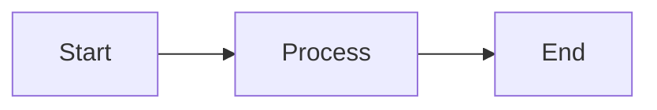

# JuDDGES Documentation Style Guide

This guide ensures consistency across all JuDDGES documentation.

## Document Structure

### Standard Header

Every document must start with:

```markdown
# Document Title

Brief one-paragraph description of what this document covers.

## Table of Contents

- [Section 1](#section-1)
- [Section 2](#section-2)
- [Section 3](#section-3)

---
```

### Standard Footer

Every document must end with:

```markdown
---

## Related Documentation

- [Related Doc 1](link1.md)
- [Related Doc 2](link2.md)

## Support

For questions or issues, see [Getting Help](GETTING_STARTED.md#getting-help)

---

**Last Updated**: YYYY-MM-DD | **Version**: X.Y | **Status**: Draft/Review/Published
```

## Naming Conventions

### File Names

- **How-to guides**: `how-to-{action}.md` (e.g., `how-to-deploy.md`)
- **Tutorials**: `tutorial-{topic}.md` (e.g., `tutorial-extraction.md`)
- **Reference**: `ref-{component}.md` (e.g., `ref-api.md`)
- **Explanation**: `explanation-{concept}.md` (e.g., `explanation-architecture.md`)
- **Major documents**: `UPPERCASE.md` (e.g., `README.md`, `GETTING_STARTED.md`)

### Headings

```markdown
# Document Title (H1 - one per document)
## Major Section (H2)
### Subsection (H3)
#### Minor Point (H4 - avoid if possible)
```

## Code Examples

### Python Code

```python
# Always include imports
from juddges.extraction import GeminiExtractionChain

# Add descriptive comments
def example_function():
    """Include docstrings for functions."""
    # Implementation here
    pass

# Show expected output
print(result)
# Output: {'key': 'value'}
```

### Shell Commands

```bash
# Include the prompt character
$ command --option value

# Show expected output
Output line 1
Output line 2

# Use comments to explain
$ docker compose up -d  # Start services in background
```

### Configuration Files

```yaml
# filename.yaml
# Always indicate the filename
key: value
nested:
  key: value
```

## Formatting Guidelines

### Lists

**Unordered Lists**:

- Use `-` for all unordered lists
- Maintain consistent indentation (2 spaces)
- End items with proper punctuation

**Ordered Lists**:

1. Use `1.` for all items (auto-numbering)
2. Include clear action verbs
3. End with periods for complete sentences

### Tables

```markdown
| Column 1 | Column 2 | Column 3 |
|----------|----------|----------|
| Data     | Data     | Data     |
| Data     | Data     | Data     |
```

- Always include header separator
- Align columns for readability
- Keep tables simple (consider lists for complex data)

### Links

**Internal Links**:

```markdown
[Link Text](relative/path/to/file.md)
[Section Link](#section-heading)
```

**External Links**:

```markdown
[Link Text](https://example.com)
```

**Reference Style** (for repeated links):

```markdown
[Link Text][ref]
[ref]: https://example.com
```

### Emphasis

- **Bold** for important terms: `**term**`
- _Italic_ for emphasis: `*emphasis*`
- `Code` for inline code: `` `code` ``
- Avoid CAPS except for acronyms

## Content Guidelines

### Language

- **Active voice**: "The system processes..." not "Documents are processed by..."
- **Present tense**: "The API returns..." not "The API will return..."
- **Second person**: "You can..." not "Users can..." or "One can..."
- **Simple language**: Avoid jargon unless necessary
- **Consistent terminology**: Use the same term throughout

### Diátaxis Classification

Each document should clearly belong to one category:

**Tutorials** (Learning-oriented):

- Start with learning goals
- Step-by-step instructions
- Include exercises
- End with achievements

**How-To Guides** (Task-oriented):

- Start with the problem
- Provide solution steps
- Include troubleshooting
- Link to related tasks

**Reference** (Information-oriented):

- Start with overview
- Organize alphabetically or logically
- Include all parameters/options
- Provide examples

**Explanation** (Understanding-oriented):

- Start with context
- Explain concepts
- Compare alternatives
- Discuss trade-offs

## Special Elements

### Admonitions

```markdown
> **Note**: Important information

> **Warning**: Potential issues

> **Tip**: Helpful suggestions

> **Important**: Critical information
```

### Diagrams

Use Mermaid for diagrams:



### Status Indicators

For work in progress:

```markdown
> **Status**: 🚧 Work in Progress
> **Status**: ✅ Complete
> **Status**: 📝 Under Review
> **Status**: ⚠️ Deprecated
```

## Version Control

### Document Metadata

Include at the top of technical documents:

```markdown
---
title: Document Title
description: Brief description
category: tutorial|how-to|reference|explanation
tags: [tag1, tag2, tag3]
author: Name
date: YYYY-MM-DD
version: 1.0
---
```

### Change Tracking

For significant updates:

```markdown
## Changelog

### Version 1.1 (2025-10-15)
- Added new section on X
- Updated code examples
- Fixed typos

### Version 1.0 (2025-10-01)
- Initial release
```

## Quality Checklist

Before publishing, ensure:

- [ ] **Accuracy**: Information is correct and up-to-date
- [ ] **Completeness**: All necessary information included
- [ ] **Clarity**: Language is clear and simple
- [ ] **Consistency**: Follows style guide
- [ ] **Code Testing**: All code examples work
- [ ] **Links**: All links are valid
- [ ] **Formatting**: Proper markdown formatting
- [ ] **Cross-references**: Related docs are linked
- [ ] **Metadata**: Version and date updated
- [ ] **Review**: Peer-reviewed by team member

## Common Terms

Use these terms consistently:

| Term | Usage | Not |
|------|-------|-----|
| JuDDGES | The project name | Juddges, JUDDGES |
| Weaviate | Vector database | weaviate |
| Gemini | Google's model | gemini |
| Fine-tuning | Model training | Finetuning, fine tuning |
| How-to | Guide type | How to, HowTo |
| Dataset | Data collection | Data set |
| LLM | Large Language Model | llm, Llm |
| API | Application Programming Interface | api, Api |

## Examples

### Good Tutorial Title

```markdown
# Tutorial: Extract Information from Polish Court Decisions
```

### Good How-To Title

```markdown
# How to Deploy JuDDGES to Production
```

### Good Reference Title

```markdown
# API Reference: Extraction Module
```

### Good Explanation Title

```markdown
# Understanding Vector Embeddings in Legal Search
```

## Review Process

1. **Self-review**: Use the quality checklist
2. **Peer review**: Have colleague review
3. **Technical review**: Verify code and commands
4. **Final check**: Update metadata and publish

---

## Related Documentation

- [Contributing Guidelines](CONTRIBUTING.md)
- [README Template](templates/README_TEMPLATE.md)
- [Getting Started](GETTING_STARTED.md)

## Support

For documentation questions, create an issue on [GitHub](https://github.com/pwr-ai/JuDDGES/issues) or contact: lukasz.augustyniak@pwr.edu.pl

---

**Last Updated**: 2025-10-11 | **Version**: 1.0 | **Status**: Published
