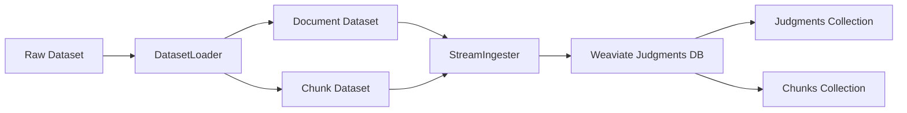
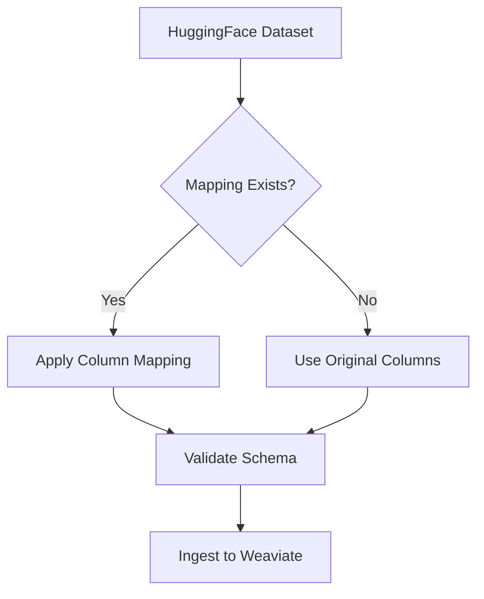

# Data Management API

Comprehensive data management modules for loading, transforming, and storing legal documents in Weaviate.

## Overview

The `juddges.data` package provides a complete data management layer including:

- **Dataset Loading**: Load and prepare datasets for ingestion
- **Weaviate Operations**: Database connections and operations
- **Schema Definitions**: Legal document schemas for vector database
- **Stream Ingestion**: Production-grade streaming ingestion pipeline
- **Column Mapping**: Flexible dataset-to-schema mapping

## Core Modules

### [Data Loaders](loaders.md)
**Module**: `juddges.data.loaders`

Load datasets with automatic column remapping for Weaviate ingestion.

**Key Classes**:
- `DatasetLoader` - Load chunk and document datasets

**Key Features**:
- HuggingFace Datasets integration
- Automatic column mapping
- Polars-based efficient processing
- Multi-dataset support

**Common Use Cases**:
```python
from juddges.data.loaders import DatasetLoader

loader = DatasetLoader(config)
doc_dataset = loader.load_document_dataset()
chunk_dataset = loader.load_chunk_dataset()
```

---

### [Base Weaviate Database](base_weaviate_db.md)
**Module**: `juddges.data.base_weaviate_db`

Base class for all Weaviate database operations with connection management and batch operations.

**Key Classes**:
- `WeaviateDatabase` - Base database class with common operations

**Key Features**:
- Connection pooling
- Collection management
- Batch operations
- Error handling

**Common Use Cases**:
```python
from juddges.data.base_weaviate_db import WeaviateDatabase

db = WeaviateDatabase(url="http://localhost:8080")
collection = db.client.collections.get("collection_name")
```

---

### [Judgments Database](judgments_weaviate_db.md)
**Module**: `juddges.data.judgments_weaviate_db`

Specialized Weaviate database for court judgment storage and retrieval.

**Key Classes**:
- `WeaviateJudgmentsDatabase` - Judgment-specific database operations

**Key Features**:
- 50+ field legal judgment schema
- UMAP coordinate support
- Chunk and document collections
- Cross-references between collections

**Common Use Cases**:
```python
from juddges.data.judgments_weaviate_db import WeaviateJudgmentsDatabase

db = WeaviateJudgmentsDatabase(url="http://localhost:8080")
judgments = db.judgments_collection
chunks = db.judgment_chunks_collection
```

---

### [Documents Database](documents_weaviate_db.md)
**Module**: `juddges.data.documents_weaviate_db`

Generic document database for non-judgment documents.

**Key Classes**:
- `WeaviateDocumentsDatabase` - Generic document operations

**Key Features**:
- Flexible schema
- Generic document storage
- Embedding support

---

### [Stream Ingester](stream_ingester.md)
**Module**: `juddges.data.stream_ingester`

Production-grade streaming ingestion pipeline with error handling and progress tracking.

**Key Classes**:
- `StreamIngester` - Batch streaming with retry logic

**Key Features**:
- Memory-efficient streaming
- Automatic batching
- Error recovery
- Progress tracking
- Configurable batch sizes

**Common Use Cases**:
```python
from juddges.data.stream_ingester import StreamIngester

ingester = StreamIngester(
    db=db,
    batch_size=100,
    max_retries=3
)
ingester.ingest_stream(dataset)
```

---

### [Dataset Factory](dataset_factory.md)
**Module**: `juddges.data.dataset_factory`

Factory for creating and managing datasets with different configurations.

**Key Classes**:
- `DatasetFactory` - Create datasets from configurations

---

### [Dataset Mapper](dataset_mapper.md)
**Module**: `juddges.data.dataset_mapper`

Utilities for mapping between different dataset schemas.

**Key Functions**:
- Column remapping functions
- Schema validators

---

### [Schemas](schemas.md)
**Module**: `juddges.data.schemas`

Pydantic models for data validation and schema definitions.

**Key Classes**:
- Schema definitions for legal documents
- Validation models

---

### [Utils](utils.md)
**Module**: `juddges.data.utils`

Utility functions for data processing.

**Key Functions**:
- Date parsing
- Field extraction
- Data cleaning

## Quick Start

### Loading and Ingesting Data

```python
from juddges.config import EmbeddingConfig
from juddges.data.loaders import DatasetLoader
from juddges.data.judgments_weaviate_db import WeaviateJudgmentsDatabase
from juddges.data.stream_ingester import StreamIngester

# 1. Configure
config = EmbeddingConfig(
    dataset_name="juddges/pl-court-raw",
    agg_embeddings_dir="data/embeddings/agg",
    chunk_embeddings_dir="data/embeddings/chunks"
)

# 2. Load datasets
loader = DatasetLoader(config)
doc_dataset = loader.load_document_dataset()
chunk_dataset = loader.load_chunk_dataset()

# 3. Connect to Weaviate
db = WeaviateJudgmentsDatabase(url="http://localhost:8080")

# 4. Ingest with streaming
ingester = StreamIngester(db=db, batch_size=100)
ingester.ingest_documents(doc_dataset)
ingester.ingest_chunks(chunk_dataset)
```

### Querying Judgments

```python
from juddges.data.judgments_weaviate_db import WeaviateJudgmentsDatabase

# Connect
db = WeaviateJudgmentsDatabase(url="http://localhost:8080")

# Semantic search
results = db.judgments_collection.query.near_text(
    query="Swiss franc loan conversion",
    limit=10
)

# Filter by date range
filtered = db.judgments_collection.query.fetch_objects(
    filters={
        "judgment_date": {
            "operator": "GreaterThanEqual",
            "valueDate": "2020-01-01"
        }
    },
    limit=100
)
```

## Data Flow



## Architecture

### Collection Structure

```
Weaviate Instance
├── judgments
│   ├── Properties (50+ fields)
│   ├── Embeddings (document-level)
│   └── UMAP coordinates (x, y)
└── judgment_chunks
    ├── Properties (chunk metadata)
    ├── Embeddings (chunk-level)
    ├── UMAP coordinates (x, y)
    └── References → judgments
```

### Dataset Mapping Flow



## Related Documentation

### Tutorials
- [Getting Started](../../../tutorials/GETTING_STARTED.md) - Complete setup guide
- [Gemini Extraction](../../../tutorials/GEMINI_EXTRACTION.md) - Extract structured data

### How-To Guides
- [Embed and Ingest](../../../how-to/embeddings/embeddings_embed_and_ingest_weaviate.md) - Complete workflow
- [Deploy Weaviate](../../../how-to/embeddings/embeddings_deploy_weaviate.md) - Database setup
- [Universal Ingestion](../../../how-to/embeddings/UNIVERSAL_INGESTION.md) - Flexible ingestion

### Reference
- [Schema Mapping](../../schemas/DOCUMENT_SCHEMA_MAPPING.md) - Field definitions
- [Dataset-Weaviate Mapping](../../schemas/dataset_weaviate_mapping.md) - Column mappings

## Common Patterns

### Adding New Dataset

```python
# 1. Add column mapping in loaders.py
DATASET_COLUMN_MAPPINGS["your/dataset"] = {
    "judgment_id": "doc_id",
    "full_text": "content",
    # ... more mappings
}

# 2. Load dataset
loader = DatasetLoader(config)
dataset = loader.load_document_dataset()

# 3. Ingest
ingester = StreamIngester(db=db)
ingester.ingest_documents(dataset)
```

### Custom Collection Schema

```python
import weaviate.classes.config as wvcc
from juddges.data.base_weaviate_db import WeaviateDatabase

class CustomDatabase(WeaviateDatabase):
    async def async_create_collections(self):
        await self.async_safe_create_collection(
            name="custom_collection",
            properties=[
                wvcc.Property(
                    name="custom_field",
                    data_type=wvcc.DataType.TEXT,
                    index_searchable=True
                ),
                # ... more properties
            ],
            vectorizer_config=wvcc.Configure.Vectorizer.text2vec_transformers()
        )
```

## Performance Tips

### Batch Size Optimization

```python
# Small documents (< 1KB)
ingester = StreamIngester(db=db, batch_size=500)

# Medium documents (1-10KB)
ingester = StreamIngester(db=db, batch_size=100)

# Large documents (> 10KB)
ingester = StreamIngester(db=db, batch_size=50)
```

### Memory Management

```python
# Stream large datasets
ds = load_dataset("large-dataset", streaming=True)

for batch in ds.iter(batch_size=100):
    ingester.ingest_batch(batch)
```

## Troubleshooting

### Connection Issues

```python
# Test connection
from juddges.data.judgments_weaviate_db import WeaviateJudgmentsDatabase

try:
    db = WeaviateJudgmentsDatabase(url="http://localhost:8080")
    print("✓ Connected to Weaviate")
except Exception as e:
    print(f"✗ Connection failed: {e}")
```

### Schema Mismatches

```python
# Validate dataset columns
expected_columns = set(DATASET_COLUMN_MAPPINGS["your/dataset"].keys())
actual_columns = set(dataset.column_names)

missing = expected_columns - actual_columns
print(f"Missing columns: {missing}")
```

### Ingestion Errors

```python
# Enable detailed logging
from loguru import logger

logger.add("ingestion.log", level="DEBUG")

ingester = StreamIngester(
    db=db,
    batch_size=10,  # Smaller batches for debugging
    max_retries=3
)
```

---

**See Also**:
- [LLM API](../llm/index.md) - Model loading and inference
- [Extraction API](../extraction/gemini_chain.md) - Information extraction
- [Evaluation API](../evals/index.md) - Evaluation metrics
