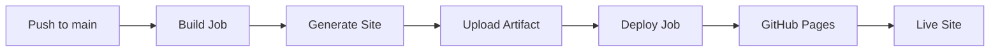

# Documentation CI/CD Reference

This document provides comprehensive reference information about the automated documentation build, deployment, and quality assurance system for the JuDDGES project.

## Table of Contents

- [Overview](#overview)
- [GitHub Actions Workflows](#github-actions-workflows)
- [Configuration Files](#configuration-files)
- [Quality Checks](#quality-checks)
- [Deployment Pipeline](#deployment-pipeline)
- [Caching Strategy](#caching-strategy)
- [Permissions and Secrets](#permissions-and-secrets)
- [Troubleshooting](#troubleshooting)

## Overview

The JuDDGES documentation CI/CD system is designed to ensure high-quality, up-to-date documentation that stays synchronized with the codebase. It implements a comprehensive automation pipeline that:

- Automatically builds and deploys documentation to GitHub Pages
- Validates documentation quality on every pull request
- Checks for broken links, spelling errors, and markdown formatting issues
- Validates Python code examples for syntax correctness
- Provides preview builds for pull requests
- Uses aggressive caching to minimize build times

## GitHub Actions Workflows

### 1. Documentation Build & Deploy

**File**: `.github/workflows/docs-build-deploy.yaml`

**Purpose**: Builds and deploys documentation to GitHub Pages on main/master branch pushes.

#### Triggers

```yaml
on:
  push:
    branches: [master, main]
    paths:
      - 'docs/**'
      - 'mkdocs.yml'
      - 'juddges/**/*.py'
  workflow_dispatch:
```

#### Workflow Jobs

##### Build Job

```yaml
jobs:
  build:
    runs-on: ubuntu-latest
    steps:
      - Checkout repository (fetch-depth: 0 for full history)
      - Setup Python 3.11
      - Cache pip dependencies
      - Cache MkDocs build
      - Install dependencies (MkDocs, project)
      - Build documentation (strict mode)
      - Upload artifact for deployment
```

**Key Features**:

- **Strict Mode**: Builds fail on warnings to catch issues early
- **Full Git History**: Enables better git info in docs
- **Dependency Caching**: Speeds up builds by caching pip packages
- **Build Caching**: Caches MkDocs intermediate files

##### Deploy Job

```yaml
jobs:
  deploy:
    needs: build
    environment:
      name: github-pages
      url: ${{ steps.deployment.outputs.page_url }}
    steps:
      - Deploy to GitHub Pages
```

**Key Features**:

- Only runs after successful build
- Uses GitHub Pages deployment action
- Automatically updates live site

#### Performance

- **Initial Build**: ~2-3 minutes
- **Cached Build**: ~1-2 minutes
- **Deployment**: ~30 seconds

### 2. Documentation Quality Checks

**File**: `.github/workflows/docs-quality-checks.yaml`

**Purpose**: Validates documentation quality on pull requests and main branch pushes.

#### Triggers

```yaml
on:
  pull_request:
    paths:
      - 'docs/**'
      - 'mkdocs.yml'
      - '.markdownlint.json'
      - 'cspell.json'
  push:
    branches: [master, main]
```

#### Workflow Jobs (Parallel Execution)

##### 1. Markdown Linting

```yaml
markdown-lint:
  runs-on: ubuntu-latest
  steps:
    - Checkout repository
    - Run markdownlint-cli2
```

**Checks**:

- Heading hierarchy
- Line length (120 characters)
- Code block fencing
- List formatting
- Trailing whitespace

**Configuration**: `.markdownlint.json`

##### 2. Link Validation

```yaml
link-checker:
  runs-on: ubuntu-latest
  steps:
    - Checkout repository
    - Setup Python & dependencies
    - Build documentation
    - Check internal links with lychee
```

**Checks**:

- Internal page links
- Internal anchor links
- External links (HTTP/HTTPS)
- Image references

**Features**:

- Excludes social media sites (rate limiting)
- 30-second timeout per link
- 3 retries for transient failures
- Accepts 200, 204, 429 status codes

##### 3. Spell Checking

```yaml
spell-checker:
  runs-on: ubuntu-latest
  steps:
    - Checkout repository
    - Setup Node.js 20
    - Install cspell
    - Run spell checker
```

**Checks**:

- Spelling in markdown files
- Technical term validation
- Custom dictionary support

**Configuration**: `cspell.json`

**Features**:

- Case-insensitive matching
- Compound word support
- Pattern exclusions (URLs, emails, UUIDs)
- Minimum word length: 4 characters

##### 4. Code Example Validation

```yaml
code-examples:
  runs-on: ubuntu-latest
  steps:
    - Checkout repository
    - Setup Python
    - Extract Python code blocks
    - Validate syntax with ast.parse()
```

**Checks**:

- Python syntax errors in code blocks
- Skips blocks with ellipsis or placeholders
- Reports file and block number for errors

##### 5. Build Test

```yaml
build-test:
  runs-on: ubuntu-latest
  steps:
    - Checkout repository
    - Setup Python & dependencies
    - Build documentation (strict mode)
    - Check for TODO/FIXME markers
    - Verify navigation structure
```

**Checks**:

- Documentation builds without errors
- No TODO/FIXME markers in production docs
- All navigation references point to existing files
- MkDocs configuration is valid

#### Performance

- **All Jobs (Parallel)**: ~3-4 minutes
- **Individual Jobs**: ~1-2 minutes each
- **Cached Runs**: ~2-3 minutes total

### 3. Documentation PR Preview

**File**: `.github/workflows/docs-pr-preview.yaml`

**Purpose**: Builds documentation preview and generates change summary for pull requests.

#### Triggers

```yaml
on:
  pull_request:
    types: [opened, synchronize, reopened]
    paths:
      - 'docs/**'
      - 'mkdocs.yml'
      - 'juddges/**/*.py'
```

#### Workflow Jobs

##### Build Preview

```yaml
build-preview:
  runs-on: ubuntu-latest
  steps:
    - Checkout repository (full history)
    - Setup Python & dependencies
    - Build documentation
    - Generate documentation summary
    - Comment on PR with summary
```

**Summary Includes**:

- Total files changed
- New files count
- Modified files count
- Deleted files count
- List of changed files
- Build status

**Features**:

- Uses `thollander/actions-comment-pull-request@v2`
- Recreates comment on each push (no spam)
- Tagged with `docs-preview` for identification

##### Preview Validation

```yaml
preview-validation:
  needs: build-preview
  steps:
    - Build and capture warnings
    - Check site size
```

**Checks**:

- Build warnings
- Documentation site size
- Optional size limit enforcement

#### Sample PR Comment

```markdown
## Documentation Changes Summary

- **Total files changed**: 5
- **New files**: 2
- **Modified files**: 3
- **Deleted files**: 0

### Changed Files:

docs/how-to/extraction.md
docs/reference/api/extraction/gemini_chain.md
...

### Build Status: ✅ Success

> Note: This is a preview build. The documentation will be deployed when this PR is merged to main/master.
```

## Configuration Files

### .markdownlint.json

Configures markdown linting rules for consistent formatting.

```json
{
  "default": true,
  "MD013": {
    "line_length": 120,
    "code_blocks": false,
    "tables": false
  },
  "MD033": {
    "allowed_elements": ["details", "summary", "br", "img", "a", "div"]
  }
}
```

**Key Rules**:

- **MD001**: Heading levels increment by one
- **MD003**: ATX-style headings only (`#`, `##`, `###`)
- **MD004**: Use dashes for unordered lists
- **MD007**: 2-space indentation for lists
- **MD013**: 120 character line length
- **MD024**: Duplicate headings only in siblings
- **MD033**: Allow specific HTML elements
- **MD046**: Fenced code blocks only

### cspell.json

Configures spell checking with custom dictionary for technical terms.

```json
{
  "version": "0.2",
  "language": "en",
  "words": ["JuDDGES", "Weaviate", "UMAP", "Gemini", ...],
  "ignorePaths": ["node_modules/**", ".venv/**", "site/**"],
  "patterns": [
    {"name": "Email", "pattern": "..."},
    {"name": "URL", "pattern": "..."}
  ]
}
```

**Features**:

- **Custom Dictionary**: 100+ technical terms
- **Pattern Exclusions**: URLs, emails, UUIDs, hex values
- **Ignore Paths**: Build artifacts, dependencies
- **Case Insensitive**: Flexible matching
- **Compound Words**: Support for hyphenated terms

### mkdocs.yml

Configures MkDocs documentation site.

**Key Sections**:

```yaml
site_name: JuDDGES API Documentation
theme:
  name: material
  features:
    - navigation.tabs
    - navigation.tracking
    - search.suggest
    - content.code.copy

plugins:
  - search
  - mkdocstrings:
      handlers:
        python:
          options:
            docstring_style: google

markdown_extensions:
  - pymdownx.superfences:
      custom_fences:
        - name: mermaid
  - admonition
  - pymdownx.details
  - pymdownx.highlight
```

## Quality Checks

### Markdown Linting

**Tool**: markdownlint-cli2

**Purpose**: Enforce consistent markdown formatting

**Rules Enforced**:

- Consistent heading styles
- Proper list formatting
- Fenced code blocks
- No trailing whitespace
- Blank lines around elements
- Proper line length

**Configuration**: `.markdownlint.json`

**Local Usage**:

```bash
# Check all docs
markdownlint-cli2 "docs/**/*.md"

# Auto-fix issues
markdownlint-cli2 "docs/**/*.md" --fix

# Check specific file
markdownlint-cli2 docs/how-to/extraction.md
```

### Link Validation

**Tool**: lychee (lychee-action)

**Purpose**: Validate internal and external links

**Features**:

- Checks HTML links (not markdown source)
- Follows redirects
- Respects retry logic
- Excludes rate-limited domains

**Configuration**:

```yaml
args: |
  --verbose
  --accept 200,204,429
  --timeout 30
  --max-retries 3
  --exclude 'linkedin.com'
  --exclude 'twitter.com'
```

**Common Issues**:

- Broken internal links (file moved/deleted)
- Outdated external links
- Anchor links to non-existent headings
- Case-sensitive path issues

### Spell Checking

**Tool**: cspell

**Purpose**: Catch spelling errors while allowing technical terms

**Configuration**: `cspell.json`

**Dictionary Management**:

```json
"words": [
  "JuDDGES",
  "Weaviate",
  "UMAP",
  "Gemini",
  "HuggingFace"
]
```

**Local Usage**:

```bash
# Check all docs
cspell "docs/**/*.md"

# Check specific file
cspell docs/how-to/extraction.md

# Update dictionary
# Edit cspell.json and add words to "words" array
```

### Code Example Validation

**Tool**: Python AST parser

**Purpose**: Ensure Python code examples are syntactically correct

**Logic**:

```python
import re
import ast

# Extract Python code blocks
blocks = re.findall(r'```python\n(.*?)```', content, re.DOTALL)

# Skip examples with placeholders
if '...' in code:
    continue

# Validate syntax
ast.parse(code)
```

**Skipped Blocks**:

- Blocks containing `...` (ellipsis)
- Blocks with `<...>` placeholders
- Blocks with `# ...` comments

## Deployment Pipeline

### GitHub Pages Configuration

**Repository Settings**:

- **Source**: GitHub Actions
- **Branch**: Not applicable (Actions deploy)
- **Custom Domain**: Optional

**URL**: `https://laugustyniak.github.io/JuDDGES/`

### Deployment Flow



### Build Process

1. **Checkout**: Full git history for proper metadata
2. **Setup Python**: Install Python 3.11
3. **Cache Dependencies**: Restore cached packages
4. **Install MkDocs**: Install documentation tools
5. **Install Project**: Install JuDDGES package for API docs
6. **Build Site**: Run `mkdocs build --strict --verbose`
7. **Upload Artifact**: Store built site for deployment

### Deployment Process

1. **Download Artifact**: Retrieve built site
2. **Deploy**: Push to GitHub Pages
3. **Update URL**: Provide deployment URL
4. **Cache**: Update CDN cache

### Rollback Procedure

If a deployment breaks the site:

1. Revert the commit that caused the issue
2. Push the revert to main branch
3. Wait for automatic rebuild and deployment

Or manually trigger a workflow run with a specific commit.

## Caching Strategy

### Pip Dependency Cache

**Key**: Based on `requirements.txt` and `pyproject.toml`

```yaml
- uses: actions/cache@v4
  with:
    path: ~/.cache/pip
    key: ${{ runner.os }}-pip-docs-${{ hashFiles('**/requirements.txt', '**/pyproject.toml') }}
```

**Benefits**:

- Saves ~30-60 seconds per build
- Shared across workflows
- Automatically invalidated on dependency changes

### MkDocs Build Cache

**Key**: Based on commit SHA

```yaml
- uses: actions/cache@v4
  with:
    path: .cache
    key: ${{ runner.os }}-mkdocs-${{ github.sha }}
```

**Benefits**:

- Speeds up incremental builds
- Caches search index
- Caches plugin data

### npm Dependency Cache

**Key**: Based on package-lock.json

```yaml
- uses: actions/cache@v4
  with:
    path: ~/.npm
    key: ${{ runner.os }}-node-${{ hashFiles('**/package-lock.json') }}
```

**Benefits**:

- Speeds up cspell installation
- Shared across workflows

## Permissions and Secrets

### Workflow Permissions

**docs-build-deploy.yaml**:

```yaml
permissions:
  contents: read
  pages: write
  id-token: write
```

**docs-quality-checks.yaml**:

```yaml
# Default: read-only
```

**docs-pr-preview.yaml**:

```yaml
permissions:
  contents: read
  pull-requests: write
```

### Required Secrets

**GITHUB_TOKEN**: Automatically provided by GitHub Actions

**Optional Secrets**: None required for basic setup

### Repository Settings

**Required Settings**:

- GitHub Pages enabled
- Actions enabled
- Pages deployment from GitHub Actions

## Troubleshooting

### Build Failures

#### MkDocs Build Error

**Symptom**: `mkdocs build --strict` fails

**Common Causes**:

- Broken internal links
- Missing navigation entries
- Invalid markdown syntax
- Plugin configuration errors

**Solution**:

1. Run `mkdocs build --strict` locally
2. Check error message for specific issue
3. Fix the issue and test locally
4. Push fix

#### Dependency Installation Error

**Symptom**: `pip install` fails

**Common Causes**:

- Dependency conflict
- Missing system dependencies
- Cache corruption

**Solution**:

```bash
# Clear cache in workflow
# Or update dependencies
pip install --upgrade pip
pip install -e .
```

### Quality Check Failures

#### Markdown Lint Failures

**Symptom**: markdownlint reports errors

**Solution**:

```bash
# Check locally
markdownlint-cli2 "docs/**/*.md"

# Auto-fix
markdownlint-cli2 "docs/**/*.md" --fix
```

#### Link Checker Failures

**Symptom**: lychee reports broken links

**Solution**:

1. Check if file exists
2. Verify path is correct
3. Update links
4. Test build locally

#### Spell Check Failures

**Symptom**: cspell reports misspellings

**Solution**:

```bash
# Add to dictionary in cspell.json
{
  "words": ["NewTechnicalTerm"]
}
```

### Deployment Issues

#### GitHub Pages Not Updating

**Symptom**: Site doesn't reflect latest changes

**Solution**:

1. Check Actions tab for errors
2. Verify GitHub Pages is enabled
3. Clear browser cache
4. Wait 5-10 minutes for CDN update

#### 404 Errors on Site

**Symptom**: Some pages return 404

**Solution**:

1. Verify file exists in `docs/`
2. Check `mkdocs.yml` navigation
3. Rebuild and redeploy

### Cache Issues

#### Stale Cache

**Symptom**: Old dependencies being used

**Solution**:

- Update cache key in workflow
- Clear cache in Actions settings
- Force rebuild by updating dependencies

## Additional Resources

- [MkDocs Documentation](https://www.mkdocs.org/)
- [Material for MkDocs](https://squidfunk.github.io/mkdocs-material/)
- [GitHub Actions Documentation](https://docs.github.com/en/actions)
- [markdownlint Rules](https://github.com/DavidAnson/markdownlint/blob/main/doc/Rules.md)
- [cspell Configuration](https://cspell.org/configuration/)
- [lychee Link Checker](https://github.com/lycheeverse/lychee)
