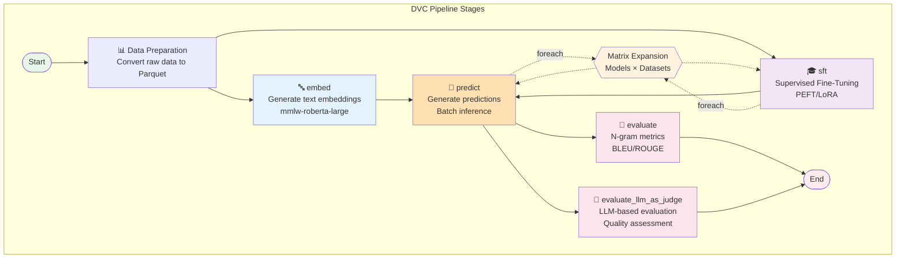
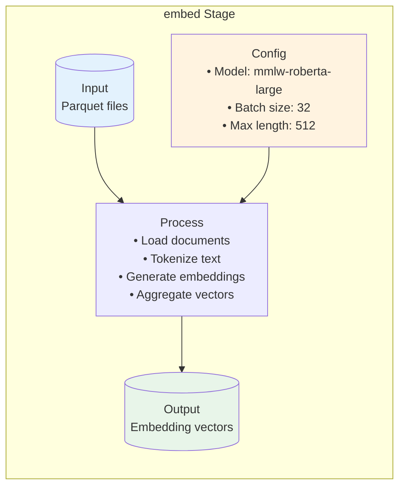
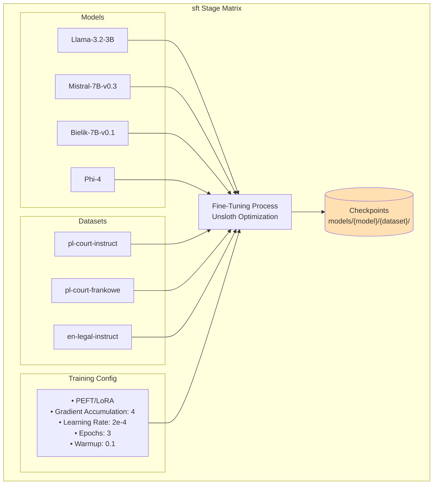
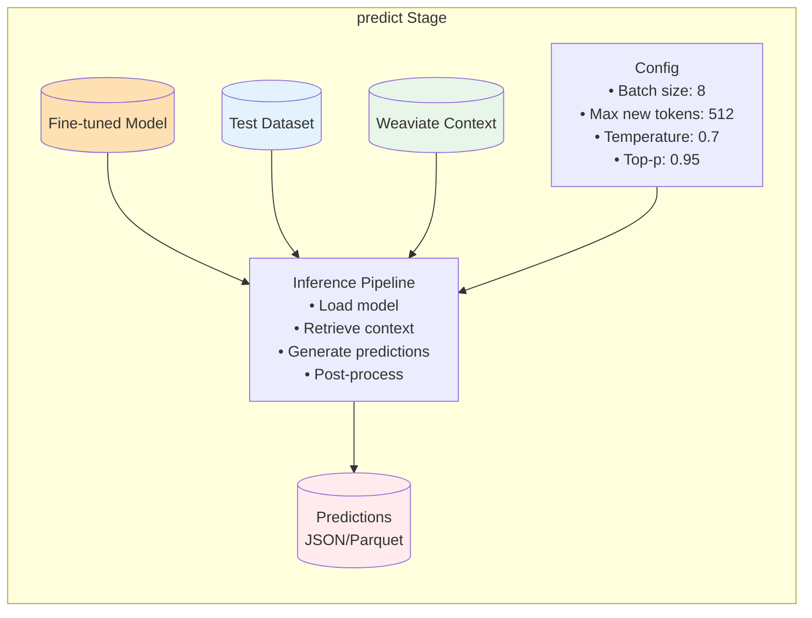
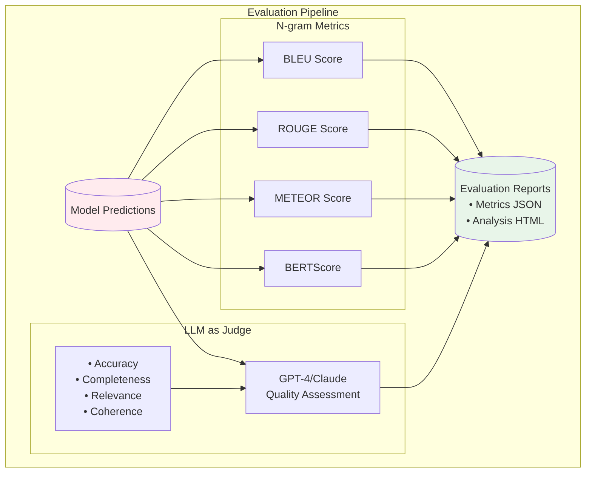
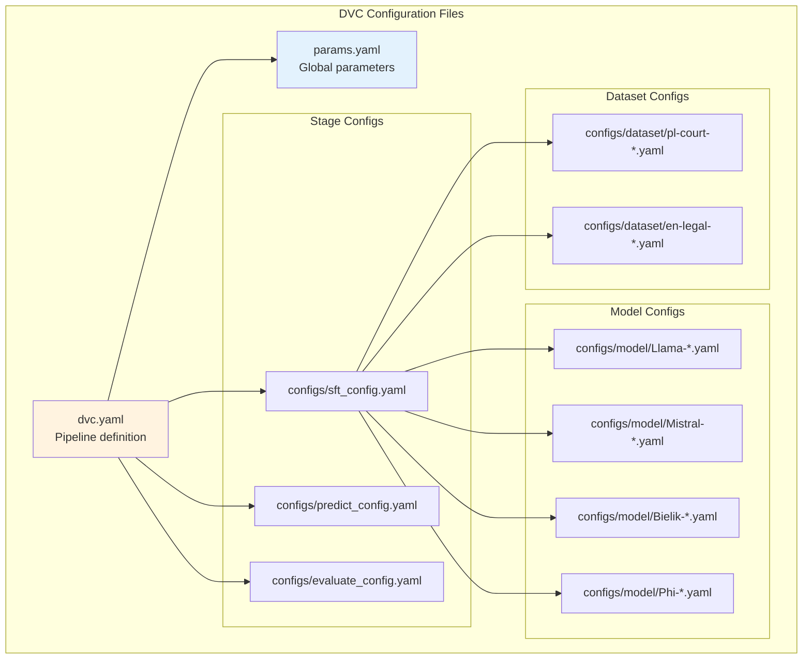
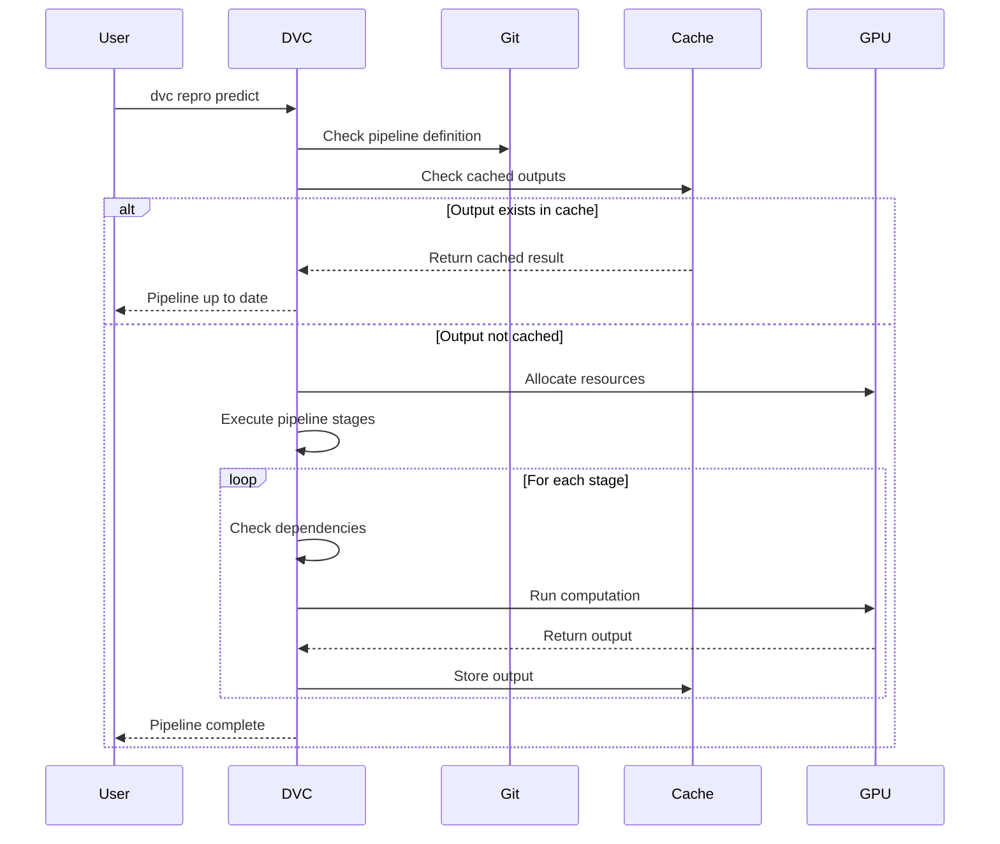
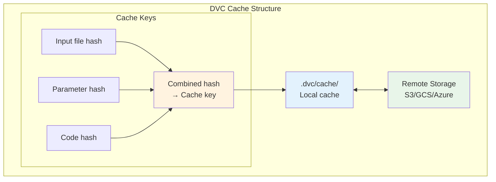

# DVC Pipeline Architecture Reference

## Overview

This reference document details the DVC (Data Version Control) pipeline architecture used in JuDDGES for reproducible machine learning workflows. DVC orchestrates complex multi-stage pipelines with automatic dependency resolution and caching.

## Pipeline DAG (Directed Acyclic Graph)



## Stage Specifications

### 1. Embedding Generation (`embed`)



**Command**: `dvc repro embed`

**Dependencies**:

- Input: `data/datasets/{pl,en}/raw/*.parquet`
- Model: `sdadas/mmlw-roberta-large`
- Output: Embedding files in `data/embeddings/`

**Parameters**:

```yaml
embedding_model:
  name: mmlw-roberta-large
  batch_size: 32
  max_length: 512
  device: cuda
```

### 2. Supervised Fine-Tuning (`sft`)



**Command**: `CUDA_VISIBLE_DEVICES=0 NUM_PROC=10 dvc repro sft`

**Matrix Expansion**:

```yaml
stages:
  sft:
    foreach:
      - model: Llama-3.2-3B-Instruct
        dataset: pl-court-instruct-sft
      - model: Mistral-7B-Instruct-v0.3
        dataset: pl-court-instruct-sft
      - model: Bielik-7B-Instruct-v0.1
        dataset: pl-court-frankowe-instruct
```

### 3. Prediction (`predict`)



**Command**: `CUDA_VISIBLE_DEVICES=0 dvc repro predict`

### 4. Evaluation (`evaluate` & `evaluate_llm_as_judge`)



## DVC Configuration Structure



## Pipeline Execution Flow



## Matrix Execution Strategy

```mermaid
graph LR
    subgraph "Matrix Definition"
        Config["dvc.yaml<br/>foreach definition"]
    end

    subgraph "Expansion"
        Expand["Cartesian Product<br/>Models × Datasets"]
    end

    subgraph "Parallel Execution"
        PE1["Llama + Dataset1"]
        PE2["Llama + Dataset2"]
        PE3["Mistral + Dataset1"]
        PE4["Mistral + Dataset2"]
        PE5["...more combinations"]
    end

    subgraph "Results"
        Results["Aggregated Results<br/>Per combination"]
    end

    Config --> Expand
    Expand --> PE1
    Expand --> PE2
    Expand --> PE3
    Expand --> PE4
    Expand --> PE5

    PE1 --> Results
    PE2 --> Results
    PE3 --> Results
    PE4 --> Results
    PE5 --> Results

    style Config fill:#fff3e0
    style Results fill:#e8f5e9
```

## Command Reference

| Command | Description | Environment Variables |
|---------|-------------|----------------------|
| `dvc repro` | Run entire pipeline | - |
| `dvc repro embed` | Generate embeddings only | `NUM_PROC` |
| `dvc repro sft` | Run fine-tuning | `CUDA_VISIBLE_DEVICES`, `NUM_PROC` |
| `dvc repro predict` | Generate predictions | `CUDA_VISIBLE_DEVICES`, `NUM_PROC` |
| `dvc repro evaluate` | Run n-gram evaluation | - |
| `dvc repro evaluate_llm_as_judge` | Run LLM evaluation | - |
| `dvc dag` | Visualize pipeline DAG | - |
| `dvc status` | Check pipeline status | - |
| `dvc stage list` | List all stages | - |

## Cache Management



## Performance Optimization

1. **Stage-level Caching**: Reuse outputs when inputs haven't changed
2. **Parallel Execution**: Run independent stages concurrently
3. **Resource Allocation**: Configure GPU/CPU per stage
4. **Batch Processing**: Optimize batch sizes for memory/speed
5. **Incremental Updates**: Only rerun affected stages

## Troubleshooting

| Issue | Solution |
|-------|----------|
| Out of memory | Reduce batch size in config |
| Stage fails | Check `dvc.log` for details |
| Cache miss | Run `dvc status` to check changes |
| Slow execution | Enable parallel processing with `NUM_PROC` |
| GPU not used | Set `CUDA_VISIBLE_DEVICES` |

## Related Documentation

- [System Architecture](../../explanation/architecture/SYSTEM_ARCHITECTURE.md)
- [Data Flow Pipeline](../../explanation/architecture/DATA_FLOW_PIPELINE.md)
- [Model Training Guide](../../how-to/training/fine_tuning.md)
