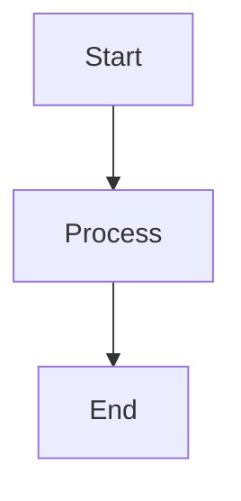
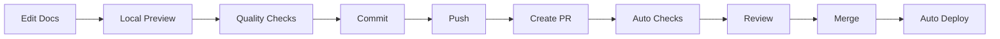

# Documentation Quick Start Guide

Quick reference for contributing to JuDDGES documentation.

## Setup (One-time)

```bash
# Install documentation tools
pip install mkdocs-material mkdocstrings[python] pymdown-extensions

# Install spell checker
npm install -g cspell

# Install pre-commit hooks
pre-commit install
```

## Local Development

```bash
# Preview documentation locally (auto-reload)
mkdocs serve
# Open http://localhost:8000

# Build documentation
mkdocs build

# Build in strict mode (catches warnings)
mkdocs build --strict
```

## Quality Checks

```bash
# Run all quality checks
make fix  # Format and lint code
markdownlint-cli2 "docs/**/*.md"  # Lint markdown
cspell "docs/**/*.md"  # Check spelling
mkdocs build --strict  # Test build

# Auto-fix markdown issues
markdownlint-cli2 "docs/**/*.md" --fix

# Run pre-commit hooks manually
pre-commit run --all-files
```

## Common Tasks

### Add New Documentation Page

1. Create markdown file in appropriate directory:
   - `docs/tutorials/` - Learning guides
   - `docs/how-to/` - Task instructions
   - `docs/reference/` - Technical specs
   - `docs/explanation/` - Conceptual docs

2. Add to navigation in `mkdocs.yml`:

   ```yaml
   nav:
     - Section:
       - Page Title: path/to/file.md
   ```

3. Test locally: `mkdocs serve`

### Add Technical Terms to Dictionary

Edit `cspell.json`:

```json
{
  "words": [
    "YourTechnicalTerm",
    "AnotherTerm"
  ]
}
```

### Write Code Examples

```markdown
```python
from juddges.data import BaseWeaviateDatabase

# Your example code here
db = BaseWeaviateDatabase(url="http://localhost:8080")
```
```

Code blocks are automatically validated for syntax.

### Add Diagrams

```markdown

```

### Add Admonitions

```markdown
!!! note
    This is a note.

!!! warning
    This is a warning.

!!! tip
    This is a helpful tip.
```

## Workflow



## CI/CD Pipeline

### On Pull Request

- Markdown linting
- Link validation
- Spell checking
- Code example validation
- Build test
- Preview build + summary comment

### On Merge to Main

- Build documentation
- Deploy to GitHub Pages
- Live site updates automatically

## Troubleshooting

### Build Fails

```bash
# Check for errors
mkdocs build --strict --verbose

# Common fixes:
# - Fix broken links
# - Add missing files
# - Update navigation in mkdocs.yml
```

### Spell Check Fails

```bash
# Check which words failed
cspell "docs/**/*.md"

# Add valid terms to cspell.json
```

### Markdown Lint Fails

```bash
# See what's wrong
markdownlint-cli2 "docs/**/*.md"

# Auto-fix most issues
markdownlint-cli2 "docs/**/*.md" --fix
```

## File Locations

- **Workflows**: `.github/workflows/docs-*.yaml`
- **Config**: `.markdownlint.json`, `cspell.json`, `mkdocs.yml`
- **Pre-commit**: `.pre-commit-config.yaml`
- **Docs**: `docs/`
- **Contributing Guide**: `docs/how-to/documentation/CONTRIBUTING_TO_DOCS.md`
- **CI/CD Reference**: `docs/reference/cicd/documentation-cicd.md`

## Resources

- **Live Docs**: <https://laugustyniak.github.io/JuDDGES/>
- **Full Guide**: [Contributing to Documentation](<path-to-JuDDGES>/docs/how-to/documentation/CONTRIBUTING_TO_DOCS.md)
- **CI/CD Reference**: [Documentation CI/CD](<path-to-JuDDGES>/docs/reference/cicd/documentation-cicd.md)

## Diátaxis Framework

Organize docs by type:

- **Tutorials**: "Build your first..." - Learning-oriented
- **How-To Guides**: "How to..." - Task-oriented
- **Reference**: "API Reference" - Information-oriented
- **Explanation**: "Understanding..." - Understanding-oriented

## Quick Commit

```bash
# Standard workflow
git add docs/
git commit -m "docs: add extraction tutorial"
# Pre-commit hooks run automatically
git push
```

## Need Help?

- Check troubleshooting in [Contributing Guide](<path-to-JuDDGES>/docs/how-to/documentation/CONTRIBUTING_TO_DOCS.md)
- Review [CI/CD Reference](<path-to-JuDDGES>/docs/reference/cicd/documentation-cicd.md)
- Open an issue on GitHub
