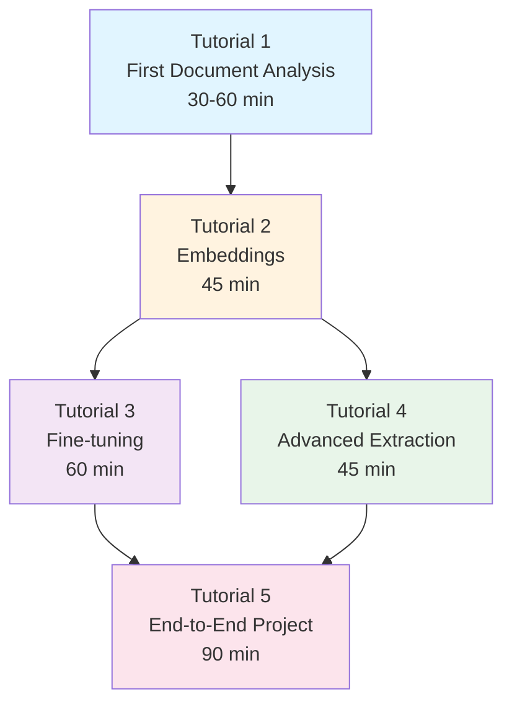

# JuDDGES Tutorials

Welcome to the JuDDGES tutorial collection! These hands-on, interactive tutorials will guide you from beginner to expert in legal document analysis with AI.

## 📚 Tutorial Overview

All tutorials follow the **Diátaxis framework** for learning-oriented documentation. Each tutorial:

- ✅ **Teaches by doing** - Hands-on exercises with real code
- ✅ **Builds progressively** - Each tutorial builds on previous ones
- ✅ **Includes checkpoints** - Verify your understanding as you go
- ✅ **Provides solutions** - Complete working code examples
- ✅ **Safe to experiment** - Learn by making mistakes

---

## 🎯 Learning Path

Follow this recommended path to master JuDDGES:

---

## Main Tutorial Series

### Tutorial 1: Your First Legal Document Analysis

**[📖 Start Tutorial](./tutorial-01-first-legal-document-analysis.md)**

Learn the fundamentals of legal document analysis with JuDDGES.

**What You'll Learn**: Set up JuDDGES • Load legal datasets • Extract information • Semantic search • Visualizations

**Level**: 🟢 Beginner | **Duration**: 30-60 min | **GPU**: Not required

---

### Tutorial 2: Working with Legal Document Embeddings

**[📖 Start Tutorial](./tutorial-02-embeddings.md)**

Master document embeddings and vector search for legal documents.

**What You'll Learn**: Generate embeddings • Set up Weaviate • Ingest documents • Semantic search • UMAP visualization

**Level**: 🟡 Intermediate | **Duration**: 45 min | **GPU**: Optional

---

### Tutorial 3: Fine-tuning Your First Legal LLM

**[📖 Start Tutorial](./tutorial-03-model-finetuning.md)**

Learn to fine-tune large language models for legal tasks.

**What You'll Learn**: Instruction datasets • PEFT/LoRA • Training • Evaluation • Deployment

**Level**: 🔴 Advanced | **Duration**: 60+ min | **GPU**: Required (40GB+)

---

### Tutorial 4: Advanced Information Extraction

**[📖 Start Tutorial](./tutorial-04-advanced-extraction.md)**

Master advanced extraction techniques with Gemini and LangChain.

**What You'll Learn**: Complex schemas • Multi-step pipelines • Validation • Scale processing • Production deployment

**Level**: 🔴 Advanced | **Duration**: 45 min | **GPU**: Not required

---

### Tutorial 5: Building an End-to-End Legal Analysis System

**[📖 Start Tutorial](./tutorial-05-end-to-end-project.md)**

Build a complete production-ready legal document analysis pipeline.

**What You'll Learn**: System design • Data pipelines • API services • Monitoring • Deployment • Optimization

**Level**: ⚫ Expert | **Duration**: 90 min | **GPU**: Optional

---

## Supplementary Tutorials

### Setup & Configuration

- **[Getting Started](GETTING_STARTED.md)** - Quick 30-minute introduction to JuDDGES
- **[Git LFS Setup](GIT_LFS_SETUP.md)** - Configure Git Large File Storage for datasets
- **[Langfuse Setup](LANGFUSE_SETUP.md)** - Set up LLM observability and monitoring

### Feature-Specific

- **[Gemini Extraction](GEMINI_EXTRACTION.md)** - Detailed guide to Gemini API for information extraction

---

## 📊 Tutorial Matrix

| Tutorial | Duration | Level | GPU | Focus |
|----------|----------|-------|-----|-------|
| [Tutorial 1](./tutorial-01-first-legal-document-analysis.md) | 30-60 min | 🟢 Beginner | No | Basics |
| [Tutorial 2](./tutorial-02-embeddings.md) | 45 min | 🟡 Intermediate | Optional | Embeddings |
| [Tutorial 3](./tutorial-03-model-finetuning.md) | 60+ min | 🔴 Advanced | Yes | Fine-tuning |
| [Tutorial 4](./tutorial-04-advanced-extraction.md) | 45 min | 🔴 Advanced | No | Extraction |
| [Tutorial 5](./tutorial-05-end-to-end-project.md) | 90 min | ⚫ Expert | Optional | Production |

**Total Learning Time**: 4-6 hours for all main tutorials

---

## 🎓 By Use Case

### For Researchers

1. [Tutorial 1: First Document Analysis](./tutorial-01-first-legal-document-analysis.md)
2. [Tutorial 2: Embeddings](./tutorial-02-embeddings.md)
3. Explore [Research Publications](../explanation/research/RESEARCH_PUBLICATIONS.md)

### For Data Scientists

1. [Tutorial 1](./tutorial-01-first-legal-document-analysis.md) + [Tutorial 2](./tutorial-02-embeddings.md)
2. [Tutorial 3: Fine-tuning](./tutorial-03-model-finetuning.md)
3. [Tutorial 5: End-to-End Project](./tutorial-05-end-to-end-project.md)

### For Legal Tech Developers

1. [Tutorial 1: First Document Analysis](./tutorial-01-first-legal-document-analysis.md)
2. [Tutorial 4: Advanced Extraction](./tutorial-04-advanced-extraction.md)
3. [Tutorial 5: End-to-End Project](./tutorial-05-end-to-end-project.md)

### For ML Engineers

1. Skim [Tutorial 1](./tutorial-01-first-legal-document-analysis.md)
2. Deep dive [Tutorial 3: Fine-tuning](./tutorial-03-model-finetuning.md)
3. [Tutorial 5: End-to-End Project](./tutorial-05-end-to-end-project.md)

---

## 🛠️ How to Use These Tutorials

### Before You Start

1. **Set up environment**: Complete [Getting Started Guide](./GETTING_STARTED.md)
2. **Check prerequisites**: Each tutorial lists required knowledge/tools
3. **Allocate time**: Set aside uninterrupted time
4. **Prepare workspace**: Terminal, editor, browser ready

### During the Tutorial

1. **Read first**: Understand before coding
2. **Type yourself**: Don't copy-paste
3. **Complete checkpoints**: Verify understanding
4. **Experiment**: Try variations
5. **Take notes**: Document insights

### After the Tutorial

1. **Complete exercises**: Test knowledge
2. **Try challenges**: Push further
3. **Build projects**: Apply learnings
4. **Share feedback**: Improve tutorials

---

## 💡 Tips for Success

### Learn by Doing

Type code yourself to:
- Understand syntax
- Debug errors
- Build muscle memory
- Gain confidence

### Embrace Mistakes

Errors are learning opportunities:
- Read error messages carefully
- Check Troubleshooting sections
- Search documentation
- Ask for help

### Experiment Freely

After each section:
- Modify parameters
- Try different inputs
- Test edge cases
- Break and fix things

---

## 🆘 Getting Help

### Documentation

- **[How-To Guides](../how-to/)** - Solve specific problems
- **[Reference](../reference/)** - Technical details
- **[Explanation](../explanation/)** - Understand concepts

### Community

- **[GitHub Issues](https://github.com/pwr-ai/JuDDGES/issues)** - Bugs/features
- **[GitHub Discussions](https://github.com/pwr-ai/JuDDGES/discussions)** - Questions/ideas
- **Email**: lukasz.augustyniak@pwr.edu.pl

### Common Issues

- [Gemini API Troubleshooting](../how-to/troubleshooting/GEMINI_API_TROUBLESHOOTING.md)
- [Weaviate Setup](../how-to/embeddings/embeddings_deploy_weaviate.md)

---

## 📈 Track Your Progress

- [ ] Completed [Tutorial 1: First Document Analysis](./tutorial-01-first-legal-document-analysis.md)
- [ ] Completed [Tutorial 2: Embeddings](./tutorial-02-embeddings.md)
- [ ] Completed [Tutorial 3: Fine-tuning](./tutorial-03-model-finetuning.md)
- [ ] Completed [Tutorial 4: Advanced Extraction](./tutorial-04-advanced-extraction.md)
- [ ] Completed [Tutorial 5: End-to-End Project](./tutorial-05-end-to-end-project.md)
- [ ] Built a personal project
- [ ] Contributed to JuDDGES
- [ ] Shared work with community

---

## 🤝 Contributing

Help improve tutorials:

- **Report issues**: [Open an issue](https://github.com/pwr-ai/JuDDGES/issues)
- **Suggest improvements**: [Start a discussion](https://github.com/pwr-ai/JuDDGES/discussions)
- **Submit changes**: Fork, edit, PR

---

## 🎉 Start Learning!

Ready? Begin with:

**[Tutorial 1: Your First Legal Document Analysis →](./tutorial-01-first-legal-document-analysis.md)**

Or jump to:
- [Tutorial 2: Embeddings](./tutorial-02-embeddings.md)
- [Tutorial 3: Fine-tuning](./tutorial-03-model-finetuning.md)
- [Tutorial 4: Advanced Extraction](./tutorial-04-advanced-extraction.md)
- [Tutorial 5: End-to-End Project](./tutorial-05-end-to-end-project.md)

---

**Last Updated**: 2025-10-11 | **Version**: 1.0 | **Status**: Published
