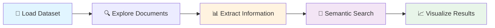

# Tutorial: Your First Legal Document Analysis with JuDDGES

Complete this hands-on tutorial to learn the fundamentals of legal document analysis using JuDDGES. You'll go from zero to analyzing real court decisions in 30-60 minutes.

## Table of Contents

- [Learning Objectives](#learning-objectives)
- [Prerequisites](#prerequisites)
- [What You'll Build](#what-youll-build)
- [Setup Your Environment](#setup-your-environment)
- [Step 1: Load Your First Dataset](#step-1-load-your-first-dataset)
- [Step 2: Explore Document Structure](#step-2-explore-document-structure)
- [Step 3: Extract Key Information](#step-3-extract-key-information)
- [Step 4: Search Documents Semantically](#step-4-search-documents-semantically)
- [Step 5: Visualize Results](#step-5-visualize-results)
- [Checkpoints & Exercises](#checkpoints--exercises)
- [Troubleshooting](#troubleshooting)
- [Summary](#summary)
- [Next Steps](#next-steps)

---

## Learning Objectives

By the end of this tutorial, you will be able to:

- ✅ Set up the JuDDGES environment and dependencies
- ✅ Load and explore Polish legal document datasets
- ✅ Extract structured information from court judgments
- ✅ Perform semantic search on legal documents
- ✅ Understand the basic JuDDGES workflow
- ✅ Run interactive legal document analysis

**Estimated Time**: 30-60 minutes

---

## Prerequisites

### Required Knowledge

- Basic Python programming (variables, functions, loops)
- Command line familiarity (running commands in terminal)
- Basic understanding of JSON and dictionaries

### Required Software

- **Python 3.10+** installed
- **Docker** and **Docker Compose** installed
- **Git** for cloning the repository
- **16GB+ RAM** recommended (8GB minimum)
- **10GB+ free disk space**

### Optional

- **Google API Key** for Gemini extraction (get it [here](https://ai.google.dev/gemini-api/docs/api-key))
- **GPU** with CUDA support (for advanced features)

> **Note**: Don't worry if you don't have everything yet! We'll guide you through the setup.

---

## What You'll Build

In this tutorial, you'll create a complete legal document analysis pipeline:



**Real-world application**: This is the foundation for building legal research tools, compliance systems, and case analytics platforms.

---

## Setup Your Environment

### Step 1: Clone the Repository

Open your terminal and run:

```bash
# Clone the JuDDGES repository
git clone https://github.com/pwr-ai/JuDDGES.git
cd JuDDGES
```

**Expected output**:

```
Cloning into 'JuDDGES'...
remote: Enumerating objects: 1234, done.
remote: Counting objects: 100% (1234/1234), done.
```

### Step 2: Run Automated Setup

```bash
# Linux/macOS
./setup.sh

# Windows
setup.bat
```

This script will:

- Create a virtual environment in `.venv/`
- Install all Python dependencies
- Set up pre-commit hooks
- Configure Git LFS for large files

**Expected output**:

```
✓ Creating virtual environment
✓ Installing dependencies
✓ Setting up pre-commit hooks
✓ JuDDGES setup complete!
```

### Step 3: Activate Virtual Environment

```bash
# Linux/macOS
source .venv/bin/activate

# Windows
.venv\Scripts\activate
```

Your prompt should now show `(.venv)` indicating the environment is active.

### Step 4: Set Environment Variables

Create a `.env` file in the project root:

```bash
# Create .env file
touch .env
```

Add your API keys (optional for this tutorial):

```bash
# For Gemini extraction (optional for now)
GOOGLE_API_KEY=your-google-api-key-here

# For GPU acceleration (optional)
CUDA_VISIBLE_DEVICES=0
NUM_PROC=10
```

> **Tip**: You can skip the API key for now and add it later when we do extraction.

---

## Step 1: Load Your First Dataset

### Understanding JuDDGES Datasets

JuDDGES provides pre-built datasets of Polish and English legal documents. Let's start with a sample dataset.

### Create Your First Script

Create a new file called `my_first_analysis.py`:

```python
"""My First Legal Document Analysis with JuDDGES."""

from datasets import load_dataset
from rich.console import Console
from rich.table import Table

# Initialize rich console for beautiful output
console = Console()

# Step 1: Load a sample dataset
console.print("[bold blue]Loading Polish court decisions dataset...[/bold blue]")

# Load a small sample for quick experimentation
dataset = load_dataset(
    "JuDDGES/pl-court-raw-sample",
    split="train[:100]"  # Load only first 100 documents
)

console.print(f"[green]✓ Loaded {len(dataset)} documents[/green]")

# Step 2: Explore the dataset structure
console.print("\n[bold]Dataset Info:[/bold]")
console.print(f"Number of documents: {len(dataset)}")
console.print(f"Available fields: {list(dataset.features.keys())}")

# Step 3: Display first document
console.print("\n[bold]First Document Sample:[/bold]")
sample = dataset[0]

# Create a table for better visualization
table = Table(show_header=True, header_style="bold magenta")
table.add_column("Field", style="cyan")
table.add_column("Value", style="white")

# Show key fields
table.add_row("ID", str(sample.get("id", "N/A")))
table.add_row("Court", sample.get("court", "N/A"))
table.add_row("Date", sample.get("judgment_date", "N/A"))
table.add_row("Case Type", sample.get("court_type", "N/A"))

# Show truncated text
text_preview = sample.get("text", "")[:200] + "..."
table.add_row("Text Preview", text_preview)

console.print(table)

console.print("\n[bold green]✓ Step 1 Complete![/bold green]")
console.print("You've successfully loaded and explored a legal dataset!")
```

### Run Your Script

```bash
python my_first_analysis.py
```

**Expected output**:

```
Loading Polish court decisions dataset...
✓ Loaded 100 documents

Dataset Info:
Number of documents: 100
Available fields: ['id', 'text', 'court', 'judgment_date', 'court_type', ...]

First Document Sample:
┌─────────────┬──────────────────────────────┐
│ Field       │ Value                        │
├─────────────┼──────────────────────────────┤
│ ID          │ 12345678                     │
│ Court       │ Sąd Okręgowy w Warszawie     │
│ Date        │ 2023-03-15                   │
│ Case Type   │ civil                        │
│ Text Preview│ W imieniu Rzeczypospolitej...│
└─────────────┴──────────────────────────────┘

✓ Step 1 Complete!
You've successfully loaded and explored a legal dataset!
```

### 🎯 Checkpoint 1: Test Your Understanding

**Question**: How many fields does the dataset have?
<details>
<summary>Click to reveal answer</summary>

Run this to find out:

```python
print(f"Number of fields: {len(dataset.features)}")
print(f"Field names: {list(dataset.features.keys())}")
```

The dataset typically has 15-20 fields including `id`, `text`, `court`, `judgment_date`, `parties`, etc.
</details>

**Try This**: Modify the script to load 200 documents instead of 100. What happens to the loading time?

---

## Step 2: Explore Document Structure

Now let's dive deeper into the structure of legal documents.

### Add to Your Script

```python
"""Step 2: Explore document structure in detail."""

# Continuing from previous script...

console.print("\n[bold blue]Step 2: Exploring Document Structure[/bold blue]")

# Analyze document statistics
total_docs = len(dataset)
courts = {}
years = {}

for doc in dataset:
    # Count documents by court
    court = doc.get("court", "Unknown")
    courts[court] = courts.get(court, 0) + 1

    # Count documents by year
    date = doc.get("judgment_date", "")
    if date:
        year = date[:4]  # Extract year from YYYY-MM-DD
        years[year] = years.get(year, 0) + 1

# Display court statistics
console.print("\n[bold]Top 5 Courts by Document Count:[/bold]")
top_courts = sorted(courts.items(), key=lambda x: x[1], reverse=True)[:5]

court_table = Table(show_header=True, header_style="bold cyan")
court_table.add_column("Court Name", style="white")
court_table.add_column("Count", justify="right", style="green")

for court, count in top_courts:
    court_table.add_row(court, str(count))

console.print(court_table)

# Display year distribution
console.print("\n[bold]Documents by Year:[/bold]")
year_table = Table(show_header=True, header_style="bold cyan")
year_table.add_column("Year", style="white")
year_table.add_column("Count", justify="right", style="green")

for year in sorted(years.keys()):
    year_table.add_row(year, str(years[year]))

console.print(year_table)

# Analyze document length
text_lengths = [len(doc.get("text", "")) for doc in dataset]
avg_length = sum(text_lengths) / len(text_lengths)
min_length = min(text_lengths)
max_length = max(text_lengths)

console.print(f"\n[bold]Document Length Statistics:[/bold]")
console.print(f"Average length: {avg_length:,.0f} characters")
console.print(f"Shortest: {min_length:,} characters")
console.print(f"Longest: {max_length:,} characters")

console.print("\n[bold green]✓ Step 2 Complete![/bold green]")
```

### 🎯 Checkpoint 2: Exploration Exercise

**Exercise**: Find documents from a specific court.

```python
# Try this code
target_court = "Sąd Okręgowy w Warszawie"
filtered_docs = [doc for doc in dataset if doc.get("court") == target_court]
console.print(f"Found {len(filtered_docs)} documents from {target_court}")
```

**Challenge**: Can you find the oldest document in the dataset? Write code to find it!

<details>
<summary>Hint</summary>

```python
oldest_doc = min(
    dataset,
    key=lambda x: x.get("judgment_date", "9999-99-99")
)
console.print(f"Oldest: {oldest_doc['judgment_date']} from {oldest_doc['court']}")
```

</details>

---

## Step 3: Extract Key Information

Now let's extract structured information from judgments using Gemini.

### Prerequisites Check

Before continuing, ensure you have:

```bash
# Check if Google API key is set
echo $GOOGLE_API_KEY  # Should show your API key
```

If not set, add it to your `.env` file or export it:

```bash
export GOOGLE_API_KEY="your-api-key-here"
```

### Extraction Script

Create `extract_information.py`:

```python
"""Extract structured information from legal documents."""

import os
from datasets import load_dataset
from rich.console import Console
from rich.panel import Panel

from juddges.extraction import GeminiExtractionChain
from juddges.extraction.gemini_chain import DocumentType, ExtractionSchema

console = Console()

# Step 1: Initialize extraction chain
console.print("[bold blue]Initializing Gemini extraction chain...[/bold blue]")

chain = GeminiExtractionChain(
    model_name="gemini-2.5-flash",  # Fast and cost-effective
    api_key=os.getenv("GOOGLE_API_KEY"),
    temperature=0.0,  # Deterministic for consistency
    cache_path=".cache/tutorial_extraction.db",
)

console.print("[green]✓ Chain initialized[/green]")

# Step 2: Load a document
console.print("\n[bold blue]Loading document...[/bold blue]")
dataset = load_dataset("JuDDGES/pl-court-raw-sample", split="train[:1]")
document = dataset[0]

console.print(f"[green]✓ Loaded document from {document.get('court', 'Unknown')}[/green]")
console.print(f"Document length: {len(document['text'])} characters")

# Step 3: Define extraction schema
console.print("\n[bold blue]Defining extraction schema...[/bold blue]")

schema = ExtractionSchema(
    fields={
        "verdict_date": "date as ISO 8601, data wydania wyroku",
        "case_signature": "string, sygnatura sprawy",
        "court": "string, nazwa sądu",
        "judge_names": "List[string], imiona i nazwiska sędziów",
        "parties": "List[string], strony postępowania",
        "verdict": "string, treść rozstrzygnięcia",
    },
    instructions=(
        "Wyodrębnij informacje faktyczne z treści wyroku. "
        "Dla dat użyj formatu ISO 8601. "
        "Dla list uwzględnij wszystkie wymienione pozycje."
    ),
    language="polish",
)

console.print("[green]✓ Schema defined with 6 fields[/green]")

# Step 4: Extract information
console.print("\n[bold blue]Extracting information...[/bold blue]")
console.print("[yellow]This may take 5-10 seconds for the first run...[/yellow]")

try:
    result = chain.extract(
        document_type=DocumentType.JUDGMENT,
        text=document["text"],
        schema=schema,
    )

    console.print("[green]✓ Extraction complete![/green]")

    # Step 5: Display results
    console.print("\n[bold]Extracted Information:[/bold]")

    for field, value in result.items():
        if isinstance(value, list):
            value_str = "\n  • " + "\n  • ".join(value) if value else "[]"
        else:
            value_str = str(value)

        panel = Panel(
            value_str,
            title=f"[cyan]{field}[/cyan]",
            border_style="blue",
        )
        console.print(panel)

    console.print("\n[bold green]✓ Step 3 Complete![/bold green]")
    console.print("You've successfully extracted structured data from a legal document!")

except Exception as e:
    console.print(f"[red]Error during extraction: {e}[/red]")
    console.print("[yellow]Tip: Make sure GOOGLE_API_KEY is set correctly[/yellow]")
```

### Run Extraction

```bash
python extract_information.py
```

**Expected output**:

```
Initializing Gemini extraction chain...
✓ Chain initialized

Loading document...
✓ Loaded document from Sąd Okręgowy w Warszawie
Document length: 8,543 characters

Defining extraction schema...
✓ Schema defined with 6 fields

Extracting information...
This may take 5-10 seconds for the first run...
✓ Extraction complete!

Extracted Information:
╭─ verdict_date ──────────────────╮
│ 2023-03-15                      │
╰─────────────────────────────────╯
╭─ case_signature ────────────────╮
│ II C 123/2023                   │
╰─────────────────────────────────╯
[... more fields ...]

✓ Step 3 Complete!
You've successfully extracted structured data from a legal document!
```

### 🎯 Checkpoint 3: Extraction Challenge

**Challenge**: Modify the schema to extract additional fields:

- `legal_basis`: List of referenced laws
- `verdict_type`: Type of verdict (e.g., "oddalono powództwo", "uwzględniono powództwo")

Try running the extraction again with your modified schema!

---

## Step 4: Search Documents Semantically

Let's set up semantic search using Weaviate vector database.

### Start Weaviate

```bash
# Navigate to weaviate directory
cd weaviate

# Start Weaviate with Docker Compose
docker compose up -d

# Check if it's running
docker compose ps
```

**Expected output**:

```
NAME                IMAGE                       STATUS
weaviate            semitechnologies/weaviate   Up 5 seconds
```

### Semantic Search Script

Create `semantic_search.py`:

```python
"""Perform semantic search on legal documents."""

from rich.console import Console
from rich.table import Table

from juddges.data.judgments_weaviate_db import JudgmentsWeaviateDB

console = Console()

# Step 1: Connect to Weaviate
console.print("[bold blue]Connecting to Weaviate vector database...[/bold blue]")

try:
    db = JudgmentsWeaviateDB(url="http://localhost:8080")
    console.print("[green]✓ Connected to Weaviate[/green]")
except Exception as e:
    console.print(f"[red]Connection failed: {e}[/red]")
    console.print("[yellow]Make sure Weaviate is running: cd weaviate && docker compose up -d[/yellow]")
    exit(1)

# Step 2: Check database status
console.print("\n[bold blue]Checking database status...[/bold blue]")

# Get document count (this may be 0 if you haven't ingested data yet)
# We'll show the search functionality anyway

# Step 3: Perform semantic search
console.print("\n[bold blue]Performing semantic search...[/bold blue]")

# Example search query
query = "umowa kredytu we frankach szwajcarskich"

console.print(f"[cyan]Query:[/cyan] {query}")
console.print("[yellow]Searching...[/yellow]")

try:
    results = db.search_semantic(
        query=query,
        limit=5,
    )

    if results:
        console.print(f"[green]✓ Found {len(results)} relevant documents[/green]")

        # Display results
        table = Table(show_header=True, header_style="bold magenta")
        table.add_column("Rank", width=6)
        table.add_column("Court", width=30)
        table.add_column("Date", width=12)
        table.add_column("Relevance", width=10)

        for i, result in enumerate(results, 1):
            court = result.get("court", "Unknown")[:27] + "..."
            date = result.get("judgment_date", "N/A")
            # Distance is converted to similarity score (lower distance = higher relevance)
            relevance = f"{(1 - result.get('distance', 1)) * 100:.1f}%"

            table.add_row(str(i), court, date, relevance)

        console.print(table)

        # Show snippet of most relevant document
        if results:
            console.print("\n[bold]Most Relevant Document Snippet:[/bold]")
            text = results[0].get("text", "")[:300] + "..."
            console.print(f"[italic]{text}[/italic]")

        console.print("\n[bold green]✓ Step 4 Complete![/bold green]")

    else:
        console.print("[yellow]No documents found in database yet.[/yellow]")
        console.print("[yellow]You can ingest documents using: python scripts/embed/simple_ingest.py[/yellow]")

except Exception as e:
    console.print(f"[red]Search failed: {e}[/red]")
```

### Run Search

```bash
python semantic_search.py
```

> **Note**: If your database is empty, you'll see a message about ingesting documents. Don't worry - the search functionality is set up correctly!

### 🎯 Checkpoint 4: Search Exercise

**Exercise**: Try different search queries:

```python
queries = [
    "umowa kredytu we frankach szwajcarskich",
    "odszkodowanie za wypadek przy pracy",
    "rozwód z orzeczeniem o winie",
]

for query in queries:
    results = db.search_semantic(query=query, limit=3)
    print(f"Query: {query} -> Found {len(results)} results")
```

**Challenge**: Can you search in English and find relevant documents?

---

## Step 5: Visualize Results

Let's create a simple visualization dashboard.

### Create Dashboard Script

Create `simple_dashboard.py`:

```python
"""Simple interactive dashboard for legal document analysis."""

from datasets import load_dataset
from rich.console import Console
from rich.prompt import Prompt
from rich.table import Table
import os

from juddges.extraction import GeminiExtractionChain
from juddges.extraction.gemini_chain import DocumentType, ExtractionSchema

console = Console()

# Load dataset
console.print("[bold blue]Loading dataset...[/bold blue]")
dataset = load_dataset("JuDDGES/pl-court-raw-sample", split="train[:50]")
console.print(f"[green]✓ Loaded {len(dataset)} documents[/green]")

# Initialize extraction chain
chain = GeminiExtractionChain(
    model_name="gemini-2.5-flash",
    api_key=os.getenv("GOOGLE_API_KEY"),
    cache_path=".cache/tutorial_extraction.db",
)

# Define schema
schema = ExtractionSchema(
    fields={
        "verdict_date": "date as ISO 8601",
        "court": "string, nazwa sądu",
        "parties": "List[string], strony",
        "verdict": "string, wyrok",
    },
    language="polish",
)

def display_menu():
    """Display interactive menu."""
    console.print("\n[bold cyan]═══════════════════════════════════════[/bold cyan]")
    console.print("[bold cyan]  JuDDGES Legal Document Analyzer    [/bold cyan]")
    console.print("[bold cyan]═══════════════════════════════════════[/bold cyan]")
    console.print("\n[bold]Options:[/bold]")
    console.print("  [1] Browse documents")
    console.print("  [2] Extract information from document")
    console.print("  [3] Search by court")
    console.print("  [4] Exit")

def browse_documents():
    """Browse documents in a table."""
    table = Table(show_header=True, header_style="bold magenta")
    table.add_column("ID", width=4)
    table.add_column("Court", width=35)
    table.add_column("Date", width=12)

    for i, doc in enumerate(dataset[:10]):
        table.add_row(
            str(i),
            doc.get("court", "Unknown")[:32] + "...",
            doc.get("judgment_date", "N/A"),
        )

    console.print(table)
    console.print(f"\n[italic]Showing 10 of {len(dataset)} documents[/italic]")

def extract_from_document():
    """Extract information from selected document."""
    doc_id = Prompt.ask("\nEnter document ID (0-49)")

    try:
        doc_id = int(doc_id)
        if 0 <= doc_id < len(dataset):
            doc = dataset[doc_id]
            console.print(f"\n[bold]Extracting from document {doc_id}...[/bold]")

            result = chain.extract(
                document_type=DocumentType.JUDGMENT,
                text=doc["text"],
                schema=schema,
            )

            console.print("[green]✓ Extraction complete[/green]")
            for field, value in result.items():
                console.print(f"[cyan]{field}:[/cyan] {value}")
        else:
            console.print("[red]Invalid document ID[/red]")
    except ValueError:
        console.print("[red]Please enter a valid number[/red]")

def search_by_court():
    """Search documents by court name."""
    court_name = Prompt.ask("\nEnter court name (partial match)")

    results = [
        doc for doc in dataset
        if court_name.lower() in doc.get("court", "").lower()
    ]

    if results:
        console.print(f"\n[green]Found {len(results)} matching documents:[/green]")
        for i, doc in enumerate(results[:10]):
            console.print(f"{i+1}. {doc['court']} ({doc.get('judgment_date', 'N/A')})")
    else:
        console.print("[yellow]No matching documents found[/yellow]")

# Main loop
while True:
    display_menu()
    choice = Prompt.ask("\nSelect option", choices=["1", "2", "3", "4"])

    if choice == "1":
        browse_documents()
    elif choice == "2":
        extract_from_document()
    elif choice == "3":
        search_by_court()
    elif choice == "4":
        console.print("[bold green]Thank you for using JuDDGES![/bold green]")
        break
```

### Run Dashboard

```bash
python simple_dashboard.py
```

**Try This**:

1. Browse documents (option 1)
2. Extract information from document 0 (option 2)
3. Search for "Warszawa" (option 3)

### 🎯 Checkpoint 5: Final Challenge

**Challenge**: Enhance the dashboard with a new feature:

- Add option to filter documents by date range
- Add option to export extracted data to JSON
- Add option to compare two documents

---

## Checkpoints & Exercises

### Summary Exercises

Now that you've completed all steps, test your knowledge:

**Exercise 1: Data Pipeline**
Create a script that:

1. Loads 20 documents
2. Extracts information from each
3. Saves results to a JSON file

<details>
<summary>Solution</summary>

```python
import json
from datasets import load_dataset
from juddges.extraction import GeminiExtractionChain
from juddges.extraction.gemini_chain import DocumentType, ExtractionSchema

# Load documents
dataset = load_dataset("JuDDGES/pl-court-raw-sample", split="train[:20]")

# Initialize chain
chain = GeminiExtractionChain(model_name="gemini-2.5-flash")

# Define schema
schema = ExtractionSchema(
    fields={
        "verdict_date": "date as ISO 8601",
        "court": "string",
        "verdict": "string",
    },
    language="polish",
)

# Extract from all documents
results = []
for i, doc in enumerate(dataset):
    print(f"Processing document {i+1}/20...")
    result = chain.extract(
        document_type=DocumentType.JUDGMENT,
        text=doc["text"],
        schema=schema,
    )
    results.append(result)

# Save to JSON
with open("extracted_results.json", "w", encoding="utf-8") as f:
    json.dump(results, f, ensure_ascii=False, indent=2)

print("✓ Results saved to extracted_results.json")
```

</details>

**Exercise 2: Document Statistics**
Calculate:

- Average document length
- Most common court
- Documents per year distribution

**Exercise 3: Custom Schema**
Create a schema for extracting:

- All monetary amounts mentioned
- All dates mentioned
- All legal article references

---

## Troubleshooting

### Issue: "Module not found: juddges"

**Solution**: Make sure you've installed the package:

```bash
source .venv/bin/activate  # Activate environment
pip install -e .  # Install in editable mode
```

### Issue: "GOOGLE_API_KEY not found"

**Solution**: Set the environment variable:

```bash
export GOOGLE_API_KEY="your-api-key"
# Or add to .env file
```

### Issue: "Weaviate connection failed"

**Solution**: Ensure Weaviate is running:

```bash
cd weaviate
docker compose up -d
docker compose ps  # Check status
```

### Issue: "Out of memory"

**Solution**: Reduce the number of documents:

```python
# Instead of loading all documents
dataset = load_dataset(..., split="train[:50]")  # Load only 50
```

### Issue: "Extraction is slow"

**Solution**:

- Use cache (it's enabled by default)
- Use `gemini-2.5-flash` instead of `pro`
- Process documents in smaller batches

---

## Summary

Congratulations! You've completed your first legal document analysis with JuDDGES.

### What You've Learned

✅ **Environment Setup**: Installed and configured JuDDGES
✅ **Data Loading**: Loaded and explored legal document datasets
✅ **Document Structure**: Analyzed document fields and statistics
✅ **Information Extraction**: Extracted structured data using Gemini
✅ **Semantic Search**: Performed vector-based document search
✅ **Visualization**: Created an interactive analysis dashboard

### Key Concepts

| Concept | Description |
|---------|-------------|
| **Dataset** | Collection of legal documents with structured metadata |
| **Extraction Schema** | Definition of what information to extract |
| **Semantic Search** | Finding documents by meaning, not just keywords |
| **Vector Database** | Storage system for document embeddings |
| **Gemini Chain** | LangChain pipeline for LLM-based extraction |

### Your Skills Progression

```
Beginner → Novice → Intermediate → Advanced → Expert
^
You are here! 🎉
```

---

## Next Steps

### Continue Learning

Now that you've mastered the basics, explore these tutorials:

1. **[Tutorial 2: Working with Legal Document Embeddings](./tutorial-02-embeddings.md)**
   - Generate embeddings for documents
   - Ingest large datasets to Weaviate
   - Visualize document spaces with UMAP

2. **[Tutorial 3: Fine-tuning Legal LLMs](./tutorial-03-model-finetuning.md)**
   - Prepare instruction datasets
   - Fine-tune models with PEFT/LoRA
   - Evaluate model performance

3. **[Tutorial 4: Advanced Information Extraction](./tutorial-04-advanced-extraction.md)**
   - Complex extraction schemas
   - Multi-step extraction pipelines
   - Validation and quality control

4. **[Tutorial 5: End-to-End Project](./tutorial-05-end-to-end-project.md)**
   - Build a complete legal analysis system
   - Deploy to production
   - Monitor and maintain

### Explore How-To Guides

Need to solve specific problems? Check out:

- [How to Deploy Weaviate](../how-to/embeddings/embeddings_deploy_weaviate.md)
- [How to Ingest Large Datasets](../how-to/embeddings/UNIVERSAL_INGESTION.md)
- [How to Troubleshoot Gemini API](../how-to/troubleshooting/GEMINI_API_TROUBLESHOOTING.md)

### Understand the Architecture

Want to dive deeper? Read:

- [Project Overview](../explanation/architecture/PROJECT_OVERVIEW.md)
- [System Architecture](../explanation/architecture/SYSTEM_ARCHITECTURE.md)
- [Data Flow Pipeline](../explanation/architecture/DATA_FLOW_PIPELINE.md)

### Join the Community

- **GitHub**: [Report issues](https://github.com/pwr-ai/JuDDGES/issues) and contribute
- **Discussions**: Ask questions and share ideas
- **Documentation**: Help improve our docs

---

## Related Documentation

- [Getting Started Guide](./GETTING_STARTED.md) - Quick start reference
- [Gemini Extraction Tutorial](./GEMINI_EXTRACTION.md) - Detailed extraction guide
- [API Reference](../reference/api/index.md) - Complete API documentation
- [Style Guide](../reference/STYLE_GUIDE.md) - Documentation standards

## Support

For questions or issues:

- **Documentation**: Browse `/docs` for guides and references
- **GitHub Issues**: [Report bugs or request features](https://github.com/pwr-ai/JuDDGES/issues)
- **Email**: lukasz.augustyniak@pwr.edu.pl

---

**Last Updated**: 2025-10-11 | **Version**: 1.0 | **Status**: Published

**Estimated Completion Time**: 30-60 minutes | **Difficulty**: Beginner | **Prerequisites**: Python basics
