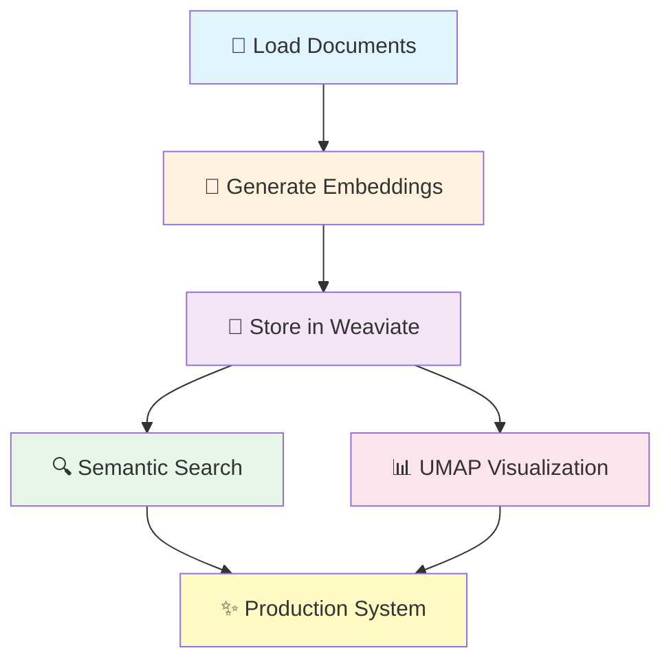
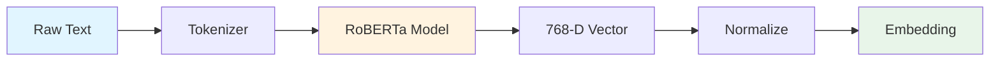
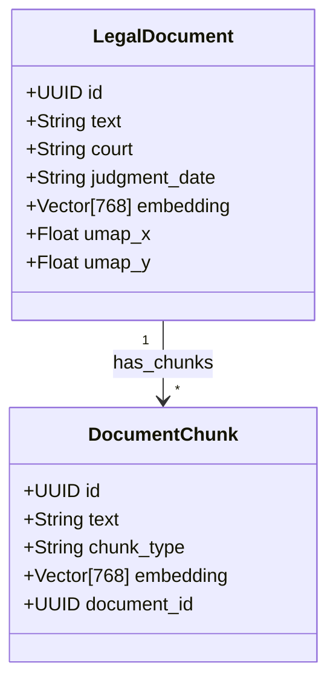
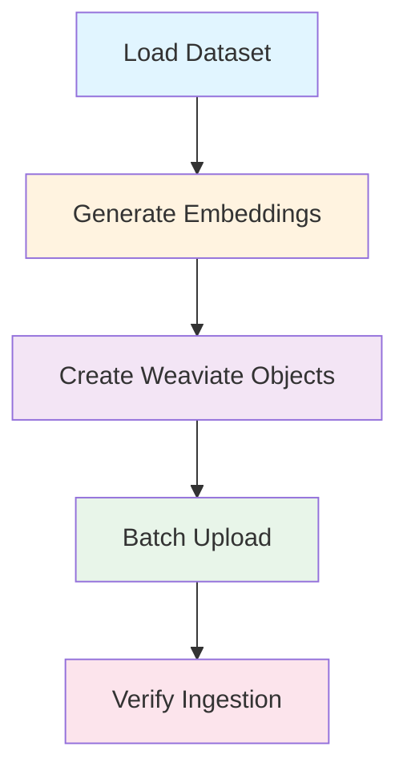
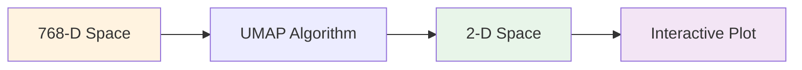

# Tutorial: Working with Legal Document Embeddings

Learn how to generate, store, and search legal document embeddings using JuDDGES. This hands-on tutorial covers the complete embedding workflow from generation to visualization with UMAP.

## Table of Contents

- [Learning Objectives](#learning-objectives)
- [Prerequisites](#prerequisites)
- [What You'll Build](#what-youll-build)
- [Understanding Embeddings](#understanding-embeddings)
- [Step 1: Generate Document Embeddings](#step-1-generate-document-embeddings)
- [Step 2: Set Up Weaviate Vector Database](#step-2-set-up-weaviate-vector-database)
- [Step 3: Ingest Documents to Weaviate](#step-3-ingest-documents-to-weaviate)
- [Step 4: Perform Semantic Search](#step-4-perform-semantic-search)
- [Step 5: Visualize with UMAP](#step-5-visualize-with-umap)
- [Checkpoints & Exercises](#checkpoints--exercises)
- [Troubleshooting](#troubleshooting)
- [Summary](#summary)
- [Next Steps](#next-steps)

---

## Learning Objectives

By the end of this tutorial, you will be able to:

- ✅ Understand what document embeddings are and why they matter
- ✅ Generate embeddings using multilingual legal models
- ✅ Set up and configure Weaviate vector database
- ✅ Ingest documents and embeddings to Weaviate
- ✅ Perform semantic similarity search
- ✅ Visualize document spaces using UMAP projections
- ✅ Analyze embedding quality and coverage

**Estimated Time**: 45 minutes

---

## Prerequisites

### Required Knowledge
- Completion of [Tutorial 1: First Legal Document Analysis](./tutorial-01-first-legal-document-analysis.md)
- Basic understanding of vectors and similarity
- Familiarity with Docker and databases

### Required Software
- **Python 3.10+** with JuDDGES installed
- **Docker** and **Docker Compose** running
- **16GB+ RAM** (embeddings are memory-intensive)
- **10GB+ free disk space** for vector database
- **(Optional) GPU** with CUDA for faster embedding generation

### Required Setup
- JuDDGES environment activated
- Weaviate running (we'll set this up together)

---

## What You'll Build

In this tutorial, you'll create a complete semantic search system:



**Real-world application**: This powers legal research tools, case law retrieval, and citation analysis systems.

---

## Understanding Embeddings

### What Are Embeddings?

Embeddings are **numerical representations** of text that capture semantic meaning. Similar documents have similar embeddings.

```python
# Text
doc1 = "Umowa kredytu we frankach szwajcarskich"
doc2 = "Swiss franc loan agreement"
doc3 = "Rozwód z orzeczeniem o winie"

# Embeddings (simplified)
emb1 = [0.2, 0.8, 0.1, 0.9, ...]  # 768 dimensions
emb2 = [0.3, 0.7, 0.2, 0.8, ...]  # Similar to emb1!
emb3 = [0.9, 0.1, 0.8, 0.2, ...]  # Different from emb1/emb2
```

### Why Use Embeddings?

**Traditional Keyword Search**:
```python
query = "swiss franc"
results = search("swiss franc")  # Only finds exact matches
```

**Semantic Search with Embeddings**:
```python
query = "swiss franc"
results = semantic_search("swiss franc")  # Finds:
# - "franki szwajcarskie"
# - "CHF loan"
# - "foreign currency mortgage"
```

### The mmlw-roberta-large Model

JuDDGES uses `sdadas/mmlw-roberta-large`:
- **Multilingual**: Polish, English, and 100+ languages
- **Legal-specific**: Trained on legal documents
- **768-dimensional** embeddings
- **State-of-the-art** performance on legal tasks

---

## Step 1: Generate Document Embeddings

### Understanding the Embedding Pipeline



### Create Embedding Script

Create `generate_embeddings.py`:

```python
"""Generate embeddings for legal documents."""

import torch
from datasets import load_dataset
from transformers import AutoTokenizer, AutoModel
from rich.console import Console
from rich.progress import track
import numpy as np

console = Console()

# Step 1: Load model and tokenizer
console.print("[bold blue]Loading embedding model...[/bold blue]")
console.print("[yellow]Model: sdadas/mmlw-roberta-large[/yellow]")

model_name = "sdadas/mmlw-roberta-large"
tokenizer = AutoTokenizer.from_pretrained(model_name)
model = AutoModel.from_pretrained(model_name)

# Move to GPU if available
device = "cuda" if torch.cuda.is_available() else "cpu"
model = model.to(device)
model.eval()  # Set to evaluation mode

console.print(f"[green]✓ Model loaded on {device}[/green]")

# Step 2: Load documents
console.print("\n[bold blue]Loading documents...[/bold blue]")
dataset = load_dataset("JuDDGES/pl-court-raw-sample", split="train[:20]")
console.print(f"[green]✓ Loaded {len(dataset)} documents[/green]")

# Step 3: Generate embeddings function
def generate_embedding(text: str, max_length: int = 512) -> np.ndarray:
    """Generate embedding for a single text.

    Args:
        text: Input text
        max_length: Maximum token length

    Returns:
        768-dimensional embedding vector
    """
    # Tokenize
    inputs = tokenizer(
        text,
        max_length=max_length,
        truncation=True,
        padding=True,
        return_tensors="pt",
    )

    # Move to device
    inputs = {k: v.to(device) for k, v in inputs.items()}

    # Generate embedding
    with torch.no_grad():
        outputs = model(**inputs)

    # Use [CLS] token embedding (first token)
    embedding = outputs.last_hidden_state[:, 0, :].cpu().numpy()[0]

    # Normalize (for cosine similarity)
    embedding = embedding / np.linalg.norm(embedding)

    return embedding

# Step 4: Generate embeddings for all documents
console.print("\n[bold blue]Generating embeddings...[/bold blue]")
console.print("[yellow]This may take 1-2 minutes...[/yellow]")

embeddings = []
for doc in track(dataset, description="Processing documents"):
    # Use first 2000 characters for embedding
    text = doc["text"][:2000]

    embedding = generate_embedding(text)
    embeddings.append(embedding)

embeddings = np.array(embeddings)

console.print(f"[green]✓ Generated embeddings: shape {embeddings.shape}[/green]")

# Step 5: Analyze embeddings
console.print("\n[bold blue]Analyzing embeddings...[/bold blue]")

# Calculate pairwise similarities
from sklearn.metrics.pairwise import cosine_similarity

similarities = cosine_similarity(embeddings)

# Find most similar document pairs
console.print("\n[bold]Most Similar Document Pairs:[/bold]")
for i in range(min(5, len(dataset) - 1)):
    # Get most similar document (excluding itself)
    similarities[i, i] = -1  # Exclude self
    most_similar_idx = similarities[i].argmax()
    similarity_score = similarities[i, most_similar_idx]

    console.print(f"\nDocument {i} ↔ Document {most_similar_idx}")
    console.print(f"Similarity: {similarity_score:.3f}")
    console.print(f"Court 1: {dataset[i]['court'][:50]}")
    console.print(f"Court 2: {dataset[most_similar_idx]['court'][:50]}")

# Step 6: Save embeddings
console.print("\n[bold blue]Saving embeddings...[/bold blue]")
np.save("document_embeddings.npy", embeddings)
console.print("[green]✓ Embeddings saved to document_embeddings.npy[/green]")

console.print("\n[bold green]✓ Step 1 Complete![/bold green]")
console.print(f"Generated {len(embeddings)} embeddings of dimension {embeddings.shape[1]}")
```

### Run the Script

```bash
python generate_embeddings.py
```

**Expected output**:
```
Loading embedding model...
Model: sdadas/mmlw-roberta-large
✓ Model loaded on cuda

Loading documents...
✓ Loaded 20 documents

Generating embeddings...
Processing documents ━━━━━━━━━━━━━━━━━━━━━━ 100% 20/20
✓ Generated embeddings: shape (20, 768)

Analyzing embeddings...

Most Similar Document Pairs:

Document 0 ↔ Document 5
Similarity: 0.857
Court 1: Sąd Okręgowy w Warszawie
Court 2: Sąd Okręgowy w Warszawie

[... more pairs ...]

✓ Step 1 Complete!
Generated 20 embeddings of dimension 768
```

### 🎯 Checkpoint 1: Understanding Embeddings

**Quiz**: What does a similarity score of 0.95 mean?
<details>
<summary>Answer</summary>

A score of 0.95 (on a scale of 0 to 1) means the documents are very similar semantically. They likely discuss similar topics, even if they use different words.

- **0.0**: Completely different
- **0.5**: Somewhat related
- **0.95**: Very similar
- **1.0**: Identical
</details>

**Try This**: Modify the script to use only the first 500 characters instead of 2000. How do the similarity scores change?

---

## Step 2: Set Up Weaviate Vector Database

### Why Weaviate?

**Weaviate** is a vector database optimized for:
- ⚡ **Fast similarity search** on millions of documents
- 🔄 **Hybrid search** combining semantic and keyword search
- 📊 **CRUD operations** with full document management
- 🐳 **Docker deployment** for easy setup
- 🔌 **REST API** for integration

### Start Weaviate

```bash
# Navigate to weaviate directory
cd /home/laugustyniak/github/legal-ai/JuDDGES/weaviate

# Start Weaviate with Docker Compose
docker compose up -d

# Check status
docker compose ps
```

**Expected output**:
```
NAME      IMAGE                              STATUS
weaviate  semitechnologies/weaviate:1.25.0   Up 10 seconds (healthy)
```

### Verify Weaviate is Running

```bash
# Check health endpoint
curl http://localhost:8080/v1/.well-known/ready

# Expected: {"status": "healthy"}
```

### Understanding Weaviate Schema

JuDDGES uses predefined schemas for legal documents:



### Check Schema

Create `check_weaviate_schema.py`:

```python
"""Check Weaviate schema and status."""

import weaviate
from rich.console import Console
from rich.table import Table

console = Console()

# Connect to Weaviate
console.print("[bold blue]Connecting to Weaviate...[/bold blue]")
client = weaviate.Client("http://localhost:8080")

# Check if ready
if client.is_ready():
    console.print("[green]✓ Weaviate is ready[/green]")
else:
    console.print("[red]✗ Weaviate is not ready[/red]")
    exit(1)

# Get schema
schema = client.schema.get()

# Display classes
console.print("\n[bold]Weaviate Schema:[/bold]")
table = Table(show_header=True, header_style="bold magenta")
table.add_column("Class Name", style="cyan")
table.add_column("Properties", style="white")
table.add_column("Vector Indexing", style="green")

if "classes" in schema:
    for cls in schema["classes"]:
        class_name = cls["class"]
        properties = ", ".join([p["name"] for p in cls["properties"][:5]])
        if len(cls["properties"]) > 5:
            properties += "..."
        vector_config = cls.get("vectorizer", "none")

        table.add_row(class_name, properties, vector_config)

    console.print(table)
    console.print(f"\n[green]Found {len(schema['classes'])} classes[/green]")
else:
    console.print("[yellow]No schema defined yet[/yellow]")

# Check object counts
console.print("\n[bold]Document Counts:[/bold]")
for cls in schema.get("classes", []):
    class_name = cls["class"]
    result = client.query.aggregate(class_name).with_meta_count().do()
    count = result["data"]["Aggregate"][class_name][0]["meta"]["count"]
    console.print(f"{class_name}: {count:,} documents")

console.print("\n[bold green]✓ Step 2 Complete![/bold green]")
```

### Run Schema Check

```bash
python check_weaviate_schema.py
```

### 🎯 Checkpoint 2: Weaviate Setup

**Exercise**: Check if Weaviate is accessible from Python:

```python
import weaviate

client = weaviate.Client("http://localhost:8080")
print(f"Ready: {client.is_ready()}")
print(f"Version: {client.get_meta()}")
```

**Challenge**: What happens if you stop Weaviate? Try it:
```bash
docker compose down
# Run your script again
# Then restart: docker compose up -d
```

---

## Step 3: Ingest Documents to Weaviate

### Understanding the Ingestion Pipeline



### Create Ingestion Script

Create `ingest_to_weaviate.py`:

```python
"""Ingest documents with embeddings to Weaviate."""

import uuid
from datetime import datetime
from datasets import load_dataset
import weaviate
from weaviate.util import generate_uuid5
from rich.console import Console
from rich.progress import track
import torch
from transformers import AutoTokenizer, AutoModel
import numpy as np

console = Console()

# Step 1: Connect to Weaviate
console.print("[bold blue]Connecting to Weaviate...[/bold blue]")
client = weaviate.Client("http://localhost:8080")

if not client.is_ready():
    console.print("[red]Weaviate is not ready. Start it with: docker compose up -d[/red]")
    exit(1)

console.print("[green]✓ Connected to Weaviate[/green]")

# Step 2: Load embedding model
console.print("\n[bold blue]Loading embedding model...[/bold blue]")
model_name = "sdadas/mmlw-roberta-large"
tokenizer = AutoTokenizer.from_pretrained(model_name)
model = AutoModel.from_pretrained(model_name)

device = "cuda" if torch.cuda.is_available() else "cpu"
model = model.to(device)
model.eval()

console.print(f"[green]✓ Model loaded on {device}[/green]")

# Step 3: Load dataset
console.print("\n[bold blue]Loading dataset...[/bold blue]")
dataset = load_dataset("JuDDGES/pl-court-raw-sample", split="train[:50]")
console.print(f"[green]✓ Loaded {len(dataset)} documents[/green]")

# Step 4: Define embedding function
def generate_embedding(text: str, max_length: int = 512) -> list[float]:
    """Generate embedding vector for text."""
    inputs = tokenizer(
        text,
        max_length=max_length,
        truncation=True,
        padding=True,
        return_tensors="pt",
    )
    inputs = {k: v.to(device) for k, v in inputs.items()}

    with torch.no_grad():
        outputs = model(**inputs)

    embedding = outputs.last_hidden_state[:, 0, :].cpu().numpy()[0]
    embedding = embedding / np.linalg.norm(embedding)

    return embedding.tolist()

# Step 5: Ingest documents
console.print("\n[bold blue]Ingesting documents to Weaviate...[/bold blue]")
console.print("[yellow]This may take 2-5 minutes for 50 documents...[/yellow]")

# Configure batch
client.batch.configure(
    batch_size=10,
    dynamic=True,
)

ingested_count = 0
error_count = 0

with client.batch as batch:
    for i, doc in track(enumerate(dataset), description="Ingesting", total=len(dataset)):
        try:
            # Generate embedding
            text = doc.get("text", "")[:2000]  # Use first 2000 chars
            embedding = generate_embedding(text)

            # Create deterministic UUID based on document ID
            doc_id = doc.get("id", str(i))
            doc_uuid = generate_uuid5(doc_id)

            # Prepare properties
            properties = {
                "text": text,
                "court": doc.get("court", ""),
                "judgment_date": doc.get("judgment_date", ""),
                "court_type": doc.get("court_type", ""),
                "case_number": doc.get("case_number", ""),
                "raw_text": doc.get("text", ""),  # Full text
            }

            # Add to batch
            batch.add_data_object(
                data_object=properties,
                class_name="LegalDocument",
                uuid=doc_uuid,
                vector=embedding,
            )

            ingested_count += 1

        except Exception as e:
            console.print(f"[red]Error ingesting document {i}: {e}[/red]")
            error_count += 1

# Step 6: Verify ingestion
console.print("\n[bold blue]Verifying ingestion...[/bold blue]")

result = client.query.aggregate("LegalDocument").with_meta_count().do()
total_docs = result["data"]["Aggregate"]["LegalDocument"][0]["meta"]["count"]

console.print(f"[green]✓ Successfully ingested {ingested_count} documents[/green]")
if error_count > 0:
    console.print(f"[yellow]⚠ {error_count} documents failed[/yellow]")
console.print(f"[green]Total documents in Weaviate: {total_docs}[/green]")

# Step 7: Test a query
console.print("\n[bold blue]Testing semantic search...[/bold blue]")

test_query = "umowa kredytu we frankach szwajcarskich"
query_embedding = generate_embedding(test_query)

result = (
    client.query
    .get("LegalDocument", ["court", "judgment_date", "text"])
    .with_near_vector({"vector": query_embedding})
    .with_limit(3)
    .do()
)

if "data" in result and "Get" in result["data"]:
    docs = result["data"]["Get"]["LegalDocument"]
    console.print(f"[green]✓ Found {len(docs)} similar documents[/green]")

    for i, doc in enumerate(docs, 1):
        console.print(f"\n{i}. {doc['court']}")
        console.print(f"   Date: {doc['judgment_date']}")
        console.print(f"   Text: {doc['text'][:100]}...")

console.print("\n[bold green]✓ Step 3 Complete![/bold green]")
console.print("Documents are now searchable in Weaviate!")
```

### Run Ingestion

```bash
python ingest_to_weaviate.py
```

**Expected output**:
```
Connecting to Weaviate...
✓ Connected to Weaviate

Loading embedding model...
✓ Model loaded on cuda

Loading dataset...
✓ Loaded 50 documents

Ingesting documents to Weaviate...
Ingesting ━━━━━━━━━━━━━━━━━━━━━━ 100% 50/50

Verifying ingestion...
✓ Successfully ingested 50 documents
Total documents in Weaviate: 50

Testing semantic search...
✓ Found 3 similar documents

1. Sąd Okręgowy w Warszawie
   Date: 2023-03-15
   Text: W sprawie o zapłatę...

✓ Step 3 Complete!
Documents are now searchable in Weaviate!
```

### 🎯 Checkpoint 3: Ingestion Challenge

**Challenge**: Ingest documents in smaller batches and measure performance:

```python
import time

batch_sizes = [5, 10, 20]
for batch_size in batch_sizes:
    start = time.time()
    # Run ingestion with this batch size
    duration = time.time() - start
    print(f"Batch size {batch_size}: {duration:.2f} seconds")
```

**Question**: What's the optimal batch size for your system?

---

## Step 4: Perform Semantic Search

### Create Search Interface

Create `semantic_search_demo.py`:

```python
"""Interactive semantic search on legal documents."""

import weaviate
from rich.console import Console
from rich.prompt import Prompt
from rich.table import Table
from rich.panel import Panel
import torch
from transformers import AutoTokenizer, AutoModel
import numpy as np

console = Console()

# Initialize
console.print("[bold blue]Initializing semantic search...[/bold blue]")

client = weaviate.Client("http://localhost:8080")
model_name = "sdadas/mmlw-roberta-large"
tokenizer = AutoTokenizer.from_pretrained(model_name)
model = AutoModel.from_pretrained(model_name)

device = "cuda" if torch.cuda.is_available() else "cpu"
model = model.to(device)
model.eval()

console.print("[green]✓ Ready for search[/green]")

def generate_embedding(text: str) -> list[float]:
    """Generate embedding for query."""
    inputs = tokenizer(text, max_length=512, truncation=True, padding=True, return_tensors="pt")
    inputs = {k: v.to(device) for k, v in inputs.items()}

    with torch.no_grad():
        outputs = model(**inputs)

    embedding = outputs.last_hidden_state[:, 0, :].cpu().numpy()[0]
    embedding = embedding / np.linalg.norm(embedding)
    return embedding.tolist()

def search(query: str, limit: int = 5):
    """Perform semantic search."""
    # Generate query embedding
    console.print(f"\n[yellow]Searching for: '{query}'...[/yellow]")
    query_embedding = generate_embedding(query)

    # Search Weaviate
    result = (
        client.query
        .get("LegalDocument", ["court", "judgment_date", "case_number", "text"])
        .with_near_vector({"vector": query_embedding})
        .with_limit(limit)
        .with_additional(["distance"])
        .do()
    )

    if "data" not in result or "Get" not in result["data"]:
        console.print("[red]No results found[/red]")
        return

    docs = result["data"]["Get"]["LegalDocument"]

    # Display results
    console.print(f"\n[green]✓ Found {len(docs)} relevant documents[/green]")

    table = Table(show_header=True, header_style="bold magenta")
    table.add_column("Rank", width=6)
    table.add_column("Court", width=35)
    table.add_column("Date", width=12)
    table.add_column("Similarity", width=12)

    for i, doc in enumerate(docs, 1):
        court = doc["court"][:32] + "..." if len(doc["court"]) > 35 else doc["court"]
        date = doc.get("judgment_date", "N/A")

        # Convert distance to similarity (1 - distance)
        distance = doc["_additional"]["distance"]
        similarity = f"{(1 - distance) * 100:.1f}%"

        table.add_row(str(i), court, date, similarity)

    console.print(table)

    # Show top result detail
    top_doc = docs[0]
    text_preview = top_doc["text"][:400] + "..."

    panel = Panel(
        f"[bold]Court:[/bold] {top_doc['court']}\n"
        f"[bold]Date:[/bold] {top_doc.get('judgment_date', 'N/A')}\n"
        f"[bold]Case:[/bold] {top_doc.get('case_number', 'N/A')}\n\n"
        f"[italic]{text_preview}[/italic]",
        title="[bold cyan]Top Result[/bold cyan]",
        border_style="cyan",
    )
    console.print(panel)

# Predefined example queries
EXAMPLE_QUERIES = [
    "umowa kredytu we frankach szwajcarskich",
    "odszkodowanie za wypadek przy pracy",
    "rozwód z orzeczeniem o winie",
    "naruszenie dóbr osobistych",
    "Swiss franc loan agreement",
]

# Main loop
console.print("\n[bold cyan]═══════════════════════════════════════[/bold cyan]")
console.print("[bold cyan]  Semantic Search Demo                [/bold cyan]")
console.print("[bold cyan]═══════════════════════════════════════[/bold cyan]")

while True:
    console.print("\n[bold]Options:[/bold]")
    console.print("  [1] Use example query")
    console.print("  [2] Enter custom query")
    console.print("  [3] Exit")

    choice = Prompt.ask("\nSelect option", choices=["1", "2", "3"])

    if choice == "1":
        console.print("\n[bold]Example Queries:[/bold]")
        for i, query in enumerate(EXAMPLE_QUERIES, 1):
            console.print(f"  [{i}] {query}")

        query_idx = Prompt.ask("Select query", choices=[str(i) for i in range(1, len(EXAMPLE_QUERIES) + 1)])
        query = EXAMPLE_QUERIES[int(query_idx) - 1]
        search(query)

    elif choice == "2":
        query = Prompt.ask("\nEnter search query")
        if query.strip():
            search(query)

    elif choice == "3":
        console.print("[bold green]Thank you for using Semantic Search![/bold green]")
        break
```

### Run Search Demo

```bash
python semantic_search_demo.py
```

### 🎯 Checkpoint 4: Search Exercises

**Exercise 1**: Test multilingual search:
```python
queries = [
    "frank szwajcarski",  # Polish
    "Swiss franc",        # English
    "CHF loan",          # Abbreviation
]

for query in queries:
    search(query, limit=3)
```

Do you get similar results?

**Exercise 2**: Compare semantic vs keyword search:
```python
# Semantic
results_semantic = search("umowa kredytu", limit=5)

# Keyword (using BM25)
results_keyword = client.query.get("LegalDocument", ["text"]).with_bm25("umowa kredytu").with_limit(5).do()

# Compare the results - are they different?
```

---

## Step 5: Visualize with UMAP

### Understanding UMAP

**UMAP** (Uniform Manifold Approximation and Projection) reduces high-dimensional embeddings (768D) to 2D for visualization.



### Create UMAP Visualization

Create `visualize_embeddings.py`:

```python
"""Visualize document embeddings with UMAP."""

import numpy as np
import plotly.express as px
import plotly.graph_objects as go
from umap import UMAP
import weaviate
from rich.console import Console
from rich.progress import track

console = Console()

# Step 1: Connect and load embeddings
console.print("[bold blue]Loading embeddings from Weaviate...[/bold blue]")

client = weaviate.Client("http://localhost:8080")

# Query all documents with embeddings
result = (
    client.query
    .get("LegalDocument", ["court", "judgment_date", "court_type"])
    .with_additional(["vector"])
    .with_limit(10000)  # Adjust based on your dataset size
    .do()
)

docs = result["data"]["Get"]["LegalDocument"]
console.print(f"[green]✓ Loaded {len(docs)} documents[/green]")

# Extract embeddings and metadata
embeddings = np.array([doc["_additional"]["vector"] for doc in docs])
courts = [doc.get("court", "Unknown") for doc in docs]
dates = [doc.get("judgment_date", "Unknown") for doc in docs]
court_types = [doc.get("court_type", "Unknown") for doc in docs]

console.print(f"[green]Embeddings shape: {embeddings.shape}[/green]")

# Step 2: Apply UMAP
console.print("\n[bold blue]Applying UMAP dimensionality reduction...[/bold blue]")
console.print("[yellow]This may take 1-2 minutes...[/yellow]")

umap_model = UMAP(
    n_components=2,
    n_neighbors=15,
    min_dist=0.1,
    metric="cosine",
    random_state=42,
)

coords_2d = umap_model.fit_transform(embeddings)

console.print(f"[green]✓ UMAP complete: {coords_2d.shape}[/green]")

# Step 3: Create interactive visualization
console.print("\n[bold blue]Creating interactive visualization...[/bold blue]")

# Create a color map for courts
unique_courts = list(set(courts))
court_colors = {court: i for i, court in enumerate(unique_courts[:20])}  # Top 20 courts
colors = [court_colors.get(court, -1) for court in courts]

# Create hover text
hover_texts = [
    f"Court: {court}<br>Date: {date}<br>Type: {ctype}"
    for court, date, ctype in zip(courts, dates, court_types)
]

# Create plotly figure
fig = go.Figure(data=[
    go.Scatter(
        x=coords_2d[:, 0],
        y=coords_2d[:, 1],
        mode="markers",
        marker=dict(
            size=5,
            color=colors,
            colorscale="Viridis",
            showscale=True,
            colorbar=dict(title="Court"),
            opacity=0.7,
        ),
        text=hover_texts,
        hovertemplate="%{text}<extra></extra>",
    )
])

fig.update_layout(
    title="Legal Document Embedding Space (UMAP Projection)",
    xaxis_title="UMAP Dimension 1",
    yaxis_title="UMAP Dimension 2",
    width=1200,
    height=800,
    hovermode="closest",
)

# Save to HTML
output_file = "embeddings_visualization.html"
fig.write_html(output_file)

console.print(f"[green]✓ Visualization saved to {output_file}[/green]")
console.print(f"[cyan]Open the file in a browser to interact with the visualization[/cyan]")

# Step 4: Analyze clusters
console.print("\n[bold blue]Analyzing document clusters...[/bold blue]")

from sklearn.cluster import DBSCAN

# Cluster documents
clustering = DBSCAN(eps=0.5, min_samples=5).fit(coords_2d)
labels = clustering.labels_

n_clusters = len(set(labels)) - (1 if -1 in labels else 0)
n_noise = list(labels).count(-1)

console.print(f"[green]Found {n_clusters} clusters[/green]")
console.print(f"[yellow]Noise points: {n_noise}[/yellow]")

# Analyze cluster composition
console.print("\n[bold]Top 3 Largest Clusters:[/bold]")
from collections import Counter

for cluster_id in range(min(3, n_clusters)):
    cluster_docs = [i for i, label in enumerate(labels) if label == cluster_id]
    cluster_courts = [courts[i] for i in cluster_docs]
    top_courts = Counter(cluster_courts).most_common(3)

    console.print(f"\nCluster {cluster_id}: {len(cluster_docs)} documents")
    for court, count in top_courts:
        console.print(f"  - {court}: {count} docs")

console.print("\n[bold green]✓ Step 5 Complete![/bold green]")
console.print(f"Open {output_file} in your browser to explore the visualization!")
```

### Run Visualization

```bash
python visualize_embeddings.py
```

The script generates an interactive HTML file. Open it in your browser:

```bash
# Linux
xdg-open embeddings_visualization.html

# macOS
open embeddings_visualization.html

# Windows
start embeddings_visualization.html
```

### 🎯 Checkpoint 5: Visualization Challenge

**Exercise**: Try different UMAP parameters:

```python
# Experiment with these
umap_configs = [
    {"n_neighbors": 5, "min_dist": 0.1},   # More local structure
    {"n_neighbors": 50, "min_dist": 0.5},  # More global structure
    {"n_neighbors": 15, "min_dist": 0.01}, # Tighter clusters
]

for config in umap_configs:
    umap_model = UMAP(**config, random_state=42)
    coords = umap_model.fit_transform(embeddings)
    # Visualize and compare
```

**Challenge**: Color the visualization by year instead of court. Do you see temporal patterns?

---

## Checkpoints & Exercises

### Summary Exercises

**Exercise 1: Full Pipeline**
Create a script that:
1. Loads 100 documents
2. Generates embeddings
3. Ingests to Weaviate
4. Performs 5 different searches
5. Creates a UMAP visualization

**Exercise 2: Quality Analysis**
Analyze embedding quality:
- Calculate average similarity within same court
- Calculate average similarity across different courts
- Identify outlier documents (low similarity to all others)

**Exercise 3: Production Optimization**
Optimize for production:
- Implement batch embedding generation
- Add error handling and retry logic
- Add progress tracking
- Measure and log performance metrics

---

## Troubleshooting

### Issue: "CUDA out of memory"

**Solution**: Use CPU or reduce batch size:
```python
device = "cpu"  # Force CPU
# Or use smaller batches
batch_size = 5  # Instead of 10
```

### Issue: "Weaviate connection timeout"

**Solution**: Check Weaviate is running and increase timeout:
```python
client = weaviate.Client(
    "http://localhost:8080",
    timeout_config=(5, 15),  # (connect, read) timeout
)
```

### Issue: "Poor search quality"

**Solution**:
- Use more text for embeddings (increase from 2000 to 5000 chars)
- Try different embedding models
- Adjust search limit and certainty threshold
- Check if documents are properly normalized

### Issue: "UMAP takes too long"

**Solution**: Reduce dataset size or adjust parameters:
```python
# Sample documents
docs_sample = docs[:1000]  # Use first 1000

# Or use faster UMAP parameters
umap_model = UMAP(n_neighbors=15, min_dist=0.1, n_epochs=200)  # Fewer epochs
```

---

## Summary

Congratulations! You've mastered legal document embeddings with JuDDGES.

### What You've Learned

✅ **Embeddings**: Generated semantic representations of legal documents
✅ **Weaviate**: Set up and configured vector database
✅ **Ingestion**: Uploaded documents and embeddings to Weaviate
✅ **Semantic Search**: Performed meaning-based document retrieval
✅ **UMAP**: Visualized high-dimensional embedding spaces
✅ **Clustering**: Analyzed document groupings and patterns

### Key Concepts

| Concept | Description |
|---------|-------------|
| **Embedding** | 768-dimensional vector representing document meaning |
| **Vector Database** | Database optimized for similarity search |
| **Semantic Search** | Finding documents by meaning, not keywords |
| **UMAP** | Dimensionality reduction for visualization |
| **Cosine Similarity** | Measure of document similarity (0-1) |
| **Batch Processing** | Processing multiple documents efficiently |

### Performance Metrics

From this tutorial, you should achieve:

- **Embedding Generation**: ~0.5-1s per document (GPU)
- **Ingestion**: ~50 documents per minute
- **Search**: <100ms per query
- **UMAP**: ~1-2 minutes for 1000 documents

---

## Next Steps

### Continue Learning

1. **[Tutorial 3: Fine-tuning Legal LLMs](./tutorial-03-model-finetuning.md)**
   - Prepare instruction datasets
   - Fine-tune models with PEFT/LoRA
   - Evaluate fine-tuned models

2. **[Tutorial 4: Advanced Information Extraction](./tutorial-04-advanced-extraction.md)**
   - Complex extraction schemas
   - Multi-step extraction pipelines
   - Quality validation

3. **[Tutorial 5: End-to-End Project](./tutorial-05-end-to-end-project.md)**
   - Build complete legal analysis system
   - Production deployment
   - Monitoring and maintenance

### Advanced Topics

- **Hybrid Search**: Combine semantic and keyword search
- **Multi-vector Search**: Use multiple embeddings per document
- **Fine-tune Embeddings**: Train custom legal embeddings
- **Real-time Ingestion**: Stream documents to Weaviate
- **Cross-lingual Search**: Search across Polish and English

### How-To Guides

- [Deploy Weaviate at Scale](../how-to/embeddings/embeddings_deploy_weaviate.md)
- [Streaming Ingestion Pipeline](../how-to/embeddings/STREAMING_INGESTER.md)
- [UMAP Visualization Guide](../how-to/visualization/UMAP_VISUALIZATION.md)

---

## Related Documentation

- [Weaviate Integration Architecture](../explanation/architecture/WEAVIATE_INTEGRATION.md)
- [Data Flow Pipeline](../explanation/architecture/DATA_FLOW_PIPELINE.md)
- [API Reference: Data Loaders](../reference/api/data/loaders.md)
- [Universal Ingestion Guide](../how-to/embeddings/UNIVERSAL_INGESTION.md)

## Support

For questions or issues:

- **Documentation**: Browse `/docs` for comprehensive guides
- **GitHub Issues**: [Report bugs](https://github.com/pwr-ai/JuDDGES/issues)
- **Email**: lukasz.augustyniak@pwr.edu.pl

---

**Last Updated**: 2025-10-11 | **Version**: 1.0 | **Status**: Published

**Estimated Completion Time**: 45 minutes | **Difficulty**: Intermediate | **Prerequisites**: Tutorial 1
